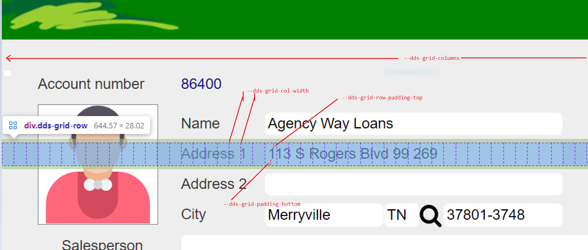

There are two CSS features that are extensively used in the definition of the Expo Library styles:

1. CSS [Global variables](https://developer.mozilla.org/en-US/docs/web/css/:root).
2. [calc CSS function](https://developer.mozilla.org/en-US/docs/Web/CSS/calc()).

The Expo Client Library's source is readily available in your `wwwroot` folder. It was designed to be customized to your preferences.

Let's take a look at the CSS style definitions, starting with the declaration of the [Global variables](https://developer.mozilla.org/en-US/docs/web/css/:root).

~~~
~\wwwroot\lib\asna-expo\css\expo.css
~~~

```css
/*-------------------------------------------*\
    CSS variables
\*-------------------------------------------*/
:root {
    --activekey-bar-background: #333;
    --activekey-bar-hover-background: #ddd;
    --activekey-bar-items-text-color: #f2f2f2;
    --activekey-bar-hover-text-color: #333;
    --activekey-bar-items-padding-top-or-bottom: 1em;
    --activekey-bar-items-padding-left-or-right: 1.5em;
    --body-font-family: "Helvetica Neue", Helvetica, Arial, sans-serif;
    --body-font-size: 18px;
    --body-font-weight: normal;
    --body-background: rgb(238, 238, 238);
    --popup-background: rgb(242, 242, 242);
    --body-text-color: #333;
    --msg-panel-background: #9AB8D5;
    --msg-panel-text-color: bisque;
    --dds-grid-columns: 132;
    --dds-grid-col-width: 11px;
    --dds-grid-row-padding-top: 0.2em;
    --dds-grid-row-padding-bottom: 0.2em;
}
```

Instead of using a [CSS preprocessor](https://developer.mozilla.org/en-US/docs/Glossary/CSS_preprocessor) like [SASS](https://sass-lang.com/) or [LESS](http://lesscss.org/), Expo Client Library uses CSS global variables and sets Style's properties based on these common values.

> For naming convention, to reduce possible collision with user-defined global variables, Expo Client Library reserves the following name prefixes:

1. `--activekey-` - For Display Page's "Active Key"/Menu system styles.
2. `--body` - For specifications describing the Font styles used by the `body` element. 
3. `--msg-panel` - For styles used on the "Message Panel"/
4. `--dds-grid` - For basic measurements to be used along with the Row grid layout.

Let's look at how these [Global variables](https://developer.mozilla.org/en-US/docs/web/css/:root) are used. In the same `expo.css` stylesheet file, the following selectors are defined:

```css
.dds-activekey-horizontal-bar, .dds-activekey-vertical-bar {
    overflow: hidden;
    background-color: var(--activekey-bar-background);
}

.dds-activekey-horizontal-bar {
    font-size: calc( var(--body-font-size) * 0.65 );
    width: 100%;
}
```

**Attributes** are normally given specific constant values, for example, we could have defined the selector `.dds-activekey-horizontal-bar`'s background color attribute as:

```css
.dds-activekey-horizontal-bar {
    background-color: #333;
}
```

But, if we wanted other selectors to use the same color `#333` for any other attribute, which may define a *theme*, then if we later want to vay the *theme*, we would have to search/replace all instances of the constant `#333` in the while stylesheet to get the job done. This process is error-prone.

Instead, we can define:

```
:root {
    --activekey-bar-background: #333;
      .
      .
      .
```

And *refer* to that *global variable value* anywhere in the stylesheet (or programmatically refer to that value in JavaScript, if we so desire). The new selector is better defined as:

```css
.dds-activekey-horizontal-bar {
    background-color: var(--activekey-bar-background);
}
```

Whenever we want to adjust the *theme*, we can change the value of the global variable (at the top of the stylesheet) and re-fresh the Application Page.

We can also use global variables to calculate expressions on CSS style definitions. 

Consider:

```css
.dds-activekey-horizontal-bar {
    font-size: calc( var(--body-font-size) * 0.65 );
    width: 100%;
}
```

We want to set the `font-size` used for the *ActiveKey* horizontal bar a size that is dependent of the size used for the Page's font - the font used for the `body` element -.

The `calc` CSS function is more than an expression evaluator, it can do automatic conversions of units. 

For example, the following calculation is valid:

```css
.banner {
    width: calc(100% - 80px);
}
```

> The `var()` function combined with the `calc()` CSS function provide a simple, yet powerful pre-processor engine.

## --dds-grid- Row Grid Layout calculations

The following image intends to indicate the four values used in the global Variables to define the *Grid* for any of the *Rows*:



The following are the CSS styles used to define the *Grid* used to position elements in a *Row*.

```css
.dds-grid-row {
    display: grid;
    grid-template-columns: repeat(var(--dds-grid-columns), var(--dds-grid-col-width));
    padding-top: var(--dds-grid-row-padding-top);
    padding-bottom: var(--dds-grid-row-padding-bottom);
}

.dds-grid-empty-row {
    padding-top: var(--dds-grid-row-padding-top);
    padding-bottom: var(--dds-grid-row-padding-bottom);
    min-height: calc(var(--body-font-size) * 1.1429);
}

.dds-row-no-gap { /* Subfile rows look better without gaps between rows, particularly when using reverse-image */
    padding-top: 0;
    padding-bottom: 0;
}
```

Note the extensive use of `var()` function and some calculations referencing the global variables.

