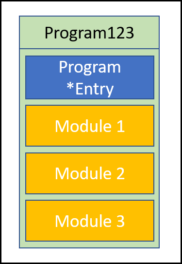
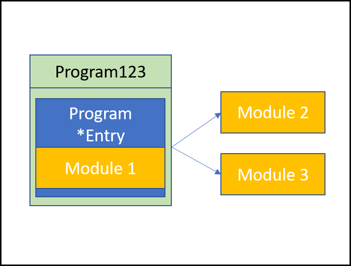

Application migrations performed by ASNA targeting the .NET platform rely on the ASNA Monarch Base framework. This framework supplements the .NET facilities to create an extended platform capable of supporting the original RPG/CL applications with a high level of automation on the migration and fidelity in the execution.

If you are unfamiliar with them, you can read the article [Programs, Modules and Procedures](../background/programs-modules-procedures.html) to learn about those IBM i concepts and terminology.  

Monarch Base provides three namesake classes that serve as the target for the migration of Modules, Programs and Service Programs; Their migrations extend these base classes:
* `ASNA.QSys.Runtime.JobSupport.Module`
* `ASNA.QSys.Runtime.JobSupport.Program`
* `ASNA.QSys.Runtime.JobSupport.ServiceProgram`

The implementation of `JobSupport.Program` and `JobSupport.ServiceProgram` have a common base class called `JobSupport.CommonProgram`.

When Monarch is performing a migration, OPM Programs are treated as if they were single-module ILE Programs; Monarch Base doesn’t have any special accommodation for OPM programs.

## Module Migration
Monarch migrates the source for a Module as a .NET class that extends the `ASNA.QSys.Runtime.JobSupport.Module` class (aka `JobSupport.Module`). 

Global declarations of Files, Fields, DataStructures, etc. become members of the generated class.

Each Subroutine in the Module generate a private .NET Method.

Each Procedure generates two methods: a private method with the code of the original procedure and a second public method which wraps a call to the private method with an invocation Push/Pop pair.

If the module has a main procedure and the module is the entry procedure for a program, the main procedure (or c-specs) logic is generated as a method named (_/*)Entry.

As part of the migration, the process of resolving exported/imported references is performed. When a module is migrated, a getter property is generated for each other module that is used by the migrated module. The property returns a reference to an instance of the used module; calls to procedures in the used module get qualified with the corresponding property reference.

## Program Migration
The process of binding modules into a program on the IBM i involves embedding copies of the modules in the program being produced.



_An IBM Program_

Migrated programs do not have copies of their modules, instead they hold an instance object of the corresponding Module class. The program instantiator  creates all the necessary modules instances.  As on the IBM i, one of the modules is designated as the Entry Module and its main procedure is invoke when the program is called.

A Monarch program is composed mostly of three elements:
 * Entry Point
 * Module Instance Collection
 * Service-Program Collection

Programs extend the Monarch Base class `ASNA.QSys.Runtime.JobSupport.Program` (aka `JobSupport.Program`).

### Entry Point
Each regular Program has a static 'Entry' method which is suitable as a target of the CALLD (call dynamic) operation.  This static method finds, or creates, the instance of the program class corresponding the the program's [activation group](activation-groups.html), and passes control to the programs entry procedure.

### Module Collection
As part of a program's class instantiation, the set of bound Modules are also instantiated and added to a collection held by the program.  This collection is used by the program's modules to find each others instance references.

When the program is disposed, the module instances in the collection are also disposed.

### Service-Program Collection
As part of a program's class instantiation, the set of Service Programs [activations](activation-groups.html) used by the program are located, or created, and added to a collection held by the program.  This collection is used by the program to locate the other service programs working on the application.


## Service Program Migration
Service Program migration and structure is very similar to regular Programs (see above) with the big exception that Service Programs do not contain an Entry Point.

Service Programs extend the Monarch Base class `ASNA.QSys.Runtime.JobSupport.ServiceProgram` (aka `JobSupport.ServiceProgram`).

## Program as a Module
On the IBM i a Module and a Program are always two distinct objects.  Even when a program is composed of a single module or when the module is deleted after the program is created, the two objects are distinct.  Recall that the CRTBNDRPG command creates a Module in QTEMP, binds it into a Program and then deletes the Module.

This pattern of single-module programs, and also the fact that the majority of programs are named identically to the name of their main module, provide an opportunity to reduce the number of classes generated for the program.

The class `JobSupport.CommonProgram` extend the class `JobSupport.Module`. This permits the migration of a module/program pair to generate a single class. OPM Programs also benefit from this simplified class structure.

## A Simple Example
Here is a example of a migrated program consisting of three modules and no service programs



_A Migrated Program_


## Another Example
The following diagram shows the relationship of a Monarch Program with its Modules and Service Programs.  In the diagram the following objects from the IBM were migrated:
+ Program1, a program composed of three modules.
  + Modules: Module1, Module2 & Module3
+ Service45, a Service Program composed of two modules, neither of which was called Service45.
  + Modules: Module4 & Module5
+ Gadget6, a Service Program composed of four module, one of which has the same name of the service program: 'Gadget6'
  + Modules: Gadget6, Module7, Module8 & Module9


_Programs, Modules and Service Programs_

Notice that when program *Program1* was generated, a single class was created to serve both as the Program and the entry Module. In addition, Program1 has a collection of references to its **other** modules.  The main entry module was not named with the same name as the program, Module1 vs Program1, so the name that survives in the combined object is that of the program, Program1.

Service Program *Gadget6* contains a module also called Gadget6, so a single class was generated to serve as both the program Gadget6 and the module Gadget6. Service program Gadget6 also has references to an additional three modules.

Service Program *Service45* shows a different style because there is no module called Service45 so the generated service program class has no user code, only the reference to its modules: Module4 and Module5.

## Binding via Class Attributes
After modules are created on the IBM they are assembled together via the binder (CRTPGM command). The binder takes the collection of modules and service programs to create the requested program.

Under the migration process, the responsibility of binding is given to Monarch Cocoon.  Monarch effects the binding by adding Class Attributes when it generates the code. For the example above, the generated class for Program1 would looked like this:

```cs
    [
        ProgramEntry("_ENTRY"),
        ModuleImport(typeof(Module2_Class), typeof(Module3_Class)),
        ServiceProgramUse(typeof(Service45_Class), typeof(Gadget6_Class))
    ]
    public partial class Program1 : Program
    {
        . . . 
    }
```
Regular Programs keep their names intact, however Modules and Service Programs get the suffix '_Class' attached to their names to avoid name collisions between the module and any of its procedures. 