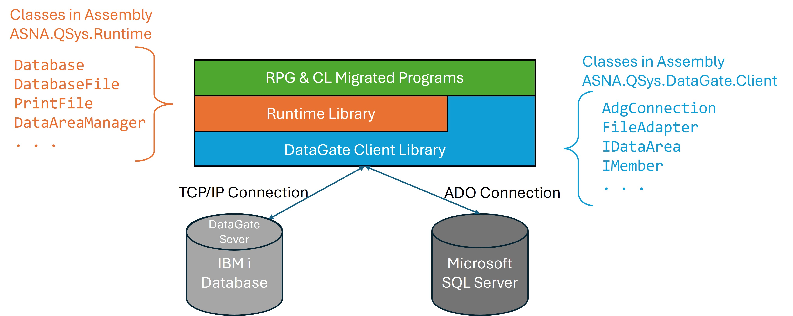

Database support for Monarch Applications is provided by ASNA DataGate. DataGate is a client/server facility capable of providing .NET programs access to data in either Microsoft SQL Server or IBM's DB2 on IBM i.

> DataGate is the bridge that lets Monarch‑converted .NET code keep doing RPG‑style record‑level I/O and job semantics, either against IBM i (via DataGate for IBM i) or against SQL Server (via DataGate for SQL Server), without rewriting the application’s core data logic.

In an ASNA Monarch migration, **DataGate** is the data‑access runtime and tooling layer that lets the converted .NET application keep behaving like RPG ---  preserving record‑level I/O, keyed access, library‑list semantics and other IBM i idioms — while running on Microsoft .NET and pointing either to **DB2 for i**  or to **Microsoft SQL Server**. Monarch generates .NET code that uses the `ASNA.QSys.Runtime` library which in turn depends on the `ASNA.DataGate`  classes to perform file I/O and related operations. 

## Where DataGate Sits in a Migrated Program
In general, programmers working on migrated programs interact with the Runtime Library instead of dealing directly with the DataGate Library.

#### DataGate Assembly
The client side of DataGate is embodied in the `ASNA.QSys.DataGate.Client.dll` (DG Client) .NET assembly, this assembly communicates with the corresponding database server using the related protocols.

## 🧩 **Role of DataGate in Migrated .NET Applications**

**DataGate** serves as the **data access engine** for ASNA’s .NET-based modernization tools targeting either **C#** and **Encore RPG**. 

Key functions include:
- **Record-level access** to IBM i Physical and Logical Files and to SQL Server Tables and Views.
- **Support for RPG-style file I/O**, including CHAIN, READ, WRITE, UPDATE, and DELETE.
- **Connection management** between .NET applications and IBM i systems.
- **Object managment** to manipulate Data Areas, Files, Members, etc.

## 🔗 Relationship Between DataGate and Runtime Assemblies

The `ASNA.QSys.Runtime.dll` assembly provides convinience classes to facilitate the use of DataGate by the migrated programs. These Runtime classes are conscious of RPG-Style constructs like File Overrides, global Field definitions and Indicators. Some of the main Runtime classes that interface with DataGate are:
- [ASNA.QSys.Runtime.Database](/reference/runtime/qsys-runtime/database.html) which servers as an interface to the DataGate [AdgConnection](/reference/datagate/datagate-client/adg-connection.html).
- [ASNA.QSys.Runtime.DatabaseFile](/reference/runtime/qsys-runtime/database-file.html) utilizes a DataGate [FileAdapter](/reference/datagate/datagate-client/file-adapter.html) to perform read/write operations to a file.
- [ASNA.QSys.Runtime.DataAreaManger](/reference/runtime/qsys-runtime//data-area-manager.html) holds a collection of DataGate's [IDataArea](/reference/datagate/datagate-client/i-data-area.html)s to facilitate performing In/Out and Lock operations.
- [ASNA.QSys.Runtime.JobSupport.CLProgram](/reference/runtime/qsys-runtime-job-support/cl-program.html) provides common Object operations found throughout CL program on the IBM i utilizing DataGate classes like [IMember](/reference/datagate/datagate-client/i-member.html) to initialize, clear, add physical and logical Members or  [iFileObject](/reference/datagate/datagate-client/i-file-object.html) to rename or delete files.

## Why DataGate matters in a Monarch conversion

1) **Preserves RPG I/O semantics in .NET.** DataGate’s record‑level access model and keyed operations (via `FileAdapter`, `AdgDataSet`, etc.) let converted programs run without wholesale rewrites to set‑based SQL/EF patterns on day one.

2) **Gives you two target states with one codebase.** The same Monarch‑generated code can point to DB2 for i or SQL Server by **changing the DataGate database/profile**, not application logic—useful for phased cutovers and hybrid states. Any code not using DataGate (like embedded SQL) will require adjustments to the code.

## See Also
[ASNA.QSys.Runtime](/reference/runtime/qsys-runtime/landing-page-namespace.html) Namespace
[ASNA.QSys.Runtime.JobSupport.CLProgram](/reference/runtime/qsys-runtime-job-support/cl-program.html) Class
[DataGate Overview](/manuals/datagate/datagate-overview.html)

