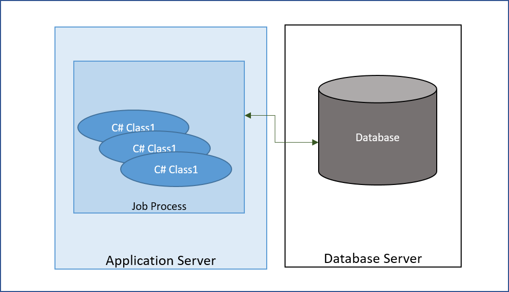
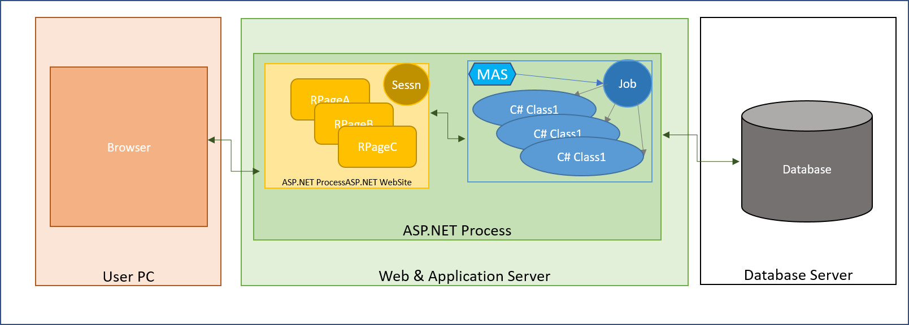
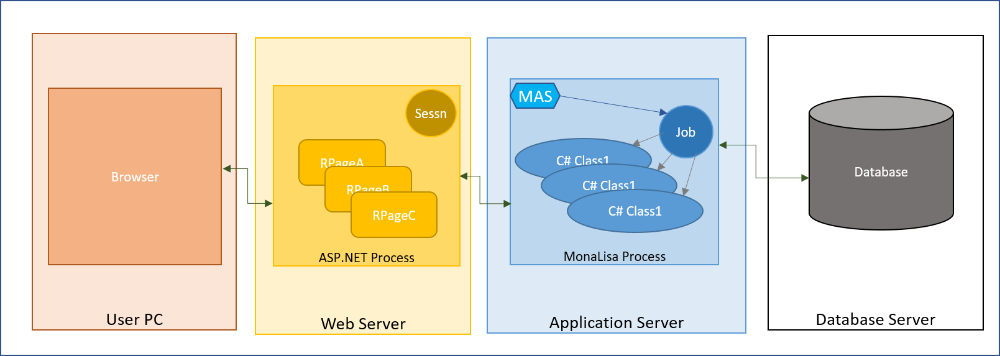

The application you are enhancing, maintaining or trying to understand probably originated on an IBM i and was migrated with ASNA Monarch technology.

There are several *Roles* involved in the complete Migration process, namely:
 
|**Role**|**Tools**|**Description**
| *Migrator*   | [ASNA Monarch Cocoon](https://docs.asna.com/documentation/Help160/Main_Monarch.htm)   [DataGate](https://docs.asna.com/documentation/Help160/Main_DataGate.htm) (for IBM i, Windows and [DSS](https://docs.asna.com/documentation/Help160/DSS/_HTML/Welcome.htm))   [Visual RPG](https://docs.asna.com/documentation/Help160/Main_AVRNET.htm) | Project Manager:   Oversees the complete Migration process.   Trained in all Tools involved.
|*Remediator* | [Visual RPG](https://docs.asna.com/documentation/Help160/Main_AVRNET.htm)   Nomad   DataGate [DSS](https://docs.asna.com/documentation/Help160/DSS/_HTML/Welcome.htm)  | Subject matter expert:   Knows the IBM i Application.   Understands RPG and Visual RPG.
|*Developer*  | ASNA Monarch Core Framework   DataGate Linear  | C# Developer:   Understands ASNA Monarch Core Framework.   Can become Subject matter expert.
 
> These documents describe in detail the *ASNA Monarch Core Framework*. The **Developer Role** is the intended audience for the content that follows. For documentation relevant to the other *Roles* please refer to [ASNA Products Documentation](https://docs.asna.com/documentation/)

## Monarch Migration Output
The ASNA Monarch migration solution translates IBM i programs written in RPG and CL into .NET C# classes.  RPG interactive programs make use of Display Files where the layout and data schema for the screens are defined, these Display Files are translated by Monarch into Razor Pages. 

A Monarch Migrator, aka Monarch Developer, organizes an RPG application into clusters of programs or GamePlans. The output of the migration of an interactive GamePlan is a pair of related projects: A Class Library with the C# source code derived from the GamePlan's programs and a Website with the set of Razor Pages, contained in an Area, representing the programs' screens. For non-interactive GamePlans, i.e. those composed solely of programs that do not interact with the screen, the migration output is the set of C# classes bundled as a Class Library or as an Executable project.  Each Program, or ILE Module, becomes one class and each Display File a Razor Page.

_Migration Output_

Migrated programs and the Website containing the Migrated Razor Pages Areas have a dependency on assemblies provided by ASNA as part of a framework.

You should become familiar with the rest of the [Concepts](/concepts/concepts-overview.html) behind the IBM i source environment and the target Monarch environment.

## Monarch Jobs
IBM i programs rely on a runtime environment provided in the form of a Job. Jobs on the IBM i represent a schedulable unit of work, they are similar to a process in Windows, Unix and other operating systems, however, Jobs are typically much 'heavier' than processes.

Some of the facilities provided to programs by the Job are:
- Program Call Stack (Invocations)
- Program Instantiation in Activation Groups (Activations)
- Library Lists
- File Overrides
- Local Data Area

IBM i Jobs can generally be classified as being either batch or interactive, where interactive jobs are associated with a workstation. Typical RPG application jobs are started in one of three ways on the IBM i:
1.	A batch job is submitted (created) by a program running in an existing job or from a command line.
2.	A batch job is submitted by an automatic job scheduler.
3.	An interactive job is created when a user signs on to a workstation.

Monarch provides an execution context anchored around the concept of a Job and implemented in its class library. Similar to IBM i Jobs, Monarch Jobs are classified as batch or interactive. Monarch Batch jobs are characterized by having a starting .NET program in the form of an .exe and are executed in their own process. Monarch Interactive jobs consist of one or more class libraries and are executed in a dedicated thread, colloquially known as _blue_ threads, of a Monarch Application Server process, these Interactive jobs are associated with an ASP.NET Session.
Monarch Jobs can be started in one of three ways:
1.	A new batch job is created by a program running in an existing job.
2.	A batch job is submitted by an automatic scheduler.
3.	An interactive job is created when a new ASP.NET Session is started.

## Application Architectures
When looking at a Monarch application's architecture the first thing to note is the type of job that will be needed to run the application. Batch Jobs have a simpler architecture as they run in their own process whereas Interactive Jobs are associated with a web site. 

For this discussion, the database server is assumed to be running on its own server, however, it is entirely possible to run it on any of the application or web servers.

### Batch Job Architecture
Batch jobs execute in their own .NET Process as console programs.

_Batch Job running on its own process_

### Interactive Job Architecture
As mentioned earlier, a set of interactive programs is packaged as a  class library derived from the CL and RPG programs and an Area in a website with the set of Razor Pages representing the programs' screens.

#### Monarch Application Server
The Monarch Application Server (MAS) is an execution environment that provides the facilities to host interactive Monarch Jobs and enables their interaction with the website hosting the Razor Pages serving as their user interface.

The core of the MAS is contained in the assembly ASNA.QSys.MonaServer.dll.  MonaServer can be configured to be instantiated within the website's ASP.NET process itself or it can be run as a separate process hosted by the (executable) service ASNA.QSys.MonaLisa (.exe).

The MAS facilities can be configured to run the application in one of these three ways:
- In-Process & In-Server
- Out-of-Process & In-Server
- Out-of-Process & Out-of-Server

Communication between the Interactive Job hosted in the MAS and the website is done via TCP/IP Sockets. 

The appsettings.json file contains a section dedicated to the Monarch Application Server.  This section, called _MonaLisaServer_, contains these two parameters:
- HostName
- Port

The special value *InProcess as a HostName signals the website startup process to start the MAS inside the website's process. Whenever the website has to communicate with the MAS, the HostName and Port values are used to establish a connection for the transaction, typically in response to a web browser GET or POST request.

#### In-Process
In its simplest configuration, the migrated code along with the website can be run in a single process. 

_MAS running in process on the Web Server_

As part of the website startup, an in-process instance of MonaServer is started.

#### Out-of-Process
It is possible to separate the Business Logic Program execution into one or more process.  Under this configuration, the website will expect the MAS to be already running and will contact it using the configured Port and Server values.

The MAS can execute directly on the web server as shown next.

_MAS running on the Web Server as a separate process_

Finally, the application can be run on one or more servers, separating the Business Logic Programs into one or more application servers as shown next.

_MAS running on its own Application Server_

## Framework Assemblies
Migrated Class Libraries and Executables as well as the Websites containing the Migrated Razor Pages Areas have a dependency on class libraries known as the ASNA Monarch Core Framework (Framework).

Here is the [Reference](/reference/reference-overview.html) documentation on the Framework Classes and their members.

The ASNA Monarch Core Framework consists of the following assemblies:
- ASNA.DataGate.Client.dll
- ASNA.QSys.Runtime.dll
- ASNA.QSys.Expo.Model.dll
- ASNA.QSys.Expo.Tags.dll
- ASNA.QSys.MonaServer.dll
- ASNA.QSys.MonaLisa.exe

### Dependencies on the Framework
Assemblies migrated from Programs, regardless of being Interactive or Batch, depend on:
- ASNA.DataGate.Client.dll
- ASNA.QSys.Runtime.dll

The Websites hosting the Razor Pages Areas depend on:
- ASNA.QSys.Expo.Model.dll
- ASNA.QSys.Expo.Tags.dll

If the Monarch Application Server is to be run In-Process within the Website, then the site will also depend on this assemblies:
- ASNA.DataGate.Client.dll
- ASNA.QSys.Runtime.dll
- ASNA.QSys.MonaServer.dll

The Out-Of-Process host ASNA.QSys.MonaLisa.exe also depends on:
- ASNA.DataGate.Client.dll
- ASNA.QSys.Runtime.dll
- ASNA.QSys.MonaServer.dll

## NuGet Packages
To facilitate the building of migrated applications, the Framework is made available via the following NuGet packages:

- **ASNA.DataGate.Client package**
  - ASNA.DataGate.Client.dll

- **ASNA.QSys.Runtime package**
  - ASNA.DataGate.Client package
  - ASNA.QSys.Runtime.dll

- **ASNA.QSys.MonaServer package**
  - ASNA.QSys.Runtime package
  - ASNA.QSys.MonaServer.dll

- **ASNA.QSys.Expo package**
  - ASNA.QSys.Expo.Model.dll
  - ASNA.QSys.Expo.Tags.dll

The NuGet packages are available at [GitHub](https://github.com/orgs/asnaqsys/packages)
