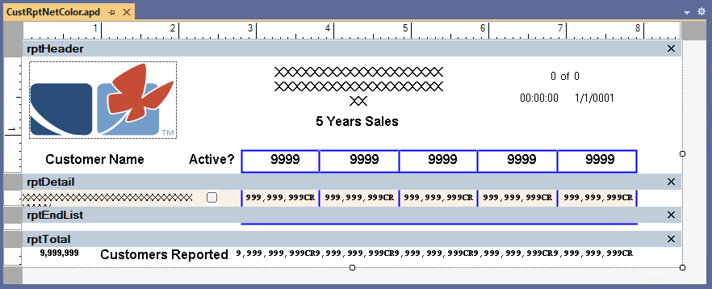
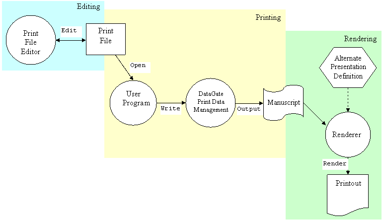
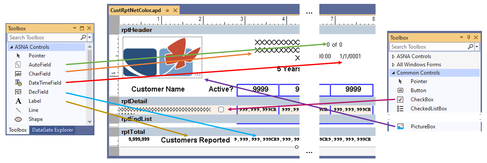

This document discusses the general concepts and some implementation details of DataGate Printer Files.

DataGate features Printer Files as multiple formatted files.  Each format of a Printer File describes a portion of a page.  When a report is to be made, writing these records causes a Renderer to ‘paint’ sections of each page on the report.

A Printer File is composed of one or more record formats, each defining a _template_ of what is to be shown in a segment of the page.  A record format is a collection of Fields and other Controls.  Fields and Controls are actual **.NET Framework**[^1] [Windows Forms Controls](//learn.microsoft.com/en-us/dotnet/desktop/winforms/controls/overview).

DataGate provides the following controls:
 - Data Fields:
   + CharField - Defines and prints a fixed length character field.
   + DecField - Defines and prints a fixed length Binary, Packed or Zoned decimal field.
   + DateTimeField - Defines and prints a Date, Time or Timestamp field.   
 - AutoField - Prints an Attribute of the report: Computer Name, Page Number or Count, Creation date/time, Process date/time.
 - Label - Prints a Constant character string.
 - Line - Prints a staight Line.
 - Shape - Prints a Rectange, Square, Oval or Circle.

In addition to the controls provided by DataGate it is theoretically possible to add to a record format any arbitrary .NET Framework Control, however, in practice only a few of them make sense to include on a printer file, most notably a [Windows.Forms.PictureBox](https://learn.microsoft.com/en-us/dotnet/api/system.windows.forms.picturebox).

The next image shows a Printer File with four record formats being edited in Visual Studio.

_Figure 1: DG Printer File in Visual Studio_

Some of the attributes of Printer Files are:
 + XML representation of the file definition.
 + Conditional attributes at the file, format and field level with the ability to provide an array of Booleans to programatically control certain properties.
 + Capability to direct the output to a text file (a Manuscript) where the data is formatted in XML instead of being printed.
 + Capability to provide alternate rendering engines to print without the use of the .NET Framework controls.

The following diagram shows the processes of editing, printing and rendering Printer Files and their output.

_Figure 2: DG Printer File &mdash; Edit, Print, Render_

## Creating and Editing a Printer File Defintion
DataGate provides an editor via the DataGate Printer File Designer to facilitate the creation and modification of Printer Files.  The editor is hosted inside Visual Studio and operates very similarly to a forms designer.  A developer can create new files and record formats with this editor.  A record format gets composed with fields taken from the tool palette where the developer will find DataGate provided controls and third party controls installed on the machine.

_Figure 3: Editing a Printer File with DataGate Designer_

An alternate way of editing a Printer File is to request the XML description from DataGate and manipulate it directly via normal XML processing; afterwards, a new Printer File can be created using the new XML description.

## Printing
To create a report, a user program issues operations against the Printer File.  After connecting to the database, the program opens the Printer File and as the program executes, multiple write operations against different record formats are made; additionally, the controls property values might be modify as part of the execution.  The write operations cause DataGate to record the values of fields and properties in a _manuscript_.

The manuscript is an XML document composed of four sections:
 1. Schema
 2. References
 3. Initial property values
 4. Document pages

The Schema defines the record formats and control fields found in the document pages. The References lists the .NET Assembly details of the Controls used in the Printer File. The third section lists the initial values of the properties of all controls, these values are equivalent to the design-time settings selected when the file was created.  Finally the actual data generated by the user program is recorded as a group of pages in the last section.  Each page is composed of one or more sections, corresponding to the record formats written, defining areas of the page to be printed.

When the Printer File is open, it is possible to provide an actual location to store the manuscript, if no location is provided then it is left to DataGate to determine a temporary disk location for the manuscript.

## Rendering
The final phase in the process of creating a report is the rendering of the manuscript.  A renderer sends the formated contents of a manuscript to a printer or a PDF file.  DataGate provides a default renderer program (Renderer.exe) which yields a printout produced to a Windows installed printer.  The Renderer can be executed automatically when a Printer File is closed or be invoked by an operator or application. There are command options that can be set to control certain aspects of the rendering operation when Renderer.exe is executed from the Command Line.

ASNA provides three renderers:
 1. DataGate Renderer
 2. Open.Renderer
 3. PDF.PrintRenderer

The [first two renderers](/manuals/hosting/mom/rendering-in-windows.html) depend on the Windows operating system as they direct their output to an Windows printer device, the printer can be a 'physical' printer or the _Microsoft Print to PDF_ &nbsp;'printer'. Both of them are also dependent on the .NET Framework.
 
The [third renderer](/manuals/hosting/mom/rendering-in-linux.html), `PDF.PrintRenderer`, creates a PDF document and is independent of the Windows OS. `PDF.PrintRenderer` is a .NET (Core) executable.

## Alternate Manuscript Uses

Having the manuscript formatted as an XML document makes it easy to create custom 'renderers' which can process the manuscript in arbitrary ways.  For instance a custom program can use the manuscript as input to a process that 'grabs' the data from the report much like a traditional report 'scraper' would.

---------- 

[^1]: Keep on reading as this is not a detriment to creating reports with .NET (Core).