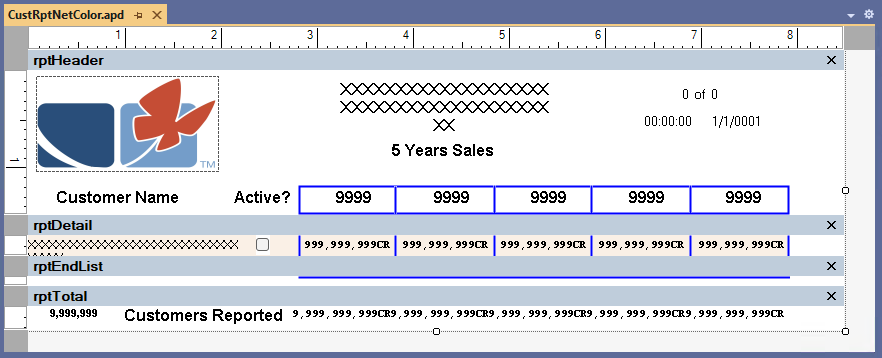
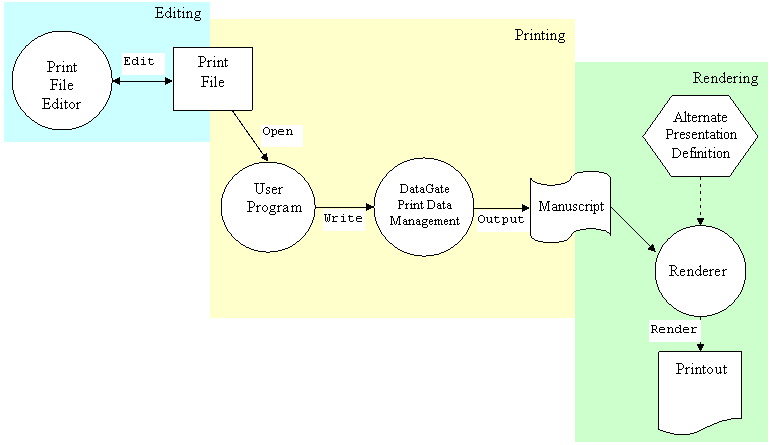
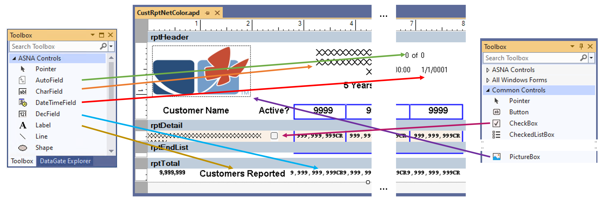
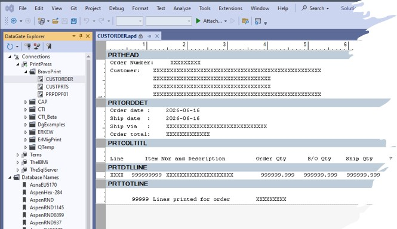
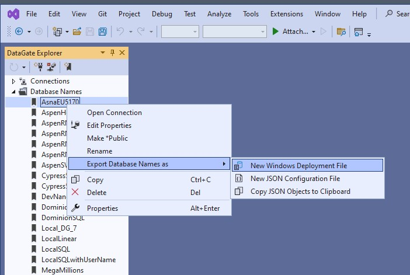
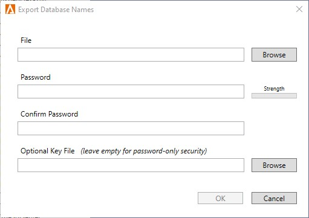

This document discusses the general concepts and some implementation details of DataGate Printer Files.

DataGate features Printer Files as multiple formatted files.  Each format of a Printer File describes a portion of a page.  When a report is to be made, writing these records causes a Renderer to ‘paint’ sections of each page on the report.

A Printer File is composed of one or more record formats, each defining a _template_ of what is to be shown in a segment of the page.  A record format is a collection of Fields and other Controls.  Fields and Controls are actual **.NET Framework**[^1] [Windows Forms Controls](//learn.microsoft.com/en-us/dotnet/desktop/winforms/controls/overview).

DataGate provides the following controls:
 - Data Fields:
   + CharField - Defines and prints a fixed length character field.
   + DecField - Defines and prints a fixed length Binary, Packed or Zoned decimal field.
   + DateTimeField - Defines and prints a Date, Time or Timestamp field.   
 - AutoField - Prints an Attribute of the report: Computer Name, Page Number or Count, Creation date/time, Process date/time.
 - Label - Prints a Constant character string.
 - Line - Prints a straight Line.
 - Shape - Prints a Rectangle, Square, Oval or Circle.

In addition to the controls provided by DataGate it is theoretically possible to add to a record format any arbitrary .NET Framework Control, however, in practice only a few of them make sense to include on a printer file, most notably a [Windows.Forms.PictureBox](https://learn.microsoft.com/en-us/dotnet/api/system.windows.forms.picturebox).

The next image shows a Printer File with four record formats being edited in Visual Studio.

_Figure 1: DG Printer File in Visual Studio_

Some of the attributes of Printer Files are:
 + XML representation of the file definition.
 + Conditional attributes at the file, format and field level with the ability to provide an array of Booleans to programmatically control certain properties.
 + Capability to direct the output to a text file (a Manuscript) where the data is formatted in XML instead of being printed.
 + Capability to provide alternate rendering engines to print without the use of the .NET Framework controls.

The following diagram shows the processes of editing, printing and rendering Printer Files and their output.


_Figure 2: DG Printer File &mdash; Edit, Print, Render_

## Creating and Editing a Printer File Definition
DataGate provides a dedicated editor—the **DataGate Printer File Designer**—to create and modify Printer Files. The designer runs inside Visual Studio and behaves much like a standard forms designer. Developers can create new Printer Files, define record formats, and add fields using the tool palette. The palette includes both DataGate‑provided controls and any compatible third‑party controls installed on the machine.


_Figure 3: Editing a Printer File with DataGate Designer_

Alternatively, developers can request the Printer File’s XML definition directly from DataGate, modify it using standard XML tooling, and then create a new Printer File from the updated XML.

### DataGate Studio in Visual Studio
Visual Studio is a native Windows application built partly on the .NET Framework and supports extensibility through .NET Framework–based extensions. ASNA provides one such extension: **DataGate Studio (DG Studio)**. DG Studio enables developers to create, inspect, and manage DataGate objects—including Printer Files.

DG Studio is a client‑side tool that communicates with a DataGate database server. In the .NET Framework version of DataGate, server connection information is stored in objects called **Database Names**. A Database Name encapsulates all the information required for a DG client to locate and authenticate with a server.

A Database Name includes attributes such as:
 - Location of the server
 - Database within the server
 - Credentials to access the Database
 - Initial Library List

Although the term is a bit redundant, a *Database Name* also has a **Name**—this serves as the identifier used by clients to reference the stored connection information.

DG Studio extends Visual Studio with several windows and tools. Two of the most commonly used are the **DataGate Explorer**, where Database Names and connections are managed, and the **Printer File Designer**, shown below.


_Figure 4: DataGate Explorer and Printer File Designer_

In DataGate for .NET (Core), the equivalent of Database Names is called **Database Sources**. These are typically stored in the `asnasettings.json` file located in the user’s profile at:
```
%LocalAppData%\ASNA\DataGate
```
(e.g., `C:\Users\<user>\AppData\Local\ASNA\DataGate` on Windows).

While Database Sources in `asnasettings.json` are stored in clear text, DataGate for .NET Framework stores Database Names in an encrypted file named `DatabaseNames.config`, also located under `%LocalAppData%\ASNA\DataGate`. The .NET Framework version also supports *public* Database Names, stored in:

```
%ProgramData%\ASNA\DataGate
```

(e.g., `C:\ProgramData\ASNA\DataGate`).

For more information, see:  
- **Introducing DataGate Print File Designer**  
  [https://docs.asna.com/documentation/Help180/PFD/_HTML/Welcome.htm](https://docs.asna.com/documentation/Help180/PFD/_HTML/Welcome.htm)  
- **Creating and Opening Database Connections**  
  [https://docs.asna.com/documentation/Help180/DGStudio/_HTML/dgCreatingNewConnection.htm](https://docs.asna.com/documentation/Help180/DGStudio/_HTML/dgCreatingNewConnection.htm)

---

### A Note on Moving the `DatabaseNames.config` File

`DatabaseNames.config` files are encrypted.  
- User‑specific Database Names are encrypted using the **user profile key**.  
- Public Database Names are encrypted using the **machine key**.

These files can become unreadable if the associated key changes—for example, when a user profile is recreated or when a virtual machine is moved to a different host.

To safely copy or move Database Names, **export them** using DG Explorer rather than copying the config file directly.


_Figure 5: Exporting a Database Name_

The export option displays a dialog where you can choose a destination file and specify a password to protect the exported Database Names.


_Figure 6: Export Database Name Dialog_

Keeping a copy of the exported Database Names is a good precaution in case of the `DatabaseNames.config` file become unreadable.

## Printing
To create a report, a user program issues operations against the Printer File.  After connecting to the database, the program opens the Printer File and as the program executes, multiple write operations against different record formats are made; additionally, the controls property values might be modify as part of the execution.  The write operations cause DataGate to record the values of fields and properties in a _manuscript_.

The manuscript is an XML document composed of four sections:
 1. Schema
 2. References
 3. Initial property values
 4. Document pages

The Schema defines the record formats and control fields found in the document pages. The References lists the .NET Assembly details of the Controls used in the Printer File. The third section lists the initial values of the properties of all controls, these values are equivalent to the design-time settings selected when the file was created.  Finally the actual data generated by the user program is recorded as a group of pages in the last section.  Each page is composed of one or more sections, corresponding to the record formats written, defining areas of the page to be printed.

When the Printer File is open, it is possible to provide an actual location to store the manuscript, if no location is provided then it is left to DataGate to determine a temporary disk location for the manuscript.

## Rendering
The final phase in the process of creating a report is the rendering of the manuscript.  A renderer sends the formatted contents of a manuscript to a printer or a PDF file.  DataGate provides a default renderer program (Renderer.exe) which yields a printout produced to a Windows installed printer.  The Renderer can be executed automatically when a Printer File is closed or be invoked by an operator or application. There are command options that can be set to control certain aspects of the rendering operation when Renderer.exe is executed from the Command Line.

ASNA provides [three Renderers](/manuals/hosting/mom/manuscript-renderer.html):
 1. DataGate Renderer
 2. ASNA.QSys.Renderer.WindowsOnly
 3. ASNA.QSys.Renderer.PDFOnly

The [first two renderers](/manuals/hosting/mom/rendering-in-windows.html) depend on the Windows operating system as they direct their output to an Windows printer device, the printer can be a 'physical' printer or the _Microsoft Print to PDF_ &nbsp;'printer'. Both of them are **.NET Framework** executables.
 
The [third renderer](/manuals/hosting/mom/rendering-in-linux.html), `ASNA.QSys.Renderer.PDFOnly`, creates a PDF document and is independent of the Windows OS. `ASNA.QSys.Renderer.PDFOnly` is a .NET (Core) executable.

As a convenience for deployment, ASNA provides a front-end program called `ASNA.QSys.Renderer` which will invoke one of the two ASNA.QSys.Renderers depending on the operating system where it is being executed.

## Alternate Manuscript Uses
Having the manuscript formatted as an XML document makes it easy to create custom 'renderers' which can process the manuscript in arbitrary ways.  For instance a custom program can use the manuscript as input to a process that 'grabs' the data from the report much like a traditional report 'scraper' would.

---------- 

[^1]: Keep on reading as this is not a detriment to creating reports with .NET (Core).