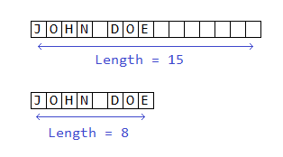

IBM i RPG applications were coded using a [Fixed Type System]({{ site.rooturl }}/ibmi-fixed-types/).

Fixed types are those than when *serialized* to a *flat* representation, the length of the serialized object is known in advance and does not change.

The easiest way to visualize this concept, is by comparing an `RPG Char` field with a `C# String field`.

Both are designed to hold *Text* values.

Consider the following declarations[^1]:

```cs
DclFld CustomerName Char(15)
```

and

```cs
string CustomerName; 
```

If we later assign the value "JOHN DOE" to `CustomerName`, with the same instruction for both:

```cs
CustomerName = "JOHN DOE"; 
```

We can safely picture a memory representation of the *serialized* types, like in the following image:


 
In RPG, the *Serialized* buffer representation in memory of the field `CustomerName`, will be *fixed* to 15 positions. When moving constant values to the field, there are operations to **Move** it to the *left* or to the *right* (appending or pre-pending with blank char values).

In most of modern General Purpose languages, such as C#, the length of the *serialized* memory representation will be *variable*, depending on the data.

Both approaches have their [advantages]({{ site.rooturl }}/ibmi-fixed-types/) and disadvantages. 

The *fact* is that their are incompatible and a *new* type system is required to make it possible for the *mapping* logic spread-out in the Business Logic, to continue executing providing the same results.

`ASNA QSys` makes available four `Scalar Types` that provide similar *declarative syntax* as RPG, can be used with the *assumed* mapping as RPG, and can be easily converted to the .NET types when appropriate.

> In the next sections, we will show the practical use of `ASNA.QSys Fixed` Types. We will not get into the internal implementation which may be more confusing than practical. If you have a license to the Reference Source, you are welcome to research how the `ASNA.QSys Fixed` works.

## ASNA.QSys Fixed Type Syntax

The `ASNA.QSys Fixed` Types use the [C# generics](https://docs.microsoft.com/en-us/dotnet/csharp/programming-guide/generics/) syntax which uses "`<`" and "`>`" to pass to the C# compiler information about *Length* and *Precision*. 

Since we need to pass more than one specifier, comma "`,`" is used to separate information.

As we discussed in previous sections, the use of *Fixed* Types in C# is extremely unusual. ASNA engineers have found a clever way to use existing C# constructs to express how the compiler should generate the *Fixed* Types.

`ASNA.QSys` namespace defines symbols that represent *Length* and *Precision* values to the C# internal generic structure implementation.

These symbols have a "`_`" (underscore) prefix, followed by the value they intend to represent [^2]

To indicate a length: `25` ...

To be used while declaring a `Fixed` **Char(25)** field, 

use: `_25` (*underscore* followed by a number) inside the `< >` generic list syntax, 

for example, in the declaration: `FixedString<_25> CustomerNumber;`

`ASNA.QSys` namespace defines symbols representing the first 100 values: `_1`, `_2`, `_3` ... `_99` [^3]

> If you need to specify more than one two-digit value, use commas, as in: `FixedString<_1, _2, _5> description;`

## ASNA.QSys.FixedString
Synopsis
: Type for fixed length text values.

Declaration Syntax
: `FixedString<length> myFixedCharField`;

## ASNA.QSys.FixedDecimal
Synopsis
: Type for fixed decimal point numeric values.

Declaration Syntax
: `FixedDecimal<length,precision> myFixedDecimalField`;

## ASNA.QSys.FixedTime
Synopsis
: Type for fixed date/time values.

Declaration Syntax
: `FixedTime<TimeFormat,separator> myFixedDateField`;

## ASNA.QSys.FixedTimestamp
Synopsis
: Type for fixed date/time stamp values.

Declaration Syntax
: `FixedTimestamp<separator> myFieldTimeStampField`;

>For more details on usage, read [ASNA.QSys Reference Documentation]().
   
<br>   
## ASNA.QSys Fixed Type C# extensions

`ASNA.QSys` shine when they are used in expressions (including assignment), where all the data conversion to the appropriate internal or C# types happens without obscuring the simplicity of the legacy code.

For example, the following simple expressions:

```cs
    FixedDecimal<_13, _2> Sales = 0;
    FixedString<_13> SalesCh;

    Sales = Sales + 1492.60;
    SalesCh = Sales.MoveRight(SalesCh);
```

Which came from an RPG Source-member similar to this code:

```
0015.00     D Sales           S             13P 2
0019.00     D SalesCh         S             13A

0078.00     C                   Eval      Sales = 0    
0078.00     C                   Eval      Sales = Sales + 1492.60    
0068.00     C                   Move      Sales         SalesCh
```

Would produce **several** intermediate instructions to map and convert Sales fixed decimal value, perform operations as a standard C# `decimal` primitive type, round or truncate the values to two decimals, and convert the result to a fixed string with blanks padded to have the exact length of 13 positions.

`ASNA.QSys` Fixed types makes available to the C# developer all the expected [extension methods](https://docs.microsoft.com/en-us/dotnet/csharp/programming-guide/classes-and-structs/extension-methods) to adjust fixed values, including:

* MoveLeft (with out without padding)
* MoveRight (with out without padding)
* RemoveDate
* RemoveTime

> In addition to implicit conversions to and from C# `string`, `decimal` and `DateTime` types.


<br>
<br>
<br>

[^1]: For RPG we use ASNA AVR Syntax.

[^2]: The symbols are C# *interfaces*. To use the syntax, there is no need to *understand* how the internal implementation works.

[^3]: `_0` is also defined, used to specify more than one digit value, such as `_2, _0, _5`.

