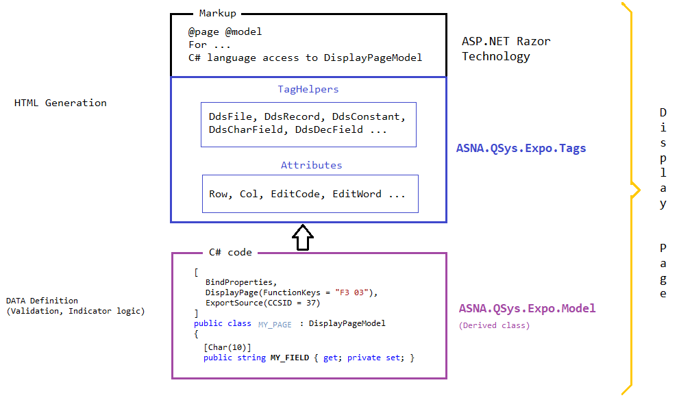

An `ASNA.QSys Expo Display Page` is a [ASP.NET RazorPage](https://en.wikipedia.org/wiki/ASP.NET_Razor) that uses ASNA.Expo *TagHelpers* to Render a [Workstation file](/concepts/user-interface/qsys-workstationfile.html/) using a flexible Grid Layout suitable to present *with fidelity* an [IBM i Displayfile](https://www.ibm.com/support/knowledgecenter/en/ssw_ibm_i_72/rzakc/displ.htm). 

## ASNA.QSys.Expo Assembly
ASNA.QSys.Expo is the implementation of the Application Presentation Layer. *Present*, *Expose* or *Exhibit* on Display, this is where the `Expo` name came from. 

The ASNA.QSys.Expo Assembly is the subsystem of ASNA.QSys that implements the classes to Render a [Workstation file](/concepts/user-interface//qsys-workstationfile/) on a Web Page.

The ASNA.QSys Expo Display Page extends the [ASP.NET 5 Websites](/concepts/user-interface/asp-net-websites.html/) model, providing [DDS-like](https://www.ibm.com/support/knowledgecenter/en/ssw_ibm_i_72/rzakc/kickoff.htm) TagHelpers.

ASNA.QSys.Expo.Tags
: DDS-like Presentation TagHelper implementation.

ASNA.QSys.Expo.Model
: Thin *data layer* implementation. Defines the `WorstationFile` *DataSet*.

## ASNA.QSys "Display Page" vs IBM i "Displayfile"

**SIMILARITIES**

*Separation of concerns* - Both architectures are based on the principle that separating "presentation" and "business logic", is a technique that simplifies complex application design.

**DIFFERENCES**

ASNA.QSys "Display Page" is more strict than IBM i "Displayfile" as to where *data* is defined.

Displayfiles on IBMi mix declarations of fields and specifications of constants on the same source file.

> There is no equivalent of distinct `DisplayPageModel` concept on the IBM i.

Being able to describe the *data* definition outside of the *markup* definition, particularly using a [strict typed](https://en.wikipedia.org/wiki/Strong_and_weak_typing) language has several advantages:

1. Smart editors increase productivity. Strict type checking saves a lot of time. Fixing DDS compiler errors on IBM i is challenging and time-consuming. 

2. Visualizing the *DataSet* is easier when the source code does not have constants mixed-in.

3. The size of the *Markup* source file can be reduce in the data definitions are moved to a separate source file.

4. PageModel code is more *testable*. Automated testing can me developer by instancing *only* the model, and feeding it programmatically without the need of a - complex - rendering engine such as a *Web Browser*.

 
## ASNA.QSys DataSet

The ASNA.QSys DataSet is not a special class defined in any of the ASNA.QSys assemblies. It is more a *Design Concept*.

As explained in the [topic ASNA.QSys WorkstationFile ](/concepts/user-interface/qsys-workstationfile.html/), the ASNA.QSys DataSet is the component in the Application architecture that is shared between the "Presentation Layer" and the "Business Logic".

ASNA.QSys uses the [.NET Dataset class](https://docs.microsoft.com/en-us/dotnet/api/system.data.dataset?view=net-5.0) with the following considerations:

1. Each *Active* Record becomes a **DataTable** in the collection of Tables.
2. There are two types of records:
    1. *Multiple-Row* Records - Used for `DdsSubfileRecord`
    2. *Single-Row* Records - Any other Record (except for the `DdsSubfileRecord`).
3. Uses DataSet *Extended Properties* are used to store [metadata](https://en.wikipedia.org/wiki/Metadata) with state information such as: *"last-record-written", "is-subfile", "field-definition", "direction", "byte-length", "byte-offset"*, etc.

> ASNA.QSys DataSet is independent and self-contained and can be serialized to be transferred (even across the wire to another location) and reproduced in its entirely.

When discussing the ASNA.QSys DataSet, we often refer as to the **green** component in the architecture, as depicted by the image below:

The **green** *DataSet* component can travel across *ALL* the different layers in the Application architecture. It is not accessed directly or in the same manner by the different layers - most frequently accessed in pieces - but the component as a *unit* is: built, transferred and re-constituted frequently - as the application executes -.

Even external Nomad Tools deal with the **green** *DataSet* component, to build static representations: (like XFU files) or even to re-generate C# code (Program partial I/O classes).