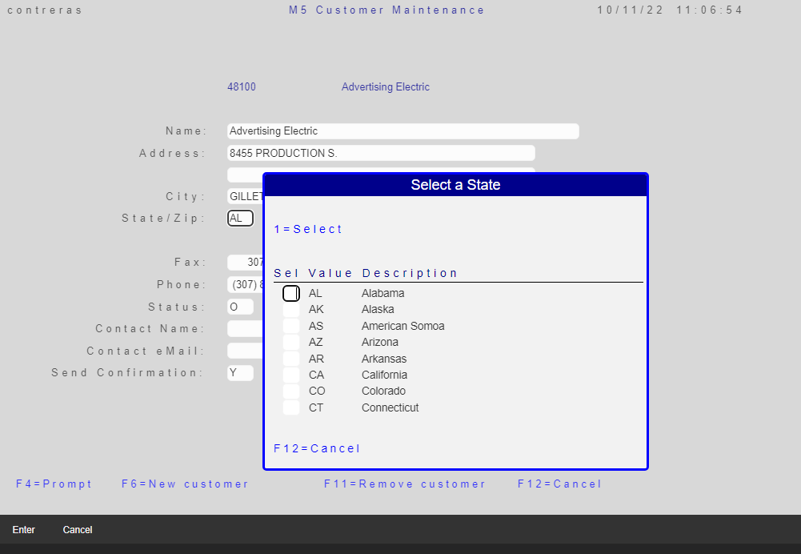
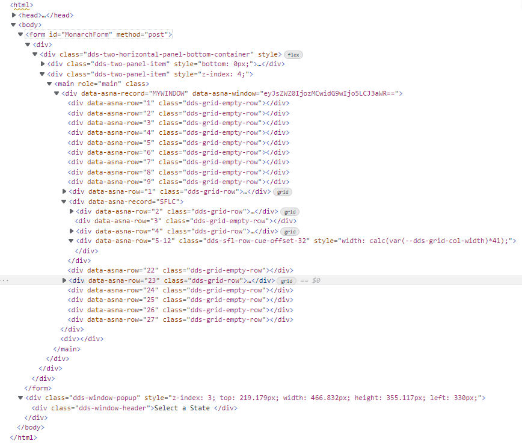

## IBM i DDS WINDOWS

IBM i DDS Keyword [WINDOW](https://www.ibm.com/docs/en/i/7.2?topic=80-window-window-keyword-display-files) is a *record-level* keyword to specify that the record format you are defining will be displayed using a window.

A DDS WINDOW defines a rectangular area on the grid screen commonly specified by a starting position (*upper-left* corner of the rectangle), a *height* (vertically occupying rows), and a *width* (horizontal columns).

For example, the following fragment of [DDS](https://www.ibm.com/docs/en/i/7.2?topic=dds-display-files) specifies a display *record* named `WINDOW1` with two fields:

```
     A          R WINDOW1                   WINDOW(4 20 9 30)
     A            FIELD1         8A  B  2 10
     A            FIELD2        10A  B  6 10
```

When the `WINDOW1` record is displayed, the *upper-left* corner of the window border is on row 4 column 20 of the display. The *lower-right* corner of the border is located 10 rows lower than the upper border and 33 columns to the right of the left border.

* *Lower* border row = *upper* border row + *height* (window-rows) + 1
* *Right* border column = *left* border column + *width* (window-columns) + 3

The `FIELD1` field starts 2 rows lower than the upper border and 11 columns (the ending attribute byte for the border character has been taken into account) to the right of the left border character (row 6, column 31 on the display).

* Actual field row = upper border row + row number of field
* Actual field column = left border column + column of field + 1

The `FIELD2` field starts 6 rows lower than the upper border and 11 columns to the right of the left border (row 10, column 31 on the display).

The following image shows the *green-screen* (terminal) rendering:


>The WINDOW frame shown in this picture does not appear in the Terminal screen - given the simple `DDS` listed above -. It is presented here for visualization clarity. The number guides for rows and columns are also not part of the screen output. Applications generate frames, title etc. using character screen attributes and other keywords such as: `WDWBORDER`, `WDWTITLE`.

### Overlaying Window records

It is very common to use `WINDOW` records that Overlay on top of other records currently displayed in the Page (See [OVERLAY](https://www.ibm.com/docs/en/i/7.2?topic=80-overlay-overlay-keyword-display-files) ).

You use this *record-level* keyword to specify that the record format that you are defining should appear on the display without the entire display being deleted first.

## Expo Overlapping WINDOW Anatomy

To describe how the legacy Displayfile rendering is implemented using RazorPage technology, let's use a real scenario.

>This topic assumes you have read [Expo DDS-like TagHelpers](qsys-expo-dds-elements.html)

An application presents a Page with *CUSTOMER MAINTENANCE* records, and enables `F4` command key to present a `WINDOW` that overlaps on the page.


When the cursor is located to the State/Zip: input field, and `F4` command key is pressed, the following Page is presented.



The Displayfile for the WINDOW record, is described in a file called `AppViews\Pages\CUSTPRMP.cshtml` and has the following contents (only a section presented to simplify explanation)

```html
<form id="MonarchForm" method="post">
    <DdsFile DisplayPageModel="Model" KeyNames="F12 'Cancel';" >
        <DdsFunctionKeys Location="HorizontalBottom" />

        <main role="main" class="display-element-uninitialized">
            <DdsRecord For="MYWINDOW" WindowLeftCol=30 WindowTopRow=9 WindowWidthCols=43 WindowHeightRows=14 WindowTitle=@Model.MYWINDOW.WINTITLE>
                @{
                    int SFLC_SubfilePage = 8;
                }
                <DdsSubfileControl For="SFLC"  SubfilePage="@SFLC_SubfilePage" ShowRecordNumber="(int)@Model.SFLC.SFLRRN" CueCurrentRecord=true ClickSetsCurrentRecord=true>
                    <div Row="2">
                        <DdsConstant Col="2" Text="1=Select" Color="Blue" />
                    </div>
                    <div Row="4">
                        <DdsConstant Col="2" Text="Sel Value Description                     " Color="DarkBlue" Underline="*True" />
                    </div>
                    <div Row="5" RowSpan="@SFLC_SubfilePage">
                        @for (int rrn=0; rrn < Model.SFLC.SFL1.Count; rrn++)
                        {
                            int row = 5 + rrn;
                            <DdsSubfileRecord RecordNumber="rrn" For="SFLC.SFL1">
                                <DdsDecField Col="3" For="SFLC.SFL1[rrn].SFLSEL" VirtualRowCol="@row,3" EditCode="Z" tabIndex=@pageTabIndex++ />
                                <DdsCharField Col="6" For="SFLC.SFL1[rrn].SFLVALUE" />
                                <DdsCharField Col="12" For="SFLC.SFL1[rrn].SFLDESC" />
                            </DdsSubfileRecord>
                        }
                    </div>
                </DdsSubfileControl>
                <div Row="14">
                    <DdsConstant Col="2" Text="F12=Cancel" Color="Blue" />
                </div>
            </DdsRecord>

            <DdsMessagePanel />
        </main>
    </DdsFile>
</form>
```

As you can see in this Markup listing, only the record `MYWINDOW` which contains the `Subfile` which is used to populate with the database list that contains the US Zip codes is presented in this Displayfile, the `Previous` pages are not in this Displayfile.

One way of describing the complex implementation of the Overlapping WINDOW Anatomy, is by removing the different layers and build it up as we go.

Let's assume there are NO prior records (in this Displayfile or from any other Displayfile). 

Displaying (Executing record format `MYWINDOW` from the App Logic), would show the following screen:


If you have followed the [Expo DDS-like TagHelpers](concepts/user-interface/qsys-expo-dds-elements.html) topic, the following HTML rendering should be familiar:



>The screen-shot has been simplified for clarification. Large attribute data cut and some elements (not relevant to discussion) have been omitted.

Focus in the `<main role="main"` branch. You should identify the record `MYWINDOW` that contains subfile-controller record `SFLC` with rows 2 and 4 (which render the constants `1 = Select` and `Sel Value Description` header) and the Subfile records on Rows 5-12.

>The private attribute `data-asna-row` on `DIV` elements is not actually used, it is there for documentation (to assist searching for elements while exploring the page using Development tools).

### How is the WINDOW offset achieved?

The `DdsRecord` has a property `WindowTopRow` with value equals to `9`. According to [WINDOW Keyword on IBMi Manual](https://www.ibm.com/docs/en/i/7.1?topic=80-window-window-keyword-display-files), the fields are displaced-down by the `WINDOW` *start-line* (+1), the [Expo Client JavaScript](qsys-expo-client-library.html) page-initialization code will inject `10` **empty-row** filler `DIV` elements to push the Window record down.

As far as the horizontal offset (column), the CSS `grid-column-start` is adjusted by the page JavaScript initialization code. 


>Subfile record *highlighting* has more complexity, but the topic is outside the scope of this documentation.


### How is the Window Frame implemented?
As you may have noticed, each Page *Row* uses [CSS Grid Layout](https://developer.mozilla.org/en-US/docs/Web/CSS/CSS_Grid_Layout), futhermore, *Rows* are independent from each other (to facilitate enhancing paging by adding elements that are larger than the size of a grid-cell, and or have different Layout).

HTML does not provide a way to *Group* selected Grid-positioned elements across different elements (each with a separate Grid Layout), such as the architecture used by Expo to render Displayfiles.

The usual techniques to add frames to elements using `CSS` styles is **not possible** given how *Rows* are implemented. 


>Elements that are not strictly part of *main* role are rendered outside of the `<form>` branch. This makes it easier to explore HTML (without distraction). 

We want to focus our attention to the Window Frame implementation, which happens to be in this *outside* area of the HTML.

The image above show the `div.dds-window-popup` element selected and you can see that it uses the following CSS style, plus has an inline style with several important attributes.

```css
.dds-window-popup {
    position: absolute;
    background: var(--popup-background);
    display: block;
    border: var(--popup-border-width) solid var(--popup-background);
    border-radius: 5px;
    text-align: center;
}
```

The most important style of this class is the `position` property. It is set to `absolute`, to allow us to place it in an area that expands multiple Rows, with precision.

An `absolute` positioned element requires explicit specification of the rectangle where this element will take place. That is:

* left
* top
* width
* height

The computation of the values of these four properties is done based on the [Bounding Client Rect](https://developer.mozilla.org/en-US/docs/Web/API/Element/getBoundingClientRect) function provided by the Browser's [DOM](https://developer.mozilla.org/en-US/docs/Web/API/Document_Object_Model), given strategic cells on the interested area (spanning multiple *Rows*). That is, currently positioned cells at the *upper-left* and *lower-right* corners of the WINDOW on the screen.

>If no elements exist right at those corners, two are created with a blank (just to use them as reference).

Once the `window-popup` element is created in the right place, a [z-index](https://developer.mozilla.org/en-US/docs/Web/CSS/z-index) is selected, to display the `window-popup` behind the *Rows* (but above the *record formats in background* - from previous overlaid records).

### Where is the Window Title?

Now that we have a Window `html` element properly positioned in the Page, we can easily create a child `DIV` with the Title as contents, with the following style:

```css
.dds-window-header {
    height: var(--popup-header-height);
    line-height: var(--popup-header-height);
    color: white;
    background-color: darkblue;
}
```

And the Window with its Tile is rendered as:

```html
<div class="dds-window-popup" style="z-index: 3; top: 219.179px; width: 466.832px; height: 355.117px; left: 330px;">
   <div class="dds-window-header">Select a State</div>
</div>

```

## Preserving Records from Prior Pages

Here comes the toughest part of the Design.

`CSS` provides a simple and straightforward approach to display information in the background of Pages, provided that this information comes in the shape of solid-colors or an *image*.

It would be wonderful if before submitting a request to the server (Enter of Command key), we could take a snapshot of the current contents of the `Main HTML` branch. We could save it in a session storage in the Browser, restore it when a new WINDOW page is about to be presented as part of the Server Response and *Voilà* we have accomplished our goal.

Sadly, the [DOM](https://developer.mozilla.org/en-US/docs/Web/API/Document_Object_Model) does not provide functionality to take pictures of the current Page.

