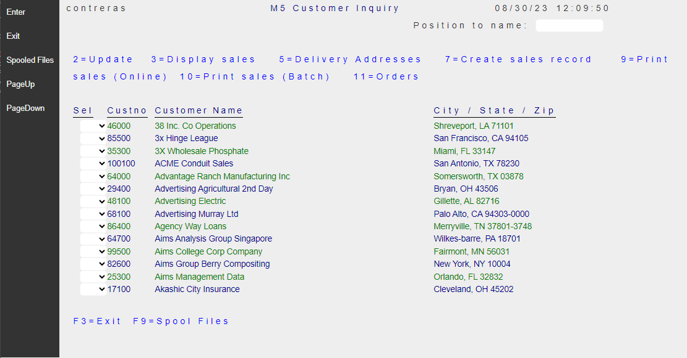
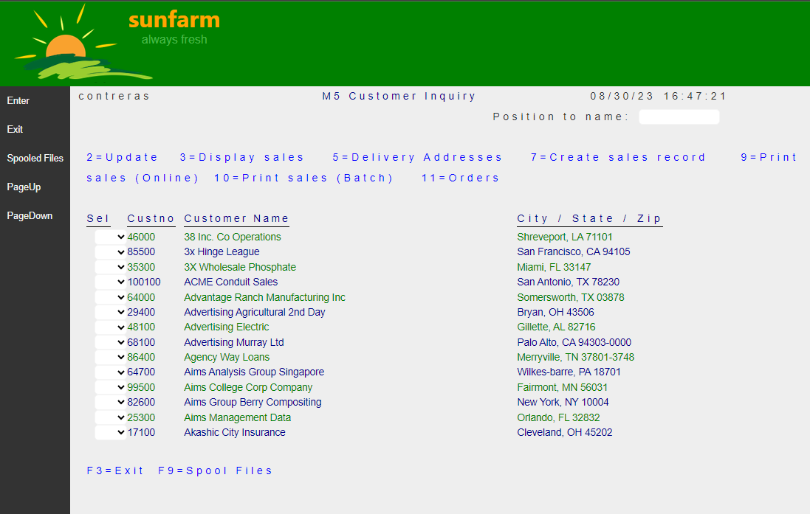

## Source

You can get the [GitHub Source Files](https://github.com/asnaqsys-examples/sunfarm-ui-enhancements) here.

## Overview

[App Branding](https://www.asynclabs.co/blog/digital-design/what-is-a-brand-app-and-why-your-business-needs-it/) is the process of creating the personality of a product. App branding is how users perceive the app, its reputation, communication, and visual image.

The simplest Branding consists on presenting an image in the Page heading on **All** pages.

As we [described in previous topic](/examples/sunfarm/enhance-remove-reverse-image.html) we are assuming the name of the Modernized App is "sunfarm".

Let's proceed to add a Logo to the App in a shared place where it can be used by **All** Pages.

## Application Logo Branding

This is what we want to see at the top of any of our App pages:


As simple as it may seem, this presents some challenges:

1. We want the graphics (sun and foliage) to blend-in with green background (no border on image).
2. The name "sunfarm" should be rendered without distortion (high quality) on any device.
3. The company "motto" (always fresh) should have some transparency to reduce the label importance. Also rendered without distortion (high quality) on any device.

There are several ways to achieve our goals.

We use the following [static content](https://en.wikipedia.org/wiki/Static_web_page):

1. An image of a sunrise. A raster png format image, designed with transparency. 


2. Two lines of text:

   Application name (“sunfarm”)

   Company Motto (“always fresh”)

The folder that contains Website Assets (including static content) is called `wwwroot` in ASP.NET 

The raster image (sun-farm.png) is stored in `~/wwwroot/images` folder.

We define a few Styles by adding the following definitions to `~/wwwroot/css/site.css` file:

```css
#logo-banner {
    height: auto;
    background-color: green;
}

#logo {
    padding-left: 1rem;
}

#logo-text {
    display: inline-block;
    vertical-align: top;
    margin-left: -3rem;
}

#logo-title {
    color: orange;
    font-size: xx-large;
    font-family: system-ui;
    font-weight: bolder;
}

#logo-subtitle {
    text-align: center;
    color: lightgreen;
    font-size: medium;
    opacity: 0.5;
}
```

The structural design of our Logo Horizontal Banner is:

1. A division horizontal with a green background (`logo-banner` style).
2. Inside that division, the image with some padding on the left (`logo` style).
2. Next to the image (on the same 'line'), a division with the two legends. Notice how this division is overlapped on the image such that it appears part of it (`logo-text` style).

Or in `HTML` syntax: 

```html
    <div id="logo-banner">
        
        <div id="logo-text">
            <div id="logo-title">sunfarm</div>
            <div id="logo-subtitle">always fresh</div>
        </div>
    </div>
```

We need to place this markup in the `Layout` used by all the Razor Pages of our site, conveniently named `_Layout` and stored in the following *Shared* location:

`
~SunFarmSite\Pages\Shared\_Layout.cshtml
`

```html
<!DOCTYPE html>
<html>
<head>
    <meta charset="utf-8" />
    <meta name="viewport" content="width=device-width, minimum-scale=1.0, maximum-scale=1.0" />
    <meta name="google" content="notranslate" />
    <title>@ViewData["Title"] - ExpoSite</title>

    <link rel="stylesheet" href="~/lib/asna-expo/css/expo.css" />
    <link rel="stylesheet" href="~/css/site.css" />
</head>
<body>
    @* --- Logo Branding on ALL Pages --- *@
    <div id="logo-banner">
        
        <div id="logo-text">
            <div id="logo-title">sunfarm</div>
            <div id="logo-subtitle">always fresh</div>
        </div>
    </div>
    @* ---------------------------------- *@

    @RenderBody()

    <script type="module">
        import { Page } from '../lib/asna-expo/js/asna.js';

        Page.init({ formId: 'MonarchForm' });
    </script>

    @RenderSection("Scripts", required: false)
</body>
</html>
```
 
>Note: the new HTML code indicated with `@*` comments `*@`. The rest was already defining the existing Layout.


## Results

| Before | After |
| :-: | :-: |
|  |  |

