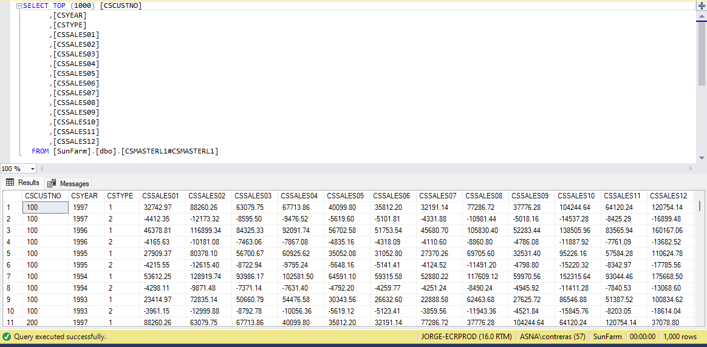
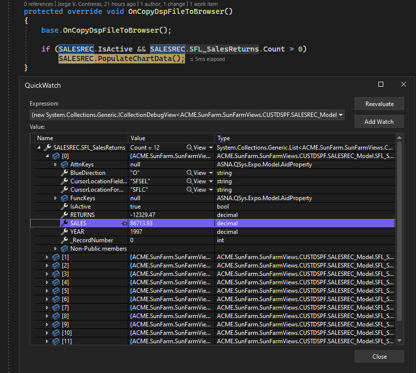
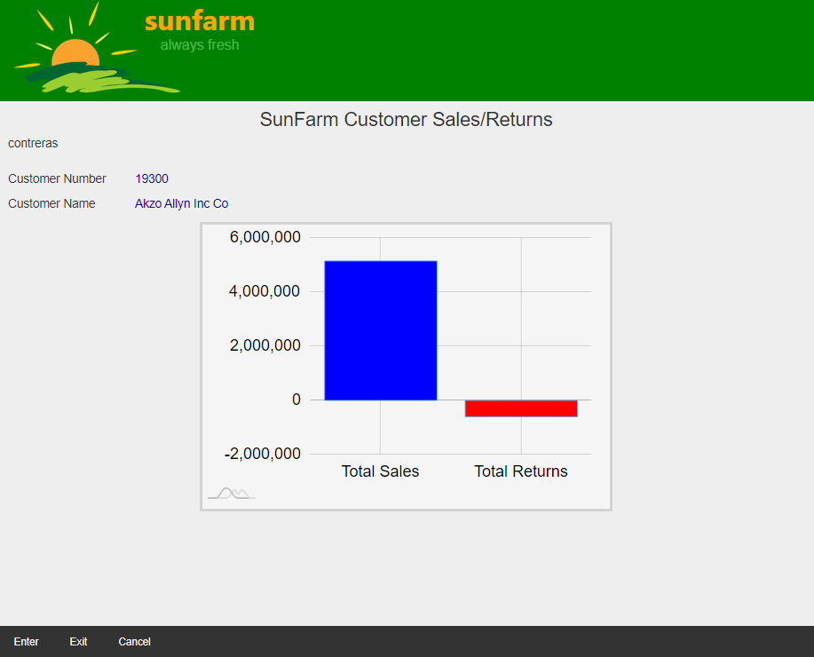

## Source

You can get the [GitHub Source Files](https://github.com/asnaqsys-examples/sunfarm-logic-enhancements) here.

## Overview

Sometimes a program requires reading from additional database files to collect more data that we want to present to the user.

On the Sales/Returns Page, instead of showing in the Chart **totals** for Sales and Returns for a given Customer, we would like to show a year's full of information with monthly data (the last year registered). The new chart is useful to show performance trends.

## Reading from additional database files

We start with a program `CUSTINQ` which calls `CUSTCALC` to compute Total Sales and Returns. 
`CUSTINQ` does not have direct access to the `CSMASTER` (Customer Sales/Returns Master File).

There is a Logical file, namely `CSMASTERL1` that would give us a *view* of the Customer Sales/Returns Master File in the sorting we need - by customer number - to collect the yearly data. The following image shows the first ten records:



Since we have the source file for `CUSTCALC`, we can copy code to bring this Logical file to `CUSTINQ`.

We need to copy:
1. Declaration of the file.
2. Code to explicitly open the file.

>Note: `CUSTINQ` closes **All** files when de-activated. This will include the new file.

We add the declaration along with the current file declarations, at the top of the class declaration:

```cs
DclDiskFile CSMASTERL1  Type(*Input) Org(*Indexed) DB(MyJob.MyDatabase) File("*LIBL/CSMASTERL1") ImpOpen(*No) RnmFmt( RCSMASTL1 )
```

We add code to open the new file in the class constructor:

```cs
Open CSMASTERL1 DB(CurrentJob.Database)
```

We leave the call to `CUSTCALC` in case we decide to show *Totals* in the future (and as a reference for this example to contrast the code changes).

```cs
BegSr SalesInfo
    ClearSel()

    CMCUSTNO = SFCUSTNO
    LockRec = "N"
    CustChk()

    CmCust# = CMCUSTNO
    Move CMCUSTNO CmCust#CH
    Move *Zeros SalesCh
    Move *Zeros ReturnsCh
    CallD Pgm( "ACME.SunFarm.CUSTCALC"  )  LR(*IN88)
        DclParm CmCust#CH
        DclParm SalesCh
        DclParm ReturnsCh

    SFNAME = CMNAME
    Move SalesCh SFSALES
    Move ReturnsCh SFRETURNS

    DoUntil ( *IN03 *Or ( *IN12) )
        LoadSalesAndReturns()
        ExFmt SALESREC 
    EndDo

    SetOff *IN03 // Reset the exit ind.
EndSr
```
>Note a call to a new subroutine named `LoadSalesAndReturns`. The rest of the code remains basically the same. 

There is one more valuable piece of code we want from `CUSTCALC`. Since we are collecting twelve months worth of data from the record at a time, it is convenient to declare a *Data structure* that will allow us to map all the values into an array:

```cs
DclDs CUSTSL ExtDesc(*Yes) DbDesc(MyJob.MyDatabase) FileDesc("*LIBL/CSMASTER")
    DclDsFld YearlySales Type( *Packed  ) Len( 11 ,2 ) Dim( 12 ) StartAt(11)
```

>Each time we read from the `CSMASTER` file, the `YearlySales` array will be populated with the values from fields `CSSALES01` to `CSSALES12` (positioned together starting at position 11 in the record buffer). 

## Collecting the data read using a twelve dimensioned array.

As you can see in the previous image, `CSMASTERL1` has sales and returns records for full-years (January to December). Field `CSYEAR` indicates the year where this data was recorded. `CSTYPE` indicates if the record belongs to *Sales* or *Returns* (`1` or `2`). Finally, field `CSCUSTNO` groups the records by Customer number.

The logic we need is as follows:
1. `CHAIN` (*position to*) the first record belonging to the requested Customer (`CMCUSTNO`).
2. Depending on the value of `CSTYPE`, the record will have either Sales or Returns information.
3. Save the *Year* value (database field `CSYEAR`) into field variable `LastRecordedYear`.
4. If this is the first time in the loop, save the monthly values (fields `CSSALES01` to `CSSALES12`).
5. Else compare the last record's `CSYEAR` with the `LastRecordedYear`, if the year is greater or equal to the previously read year, update `LastRecordedYear` and save the yearly data: for Sales use `LastRecordedYearSales`, for Returns use `LastRecordedYearReturns`.
6. Read the next record going back to step 2. until no more records matching the same Customer exist.

The EncoreRPG is the following:

```cs
BegSr LoadSalesAndReturns

    DclArray LastRecordedYearSales Like(CSSALES01) Dim(12)
    DclArray LastRecordedYearReturns Like(CSSALES01) Dim(12)
    DclFld LastRecordedYear Like(CSYEAR)

    LastRecordedYear = 0
    
    SetLL RCSMASTL1 Key(CMCUSTNO)
    ReadE From(RCSMASTL1) Key(CMCUSTNO) Eof(*IN03)
    
    DoWhile ( *Not *IN03)
        
        If CSYEAR *GE LastRecordedYear
            LastRecordedYear = CSYEAR
            
            If CSTYPE = SaleEvent 
                LastRecordedYearSales = YearlySales
            Else
                LastRecordedYearReturns = YearlySales
            EndIf
        EndIf
        
        ReadE From(RCSMASTL1) Key(CMCUSTNO) Eof(*IN03) // Read Next
    EndDo

    If LastRecordedYear *GT 0 
        // We found the yearly values we were looking for!
    EndIf

    .
    .
    .

```

## Using a second Subfile in the Display file to populate the UI Model record

We use a subfile to communicate the yearly data collected (in the Application Logic) to the Sale's record Model class (in the Website project).

We need the following new code:
1. Declaration of the Subfile in the UI Model class.
2. Since we are using a subfile in `SALESREC` we need to change the `SALESREC_Model` type from [RecordModel](/reference/asna-qsys-expo/expo-model/record-model.html) to [SubfileRecordModel](/reference/asna-qsys-expo/expo-model/subfile-record-model.html).
3. Update the RazorPage to reflect the changes in the [DisplayPageModel](/reference/asna-qsys-expo/expo-model/display-page-model.html) (done in step 2).

### WEBSITE CHANGES

The `SALESREC_Model` defines the following fields:

```cs
[Char(10)]
public string SCPGM { get; private set; }

[Dec(6, 0)]
public decimal SFCUSTNO { get; private set; } // CUSTOMER NUMBER

[Char(40)]
public string SFNAME { get; private set; }

[Dec(13, 2)]
public decimal SFSALES { get; private set; }

[Dec(13, 2)]
public decimal SFRETURNS { get; private set; }
```

Right after `SFRETURNS` we define the subfile as follows:

```cs
public class SFL_SalesReturns_Model: SubfileRecordModel
{
    [Dec(4, 0)]
    public decimal YEAR { get; private set; }

    [Dec(11, 2)]
    public decimal SALES { get; private set; }

    [Dec(11, 2)]
    public decimal RETURNS { get; private set; }
}
```

The `SALESREC_Model` is defined as:

```cs
public class SALESREC_Model : RecordModel
{
```

We need to upgrade it to include the `SFL_SalesReturns_Model`:

```cs
public class SALESREC_Model : SubfileControlModel
{
    public List<SFL_SalesReturns_Model> SFL_SalesReturns { get; set; } = new List<SFL_SalesReturns_Model>();

```

Now that `SALESREC_Model` is complete, lets update the tagHelper in the RazorPage's matching declaration:

The Razor Page refers to the `SALESREC` using the following markup:

```html
<DdsRecord For="SALESREC" StretchConstantText=false KeyNames="F12 'Cancel';" ExcludeEmptyRows="6-20">
```

We need to upgrade it to match the Model by changing the tagHelper from `DdsRecord` to `DdsSubfileControl`:

```html
<DdsSubfileControl For="SALESREC" StretchConstantText=false KeyNames="F12 'Cancel';" ExcludeEmptyRows="6-20">
```

If we recompile the Website, the new subfile is **now available** to the Application logic, were records will be written with yearly Sales and Returns information.

>Note: When new fields are added to the [DisplayPageModel](/reference/asna-qsys-expo/expo-model/display-page-model.html) class, the RazorPage has more fields available to display, but it **is not required that the fields are used**. We will see later in this Example how we will pass this new information directly to the Chart object.

### WRITING SUBFILE RECORDS IN THE APPLICATION LOGIC.

The `LoadSalesAndReturns` subroutine we added above to `CUSTINQ` program has collected a year-worth of Sales and Returns data (for the last recorded activity year in the database).  For this purpose we are using two arrays: `LastRecordedYearSales` and `LastRecordedYearReturns`.

The first thing we need is to update the `DclWorkStnFile` declaration to include the second subfile `SFL_SalesReturns` (that we added above). We also associate a field variable to represent the RRN (subfile *R*elative *R*ecord *N*umber).

The declaration changes, from this:

```cs
DclWorkStnFile CUSTDSPF DspFile("~\Areas\SunFarmViews\Pages\CUSTDSPF") Subfile( SFL1, sflrrn)
```

To this:

```cs
DclWorkStnFile CUSTDSPF DspFile("~\Areas\SunFarmViews\Pages\CUSTDSPF") Subfile( SFL1, sflrrn, SFL_SALESRETURNS, SalesSflrrn )
    .
    .
    .

DclFld SalesSflrrn Like(sflrrn)
```

The new Subfile `SFL_SALESRETURNS` and corresponding RRN `SalesSflrrn` are declared, ready for the rest of the Logic code to use.

>Note: the record format `SFL_SalesReturns` needs to be declared using Uppercase (otherwise the external declaration will not be found). 

To write the twelve records we have collected to the Subfile, we use the following code:

```cs
If LastRecordedYear *GT 0 
    WriteSalesReturnsSubfileRecord( LastRecordedYear, LastRecordedYearSales[0], LastRecordedYearReturns[0]) // Jan
    WriteSalesReturnsSubfileRecord( LastRecordedYear, LastRecordedYearSales[1], LastRecordedYearReturns[1]) // Feb
    WriteSalesReturnsSubfileRecord( LastRecordedYear, LastRecordedYearSales[2], LastRecordedYearReturns[2]) // Mar
    WriteSalesReturnsSubfileRecord( LastRecordedYear, LastRecordedYearSales[3], LastRecordedYearReturns[3]) // Apr
    WriteSalesReturnsSubfileRecord( LastRecordedYear, LastRecordedYearSales[4], LastRecordedYearReturns[4]) // May
    WriteSalesReturnsSubfileRecord( LastRecordedYear, LastRecordedYearSales[5], LastRecordedYearReturns[5]) // Jun
    WriteSalesReturnsSubfileRecord( LastRecordedYear, LastRecordedYearSales[6], LastRecordedYearReturns[6]) // Jul
    WriteSalesReturnsSubfileRecord( LastRecordedYear, LastRecordedYearSales[7], LastRecordedYearReturns[7]) // Aug
    WriteSalesReturnsSubfileRecord( LastRecordedYear, LastRecordedYearSales[8], LastRecordedYearReturns[8]) // Sep
    WriteSalesReturnsSubfileRecord( LastRecordedYear, LastRecordedYearSales[9], LastRecordedYearReturns[9]) // Oct
    WriteSalesReturnsSubfileRecord( LastRecordedYear, LastRecordedYearSales[10], LastRecordedYearReturns[10]) // Nov
    WriteSalesReturnsSubfileRecord( LastRecordedYear, LastRecordedYearSales[11], LastRecordedYearReturns[11]) // Dec
EndIf
```

>Note: If `LastRecordedYear` remains in zero, this is because we did not find any Sales/Returns records in the database (the subfile will have zeros).

Where the new Subroutine `WriteSalesReturnsSubfileRecord` is defined as:

```cs
BegSr WriteSalesReturnsSubfileRecord
    DclSrParm _year Like(YEAR)    
    DclSrParm _sales Like(SALES)
    DclSrParm _returns Like(RETURNS)
    
    YEAR = _year
    SALES = _sales 
    RETURNS = _returns
    
    SalesSflrrn = SalesSflrrn + 1
    Write SFL_SALESRETURNS
EndSr
```

### VERIFY THE NEW DATA IN THE WEBSITE RECORD MODEL

If you run the Website, you will not get the new Chart *yet*.

We need to [Intercept the Data-Flow from Program to the Model](/concepts/user-interface/intercept-model-program-dataflow.html) so we can transform the data to the format the [amcharts JavaScript Library](https://www.amcharts.com/docs/v4/getting-started/using-javascript/) requires.

Let's add the following method override to `CUSTDSPF` ([DisplayPageModel](/reference/asna-qsys-expo/expo-model/display-page-model.html) derived class):

```cs
protected override void OnCopyDspFileToBrowser()
{
    base.OnCopyDspFileToBrowser();

    if (SALESREC.IsActive && SALESREC.SFL_SalesReturns.Count > 0)
        SALESREC.PopulateChartData();
}

//
// You can declare PopulateChartData in SALESREC_Model as empty for now ...
//
            internal void PopulateChartData()
            {
            }
```

As the code states, we are interested in intercepting the data **ONLY** if the `SALESREC` is *Active* and the Subfile with the yearly Sales/Returns is **NOT** empty.

Let's set a breakpoint at the call to `SALESREC.PopulateChartData();`:
1. Run the Application (with Debugging enabled).
2. Use `3=Display sales` on one of the Customers.
3. Hit `Enter`. The breakpoint should Hit.

You can use Visual Studio **Quick Watch** debugging tools to verify that the subfile has twelve records written. Expand the first record (zero sub-index) - corresponding to January Sales/Returns - and you can verify that the record belongs to YEAR=1997 with January SALES=8,673.93 and RETURNS=-1,2329.47 (these numbers depend on the record you selected, and the information in the database).



With the confidence that the Subfile is working correctly to provide the information from the database, we proceed to complete the code to pass this information to the [amcharts JavaScript Library](https://www.amcharts.com/docs/v4/getting-started/using-javascript/).

>Note: you can skip the next section if you are not interested on using the [amcharts JavaScript Library](https://www.amcharts.com/docs/v4/getting-started/using-javascript/). The goal of this Example was to show you how you can get more database information from a Program to the Website.

## Interfacing with a JavaScript third-party Library.

The Chart we want to show is a two-series Line chart. The first series is the Sales information displayed in **green** and the second is the Returns information, displayed in **red**. The x-Axis will use Date units (where we are interested in Month labels, for a given Year). The y-Axis represents dollar amounts.

Instead of adding the required JavaScript to the RazorPage itself, we use a reference to a new JavaScript file. (Having the scripting code external to the Page helps while debugging client-side scripts using Browser Developer Tools).

The new file is named `Chart.js` and is created under `wwwroot\js` folder.

```js
const LoadChart = (appData) => {
    const CHART_ID = 'sales-chart';
    const chartEl = document.getElementById('sales-chart');
    if (chartEl) {
        // Create chart instance
        const chart = am4core.create(CHART_ID, am4charts.XYChart);
        chart.paddingRight = 20;

        // Create axes
        const dateAxis = chart.xAxes.push(new am4charts.DateAxis());
        const valueAxis = chart.yAxes.push(new am4charts.ValueAxis());

        dateAxis.dataFields.category = 'date';
        dateAxis.dateFormat = 'MMM';
        dateAxis.renderer.minGridDistance = 50;
        dateAxis.renderer.grid.template.location = 0.5;
        dateAxis.startLocation = 0.5;
        dateAxis.endLocation = 0.5;

        valueAxis.dataFields.valueY = 'value';
        valueAxis.title.text = 'Dollars';

        const salesSeries = chart.series.push(new am4charts.LineSeries());
        salesSeries.dataFields.dateX = 'date';
        salesSeries.dataFields.valueY = 'value';
        salesSeries.tensionX = 0.8;
        const salesBullet = salesSeries.bullets.push(new am4charts.CircleBullet());
        salesBullet.tooltipText = 'Sales {valueY}';
        salesSeries.stroke = am4core.color('rgb(0,255,0)');

        const returnsSeries = chart.series.push(new am4charts.LineSeries());
        returnsSeries.dataFields.dateX = 'date';
        returnsSeries.dataFields.valueY = 'value';
        returnsSeries.tensionX = 0.8;
        const returnsBullet = returnsSeries.bullets.push(new am4charts.CircleBullet());
        returnsBullet.tooltipText = 'Returns {valueY}';
        returnsSeries.stroke = am4core.color('rgb(255,0,0)');

        salesSeries.data = [
            { "date": new Date(appData.year, 0), "value": appData.sales[0] },
            { "date": new Date(appData.year, 1), "value": appData.sales[1] },
            { "date": new Date(appData.year, 2), "value": appData.sales[2] },
            { "date": new Date(appData.year, 3), "value": appData.sales[3] },
            { "date": new Date(appData.year, 4), "value": appData.sales[4] },
            { "date": new Date(appData.year, 5), "value": appData.sales[5] },
            { "date": new Date(appData.year, 6), "value": appData.sales[6] },
            { "date": new Date(appData.year, 7), "value": appData.sales[7] },
            { "date": new Date(appData.year, 8), "value": appData.sales[8] },
            { "date": new Date(appData.year, 9), "value": appData.sales[9] },
            { "date": new Date(appData.year, 10), "value": appData.sales[10] },
            { "date": new Date(appData.year, 11), "value": appData.sales[11] }
        ];
        returnsSeries.data = [
            { "date": new Date(appData.year, 0), "value": appData.returns[0] },
            { "date": new Date(appData.year, 1), "value": appData.returns[1] },
            { "date": new Date(appData.year, 2), "value": appData.returns[2] },
            { "date": new Date(appData.year, 3), "value": appData.returns[3] },
            { "date": new Date(appData.year, 4), "value": appData.returns[4] },
            { "date": new Date(appData.year, 5), "value": appData.returns[5] },
            { "date": new Date(appData.year, 6), "value": appData.returns[6] },
            { "date": new Date(appData.year, 7), "value": appData.returns[7] },
            { "date": new Date(appData.year, 8), "value": appData.returns[8] },
            { "date": new Date(appData.year, 9), "value": appData.returns[9] },
            { "date": new Date(appData.year, 10), "value": appData.returns[10] },
            { "date": new Date(appData.year, 11), "value": appData.returns[11] }
        ];
    }
}
```


## Results

| Before | After |
| :-: | :-: |
|  |  |