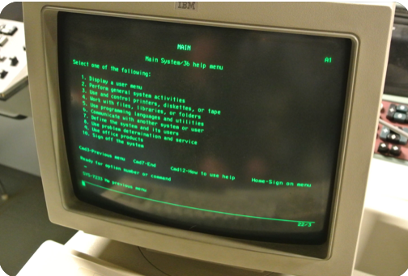
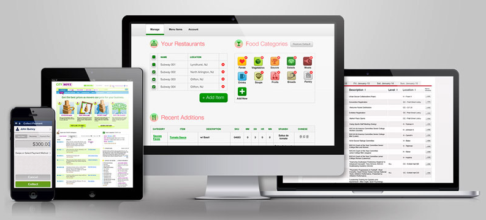

## Source

You can get the [GitHub Source Files](https://github.com/asnaqsys-examples/sunfarm-ui-enhancements) here.

## Overview

5250 emulators could display characters in reverse-image. When the intent of such use is for decoration only, this article shows how to avoid that effect which seems distracting on HTML-based User Interfaces.

When the [User Interface](https://en.wikipedia.org/wiki/User_interface) was designed while developing Legacy Applications, the developer had as the [Display Canvas](https://en.wikipedia.org/wiki/Canvas_(GUI)) a [Computer Terminal](https://en.wikipedia.org/wiki/Computer_terminal).

The Migrated Application now runs in a Web Browser.


| Computer Terminal Canvas | Web Browser based Canvas |
| :-: | :-: |
|  |  |

The *Device Capabilities* of each of these canvas are very different making the automatic Migration task very challenging.

>Note: The first major difference is the Canvas background color. Typical on Terminals: **black** when Web Browsers typically use a **white** (or light-shaded colors) for the background.

The typical technique to highlight fields on a IBM i Terminal was accomplished by assigning [Display Attributes](https://www.ibm.com/docs/en/i/7.5?topic=80-dspatr-display-attribute-keyword-display-files).

| Terminal Display Attributes | Mapping to [CSS](https://developer.mozilla.org/en-US/docs/Learn/CSS/First_steps/What_is_CSS) Style | Comments |
|  :- | :- | :- |
| **COLOR**<br>Green,<br> White,<br> Red,<br> Turquoise,<br> Yellow, Pink<br> and Blue. | Font-face **color**<br>Practically unlimited.| The meaning of the legacy COLOR<br> when considering that the background color for<br> both Canvas is the opposite,<br> presents a big challenge while<br> attempting to automatically map.|
| **Blink** |  unavailable | CSS animation effects may be used,<br> but Blinking is considered<br> *Bad design*. |
| **Column Separator** | unavailable | Has no meaning on Browsers |
| **High Intensity** | Font-face **weight** | Otherwise called *Bold*,<br>the Font-weight: 400<br> Mapping is perfect.|
| (*) **Reverse Image** | unavailable | To preserve legacy application design,<br> this is accomplished by inverting the color of<br> the Font-face and the Font-background.|
| **Underline** |  Text decoration **underline** | Mapping is perfect. |

>(\*) Of the three *unavailable* attributes in the table, only the **Reverse Image** is preserved. The other two are *dropped*.

As you can see by analyzing the table above, only two of the attributes are *perfectly* mapped: Hi Intensity and Underline. The rest present challenges and possibly misinterpretation of intent.

## Remove Reverse Image Attributes

The intent of Legacy use of **Reverse Image** is hard to predict when automatically Migrating Display files.

Sometimes it is used as *decoration*: to make subfiles look like a distinguishable Table or to emphasize Page Titles. When used for *decoration* (only), dropping the attribute may be considered the best option. On a Web Browser, individual HTML elements have enough decoration as it is, or there are better ways to decorate text, like: a change of Font size for Page titles.

Other times, the use of **Reverse Image** may be important for the Application uses, for example, when the attribute effect is used to highlight certain fields in error.

In the case of [Sun Farm Main Screen](/examples/sunfarm/sunfarm.html#main-screen) the Customer subfile record would look a lot cleaner if the **Reverse Image** attribute is dropped.

On the following [DDS](https://www.ibm.com/docs/en/i/7.5?topic=dds-display-files) legacy source section, describing the Customer Subfile record:

```
0007.00     A          R SFL1                      SFL                                 000000
0009.00     A            SFCOLOR        1A  B  8  2DSPATR(ND PR)                       000000
0010.00     A            SFSEL          2Y 0B  8  4VALUES(0 2 3 5 7 9 10 11)           000000
0011.00     A                                      EDTCDE(Z)                           000000
0012.00     A* 60                                  DSPATR(ND)                          101006
0013.00     A* 60                                  DSPATR(PR)                          101006
0014.00     A            SFCUSTNO       6Y 0O  8  7TEXT('CUSTOMER NUMBER')             000000
0015.00     A                                      EDTCDE(Z)                           000000
0016.00     A                                      DSPATR(RI)                          000000
0017.00     A N61                                  COLOR(GRN)                          000000
0018.00     A  61                                  COLOR(WHT)                          000000
0019.00     A            SFNAME1   R        O  8 14REFFLD(CMNAME)                      000000
0020.00     A                                      DSPATR(RI)                          000000
0021.00     A N61                                  COLOR(GRN)                          000000
0022.00     A  61                                  COLOR(WHT)                          000000
0023.00     A            SFCSZ         25   O  8 55TEXT('CITY-STATE-ZIP')              000000
0024.00     A                                      DSPATR(RI)                          000000
0025.00     A N61                                  COLOR(GRN)                          000000
0026.00     A  61                                  COLOR(WHT)                          000000
0027.00                                                                                000000
```

Several fields define the DSPATR(RI) attribute. These are where the **Reverse Image** attribute is defined and it becomes the 

```html
InvertFontColors="*True"
```

Property for the `DdsCharField` and `DdsDecField` tag Helpers on the Razor Page `~\SunFarmSite\Areas\SunFarmViews\Pages\CUSTDSPF.cshtml`

```html
<div Row="8" RowSpan="@SFLC_SubfilePage">
    @for (int rrn=0; rrn < Model.SFLC.SFL1.Count; rrn++)
    {
        int row = 8 + rrn;
        <DdsSubfileRecord RecordNumber="rrn" For="SFLC.SFL1">
            <DdsDecField Col="4" For="SFLC.SFL1[rrn].SFSEL" VirtualRowCol="@row,4" EditCode="Z" ValuesText="'0','2','3','5','7','9','10','11'" tabIndex=@pageTabIndex++ />
            <DdsDecField Col="7+1" For="SFLC.SFL1[rrn].SFCUSTNO" Color="Green : !61 , DarkBlue : 61" InvertFontColors="*True" EditCode="Z" Comment="CUSTOMER NUMBER" />
            <DdsCharField Col="14+1" For="SFLC.SFL1[rrn].SFNAME1" Color="Green : !61 , DarkBlue : 61" InvertFontColors="*True" />
            <DdsCharField Col="55+1" For="SFLC.SFL1[rrn].SFCSZ" Color="Green : !61 , DarkBlue : 61" InvertFontColors="*True" Comment="CITY-STATE-ZIP" />
        </DdsSubfileRecord>
    }
</div>
```

## Result

Removing all `InvertFontColors="*True"` from this file, will make the Page render in a more pleasing to the eye manner:

| Before | After |
| :-: | :-: |
|  |  |


