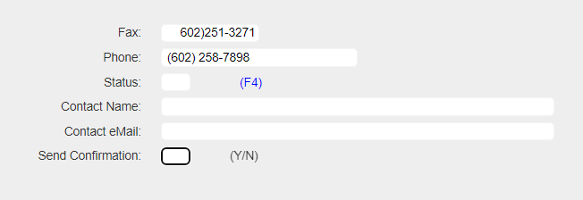

## Source

You can get the [GitHub Encore Source Files](https://github.com/asnaqsys-examples/sunfarm-encore) or the [GitHub C# Source Files](https://github.com/asnaqsys-examples/sunfarm-csharp) here.

## Overview

Certain fields are expected to have a value which is one of many discreet values. We have seen the simpler case where two values are allowed: YES, NO (or true false) — [and we used a Checkbox element for that scenario](./enhance-replace-yesno-checkboxes.html) —.

When more that two values of a discreet collection is expected, a Radio Button Group may be the best User Interface you can utilize.

>IBM i Legacy DDS referred to this User Interface field as [MLTCHCFLD or multiple-choice selection field](https://www.ibm.com/docs/en/i/7.5?topic=dkedfp4t8-mltchcfld-multiple-choice-selection-field-keyword-display-files).

An important distinction, when comparing Checkbox Groups with Radio Button Groups is that, in addition to listing the available choices, selecting one choice automatically de-selects the others. In other words, choices are mutually exclusive.

## Replacing Multiple selection fields with Radio-button Groups

ASNA Monarch® Base provides a TagHelper to simplify the production of Radio Button Groups named `DdsRadioGroupField`.

Let's review how the Legacy YES/NO field for the `Send Confirmation:` was migrated:

```html
<div Row="18">
    <DdsConstant Col="7" Text="Send Confirmation:" />
    <DdsCharField Col="27" For="CUSTREC.SFYN01" VirtualRowCol="18,27" tabIndex=@pageTabIndex++ />
    <DdsConstant Col="29+5" Text="(Y/N)" />
</div>
```

We could replace the whole row with the following markup:


```html
<div Row="18">
    <DdsRadioButtonGroupField Col="15" Text="Send Confirmation:" ValuesText="'Yes','No'" For="CUSTREC.SFYN01" VirtualRowCol="18,27" />
</div>
```

To associate the group selection with the actual value we want the field to have (that is `Y` for `Yes` and `N` for `No`), we require to complete the Model validation information. (To jump to the Model's definition for `CUSTREC.SFYN01`, you can set the cursor on the `For=` value and press `F12` ).

Add the `Values` attributes to the `SFYN01` field as follows:

```cs
[Char(1)]
[Values(typeof(string), "Y", "N")]
public string SFYN01 { get; set; }
```

>Note: The order of the values specified is **important**. It should match the same order as `ValuesText`.

On the way out, when the Page is rendered with the populated fields (after running the logic code), if the field value does not match any of the listed `Values` (for example, value is *blank*), no radio buttons will be shown as selected.

## Results

| YES/NO input | Radio Button Group |
| :-: | :-: |
|  |  |
