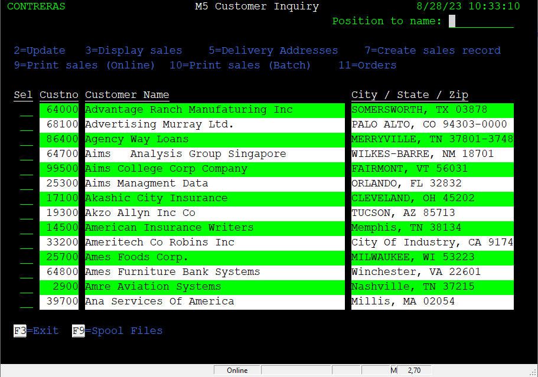
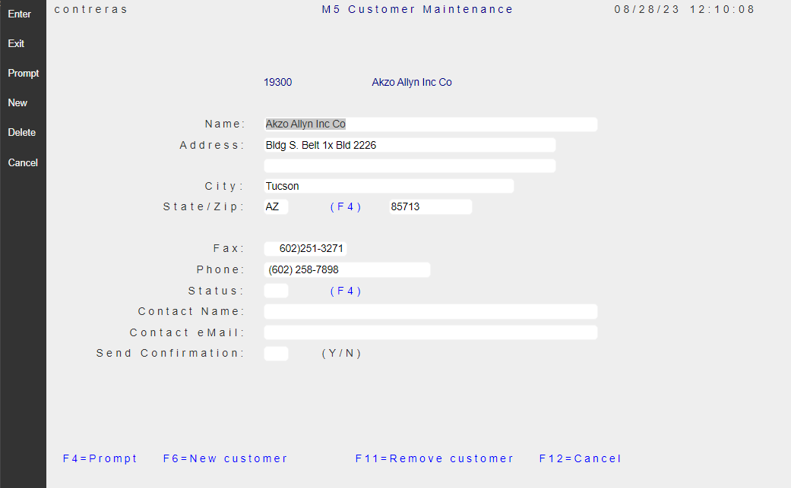
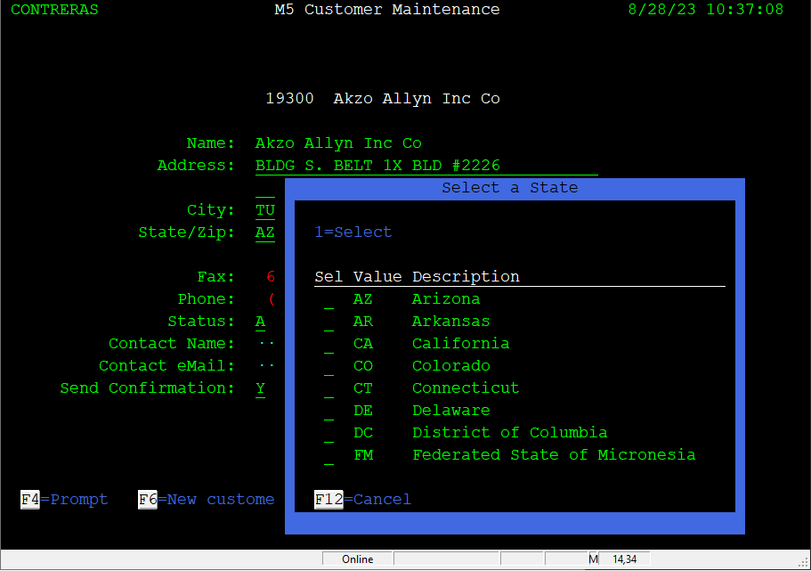
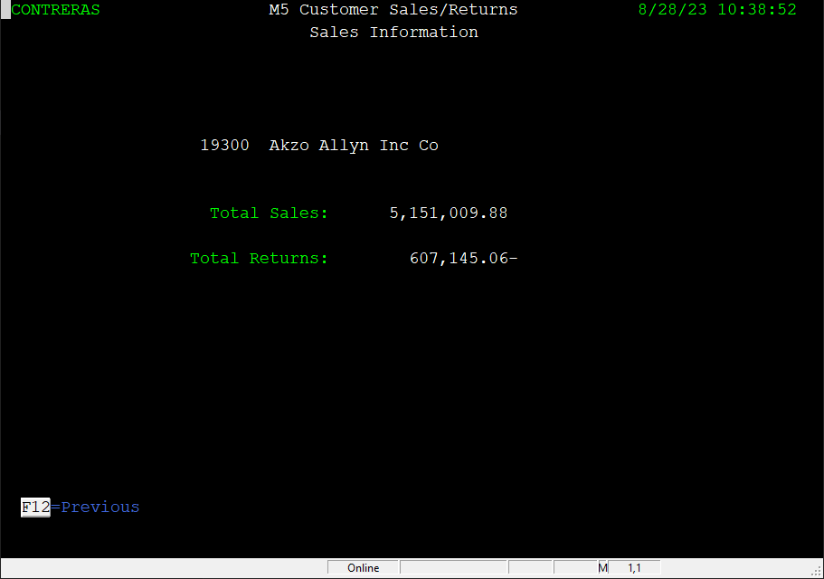

# Overview

For the purpose of this Example, we use a sample IBM i Application application named `"M5"`. 

To compare the User-Interface [Look and Feel](https://en.wikipedia.org/wiki/Look_and_feel) of the Legacy vs *RAW* Migration, we will present - later in this section -, selected Screens (with side by side images). These selections highlight typical opportunities for User Interface enhancements, for your consideration as the final Modern Style is defined.

Pretending that the Modernized Application will be used by a fictitious Company called **SunFarm**, we will brand it as such, and refer to it as **The SunFarm Application** for the remaining topic discussions on this Example.

## Basic User Interface Enhancements

1. [Remove Reverse Image Attributes](./enhance-remove-reverse-image.html) : Compared to Legacy Terminal screens, modern Web Browsers provide a very rich graphic canvas to display elements on the Page. The simple technique to remove the use of reverse-image on a Migrated Application, makes it look much more clean and pleasing to the eye.

2. [Application Logo Branding](./enhance-logo-branding.html) : All Pages should show the Company Logo at the top.

3. [Function-Keys Location](./enhance-function-keys-location.html) : Experiment with different Function-key locations. Select moving the Function-keys banner to the bottom of the screen.

4. [Modernize Constant Spacing](./enhance-modernize-font-appearance.html) : In an attempt to preserve legacy label positioning, even when the constants use a Modern Font family, the Migration adds artificial inter-character spacing that gives the appearance of *Old style Look*.

5. [Properly center page titles](./enhance-title-centering.html) : It is common to use Titles on Legacy Pages. Titles are usually centered *by hand* counting character positions and lengths using the *single* Monospaced font. We will explore how to use CSS to do it automatically with high precision.

6. [Remove redundant elements](./enhance-remove-redundant-elements.html) : Modern Operating Systems running on today's Devices already present system information (date/time user, etc.). There are simple techniques to make better use of the Page by removing these redundant elements.

7. [Replacing YES/NO fields with Check-boxes](./enhance-replace-yesno-checkboxes.html) : Check-box elements are much more effective than `YES/NO` fields. This two state input element is well identified by most users of Modern Web sites. 

8. [Replacing Multiple selection fields with Radio-button Groups](./enhance-replace-yesno-radio-groups.html): When the value of a field is expected to be a finite small set of options, the best User Interface element is a Radio button group.

9. [Replacing Promptable fields by clickable icon](./enhance-prompts-clickable-icon.html) : Legacy IBM i Applications followed the IBM command User interface where `F4` function key is mostly reserved to prompt for the values by showing an overlayed window. Instead of showing `(F4)` label by the input field, a clickable icon enhances the usability of promptable fields.

10. [Replacing numeric Data points with a Chart](./enhance-replace-data-with-chart.html) : A picture is worth one thousand words. Instead of showing total sales figures on a given year, we will show a line Chart.

## Main Screen

When application runs, the screen shows the `M5 Customer Inquiry` Screen:

| Legacy Customer Inquiry Screen | Migrated Customer Inquiry Screen |
| :-: | :-: |
|  |  |
 

The legacy Look (on the left of image above) shows the basic layout used by this sample application:

1. Screen dimensions: 80 columns x 25 lines.
2. There is *only one* font used, which happens to use Fixed-pitch characters also knowns as [Monospaced Font](https://en.wikipedia.org/wiki/Monospaced_font).
3. Dark background.
4. Use of font-face colors: Green, white and blue.
5. Use of font attributes: Reverse-video and Underline.
6. Main screen sections:

   a) **Heading**: User, Title, System date/time.
   
   b) **Command selection options**: Short descriptions for the available command "Selection" options on the subfile records.

   c) **Customer Subfile**: Showing fourteen records at a time with first column allowing for the command option to execute.

   d) **Function key Footer**: At the bottom of the page, the *active* [Function keys](https://en.wikipedia.org/wiki/Function_key) displaying a short label describing the associated command.

## Customer Maintenance Screen 
As the top-level Customer Inquiry Screen describes, using option "2" on a record selected, invokes the screen to **Update**, that is the "Customer Maintanance" page.

| Legacy Customer Maintenance Screen | Migrated Customer Maintenance Screen |
| :-: | :-: |
|  |  |

## Prompting for State Codes Screen
When the "cursor" is positioned on the "State/Zip" input field, function key `F4` brings an overlaid smaller Window to allow the selection of the fifty-two US two-letter code.

| Legacy Prompting for State | Migrated Prompting for State |
| :-: | :-: |
|  |  |

## Customer Sales/Returns Information Screen
As the top-level Customer Inquiry Screen describes, using option "3" on a record selected, invokes the screen to **Display Sales**, that is the "Customer Sales/Returns Information" page.

| Legacy Customer Sales/Returns Information | Migrated Customer Sales/Returns Information |
| :-: | :-: |
|  |  |

