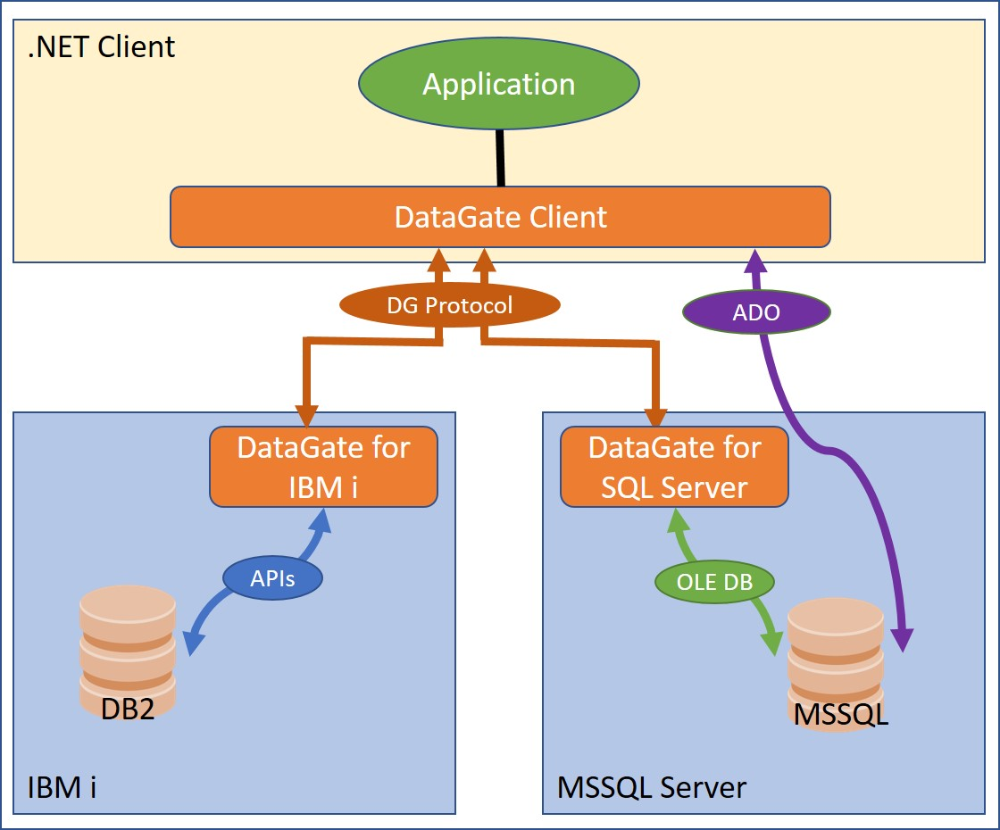

DataGate is a Client/Server middleware providing database access to .NET applications.

DataGate Client implements two different ways of communicating with the database server, both available on the ASNA.QSys.DataGate.Client .NET assembly:
1. Via TCP/IP using DataGate's own proprietary protocol to communicate with a DataGate Server. There are at least two implementations of the DataGate Server:
    * DataGate for IBM i, aka _DG/400_  ([SourceProfile](/reference/datagate/datagate-providers/source-profile.html)`.PlatformAttribute = "*DATALINK"`)
    * DataGate for SQL Server, aka _DSS_. ([SourceProfile](/reference/datagate/datagate-providers/source-profile.html)`.PlatformAttribute = "*SQLOLEDB"`)
2. Via ADO.NET to communicate **directly** with SQL Server. aka _DataGate Linear_. ([SourceProfile](/reference/datagate/datagate-providers/source-profile.html)`.PlatformAttribute = "*SQLCLIENT"`)

## Highlights
The following are highlights of the DataGate Protocol.

* DG is a proprietary RPC protocol implemented over TCP transport protocol. Each client connection "session" is a persistent TCP connection between the server’s configured TCP port (default, 5042) and a port assigned by the client system at connection initiation.  Transport mechanics and authentication of DG sessions are very similar to TELNET protocol-based console connections to IBM&nbsp;i and other console platforms.
* DG servers are "passive listeners"; a session can only be initiated by a client application, such as an AVR or C# program.  When a client successfully opens a DG connection, the connection remains open until the client actively closes the connection, or a server/network exception occurs.
* DG client software supports the "connection pooling" optional feature.  When enabled, programs can use the DG API to "close" the application’s connection "handle", but the DG protocol connection persists in the software pool of dormant connections until the connection is potentially "reused" in a later DG API "open" call.  If no such API call occurs, the connection will be closed when it ages out of the pool ("pooled connection timeout"), or its process ends, whichever comes first.  Thus, DG TCP connections may remain open for longer than they are in use by the application when connection pooling is enabled.  In busy, middle-tier applications such as ASP.NET sites, connections can cycle in and out of the pool frequently, and thus they may remain open indefinitely.
* TCP Keepalive is a configuration option found on both IBM&nbsp;i and Windows OS platforms.  It is commonly deployed in order to maintain TCP connections, including DG connections, in "intricate" or unstable networks.
* DG optionally supports .NET NEGOTIATE authentication and data encryption via Kerberos-AD SSO, including an NTLM SSO authentication-only fallback option where available/necessary.
* DG Windows-based servers (DSS, DG for Windows) optionally support SChannel-based TLS negotiation and data channel encryption, with multiple certificate verification options.  ASNA recommend this option for connections over unsecured networks. By default a Win32-generated, self-signed, "session" certificate, created at server startup, is used to authenticate and secure the data channel.  DG Windows servers may be configured, via Windows interfaces, to use and verify a properly configured certificate installed in the server’s "local machine" certificate store.
* DG IBM&nbsp;i-based servers (DG/400) optionally support GSK-based TLS negotiation and data channel encryption, with some certificate options.  ASNA recommend this option for connections over unsecured networks, but only when a proper certificate is configured, via IBM&nbsp;i interfaces, for use with the DG/400 instance. By default, DG/400 uses a self-signed, "well-known" certificate, generated by ASNA Release Engineering, and configured during installation. This is only provided for testing purposes.
* When not using TLS, authenticated NEGOTIATE-based connections to Windows servers (DSS, DG for Windows) automatically inherit Kerberos data channel encryption.  ASNA recommend this option (when TLS is not configured) for connections over secured AD networks.
* Unsecured, "clear text" connections are available for use in secured networks; this is only recommended in scenarios where all users are fully trusted and/or security resources are minimal.
* Windows client tools (DG Studio, DG Monitor) are used to configure client connection profiles (a.k.a., "database names").  By default, the tools create clear-text connection profiles.  TLS options are available in "advanced" connection configuration dialogs.  The TLS protocols available to DG connections are chosen by the operating system. In Windows and IBM&nbsp;i, this permits administrators to enable or disable certain protocols if necessary. NEGOTIATE may be enabled by specifying the user credential as "*DOMAIN".
* DG .NET client programs support TLS via .NET SslStream (SChannel-based in Windows .NET Framework).  DG .NET clients support NEGOTIATE via NegotiateStream.
* Supported (and unsupported) "Classic" programs use a prior-generation of DG protocol, which does not include TLS.  The only Windows SSO option for these programs is NTLM-based.

