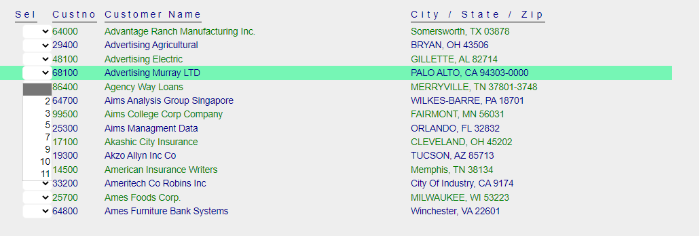

## Background


The [IBM i](https://www.ibm.com/it-infrastructure/power/os/ibm-i) defines a [subfile](https://www.ibm.com/docs/en/i/7.1?topic=files-using-subfiles) as: *A group of records that is read from or written to a display-device file. For example, a program reads records from a database file and creates a subfile of output records. When the entire subfile has been written, the program sends the entire subfile to the display device in one write operation*.

>Even when a subfile is similar to a file (as the name implies) - in which it can be read or written to - it is not a file (nor a Database View), maybe the *closest* computer term is a [Data Table](https://learn.microsoft.com/en-us/dotnet/framework/data/adonet/dataset-datatable-dataview/datatables).

[Subfiles](https://www.ibm.com/docs/en/i/7.2?topic=80-sfl-subfile-keyword-display-files) are generated by an [RPG](https://www.ibm.com/docs/en/i/7.4?topic=introduction-rpg-programming-in-ile) program by writing one or more records to the `Subfile`.

[DDS for Displayfiles](https://www.ibm.com/docs/en/i/7.2?topic=dds-display-files) syntax provides several keywords to display `Subfiles` on the screen.

While a `Subfile` is typically rendered on a Display as a *columnar* Table, the `Subfile` is frequently *not* easily represented as such. There are several peculiarities of a Subfile, that make it unique. 

### Subfile uniqueness
1. Records may be displayed in multi-line format.
2. Multi-line records may be toggled to a single-line with a command ([Drop](https://www.ibm.com/docs/en/i/7.1?topic=80-sfldrop-subfile-drop-keyword-display-files)).
3. Subfile-field heading text is usually displayed as constants, not logically associated with fields in the subfile.
4. Frequently Subfile-field heading text is *non-contiguous* (but composed by pieces, written at different positions).

>There are more *unique features* of Subfiles compared to plain Database Display Views, but these four are enough to make the case for this topic.


## Migrating Display Files containing Subfiles

Display accuracy is **the most important consideration** when Migrating Display Files. The initial (or *raw*) Migration should not make *any* wrong assumptions that may affect functionality.

Subfiles are migrated as a templated repetition of individual visible fields, each positioned on the Page using the legacy line-position definition in [DDS](https://www.ibm.com/docs/en/i/7.2?topic=dds-display-files) (converted to HTML [Grid](https://developer.mozilla.org/en-US/docs/Learn/CSS/CSS_layout/Grids) positioning ).

The following is a snippet of [RazorPage](https://learn.microsoft.com/en-us/aspnet/core/mvc/views/razor?view=aspnetcore-6.0) source for a Subfile:

```html
<div Row="7">
    <DdsConstant Col="3" Text="Sel" Color="DarkBlue" Underline="*True" />
    <DdsConstant Col="7+1" Text="Custno" Color="DarkBlue" Underline="*True" />
    <DdsConstant Col="14+1" Text="Customer Name" Color="DarkBlue" Underline="*True" />
    <DdsConstant Col="55+1" Text="City / State / Zip" Color="DarkBlue" Underline="*True" />
</div>
<div Row="8" RowSpan="@SFLC_SubfilePage">
    @for (int rrn=0; rrn < Model.SFLC.SFL1.Count; rrn++)
    {
        int row = 8 + rrn;
        <DdsSubfileRecord RecordNumber="rrn" For="SFLC.SFL1">
            <DdsDecField Col="4" For="SFLC.SFL1[rrn].SFSEL" VirtualRowCol="@row,4" EditCode="Z" ValuesText="'0','2','3','5','7','9','10','11'" tabIndex=@pageTabIndex++ />
            <DdsDecField Col="7+1" For="SFLC.SFL1[rrn].SFCUSTNO" Color="Green : !61 , DarkBlue : 61" EditCode="Z" Comment="CUSTOMER NUMBER" />
            <DdsCharField Col="14+1" For="SFLC.SFL1[rrn].SFNAME1" Color="Green : !61 , DarkBlue : 61" />
            <DdsCharField Col="55+1" For="SFLC.SFL1[rrn].SFCSZ" Color="Green : !61 , DarkBlue : 61" Comment="CITY-STATE-ZIP" />
        </DdsSubfileRecord>
    }
</div>
```

<br>
The subfile renders as the following image:



Notice:
1. Column headings are positioned individually as constants, not referencing the fields of the subfile.
2. The line to divide the column headings and the data in the subfile uses *Underline* font attribute (which does not extend the full column width).
3. The text for the Column headings could have been produced by multiple independent DdsConstant (i.e. `Customer` and `Name` may have been defined as two different constants.)
4. Column headings are not *centered*. (Centering text on IBM i requires manual calculation of positions).
5. `Col` field positioning is hard-coded. (These cannot be altered externally. I.e. using CSS styles).
6. The Subfile does not show Borders or field grid-lines.

<br>
This particular Subfile could be rendered as a HTML Table, as follows:


>Note: Not all Subfiles are candidates to be upgraded to Tables. Most Applications use a large percentage of Subfiles that may be upgraded. The rest can remain as they are.