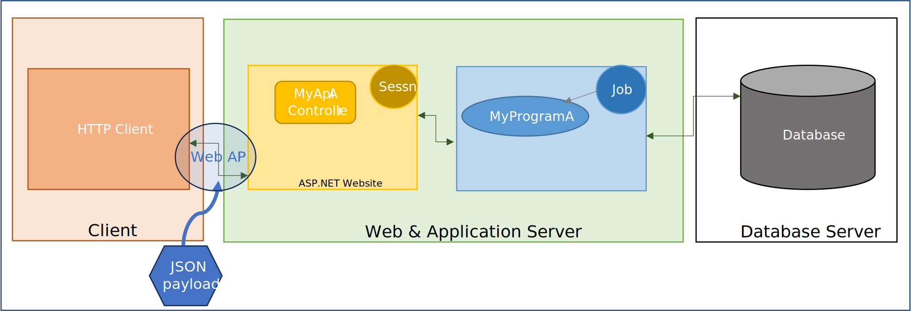

## Application Architecture Refresher

As described [here](/concepts/architecture/application-architecture.html#interactive-job-architecture), a migrated application can run on a webserver with users interacting with it via a web browser running on their own PCs. 


_Interactive Application running in four tiers_

Conceptually there are four tiers or processes involved in the execution of the application:
1. User PC displaying UI (HTML)
2. Website rendering 'screens' as HTML
3. Application logic executing 'programs' which produce the 'screens'
4. Database Server

### Focus on 'Screens'
Let's focus on the second tier above. The rendering of the screens as HTML is achieved by using Razor Pages.  Razor Pages use a Controller/View architecture where the Controller gathers/produces all the data, and the View takes that data and produces the HTML (the View is a mixture of HTML and Tags). 

In migrated applications, each **Display File** is transformed into a **Razor Page**.

### Focus on 'Programs'
Migrated programs are converted to .NET classes. Programs can be generally divided as being Interactive or not. Interactive Programs _interact_ directly with the user via a migrated **Razor Page**.  Non-Interactive programs typically communicate via input and output parameters without requiring any data directly from the user.

## Exposing Non-Interactive programs as a Web API

Sometimes it may be convenient to allow processes outside of the Application to activate certain application functions by calling individual programs.  There are several methods that can be employed, a common one is the use of the Website facilities  to surface a **Web API**. 

There is a rich set of facilities to create [APIs with ASP.NET Core](https://dotnet.microsoft.com/en-us/apps/aspnet/apis).  These facilities allow for the creation of Web APIs that expose programs as endpoints of the website.



_Exposing a Program as a Web API_

The Web API plays along the rest of the Application tiers, however some of the tiers behave with some variations.  The tiers play these roles:
1. Client system provides and consumes the program parameters typically using JSON payloads
2. Website Controller exposed endpoints repackage parameters and call program
3. Application logic executes the program and returns any output parameters
4. Database Server

Tiers 3 and 4 above do not change much from the original setup prior to the migration. 

### The Web API Controller

The novelty of the setup is the creation of an ASP.NET Core Controller that implements routes or endpoints that do not go to a Razor Page but instead are directed to your code. 

You can define routes and HTTP verbs directly within your ASP.NET code using attributes. The framework automatically maps data from the request path, query string, and body to the corresponding method parameters.

To facilitate the creation of the Controller, Monarch provides the base class [YellowController](/reference/expo/qsys-expo-model/yellow-controller.html) which itself is an extension of .NET's [ControllerBase](//learn.microsoft.com/en-us/dotnet/api/microsoft.aspnetcore.mvc.controllerbase).

`YellowController` is a small helper controller class used by web endpoints that need to start, access, or end a Monarch job associated with the current ASP.NET Core session. It encapsulates the logic to retrieve a per-session job [Command](/reference/expo/qsys-expo-model/command.html) instance, start the job if it isn't already running, and to request a shutdown and clear session state when the job ends.

The `Command` class provides a method that allows for a program to be called, it is through this facility that a program can be invoked from an endpoint on the website.

Here is an example of a controller enabling the call to a non-interactive program called `CUSTCALC`, and the ending of the job that is used to host the program.  For the example `SalesController` shown below, a client application could invoke `CalcSalesReturns` multiple times, the first call would establish a new Job and subsequent calls (on the same Session) would reuse the Job, the client application would be responsible to end the Job by invoking the `EndSession` endpoint.

```csharp
    [Route("api/[controller]")]
    [ApiController]
    public class SalesController : YellowController
    {
        [HttpPost("CalcSalesReturns")]
        public IActionResult CalcSalesReturns([FromBody] CalcSalesReturnsRequest request)
        {
            try
            {
                Command command = GetJobCommand("Service");

                string[] parms = new string[3];
                parms[0] = request.CustNumber;
                parms[1] = request.Sales;
                parms[2] = request.Returns;

                command.Call("CUSTCALC", parms);
                parms[1] = ZonedToDecimal(parms[1]).ToString();     // Sales
                parms[2] = ZonedToDecimal(parms[2]).ToString();     // Returns
                parms[0] = "OK";
                return Ok(new { parms });
            }
            catch (Exception ex)
            {
                return StatusCode(500, new { error = $"CalcSalesReturns failed: {ex.Message}" });
            }
        }

        [HttpGet("EndSession")]
        public IActionResult EndSession()
        {
            EndJob();
            return Ok();
        }

        decimal ZonedToDecimal(string zoned)
        {
            . . . 
        }

        public class CalcSalesReturnsRequest
        {
            public string CustNumber { get; set; }
            public string Sales { get; set; }
            public string Returns { get; set; }
        }
    }
}
```

### The Web API Client

Here is an example of a Client application for the sample Controller shown above. The application defines a class to wrap the calls to the Web API.  This is the SalesApiClient:

```csharp
    public class SalesApiClient
    {
        private readonly HttpClient _httpClient;
        private readonly string _baseUrl;

        public SalesApiClient(HttpClient httpClient, string baseUrl)
        {
            _httpClient = httpClient;
            _baseUrl = baseUrl.TrimEnd('/');
        }

        public async Task<string[]> CalcSalesReturnsAsync(string custNumber, string sales, string returns)
        {
            var url = $"{_baseUrl}/Sales/CalcSalesReturns";
            var request = new CalcSalesReturnsRequest
            {
                CustNumber = custNumber,
                Sales = sales,
                Returns = returns
            };

            var response = await _httpClient.PostAsJsonAsync(url, request);
            if (!response.IsSuccessStatusCode)
            {
                // Read the error details from the response body
                var errorContent = await response.Content.ReadAsStringAsync();
                throw new HttpRequestException(
                    $"Request failed with status code {response.StatusCode}. Server response: {errorContent}");
            }
            var result = await response.Content.ReadFromJsonAsync<CalcSalesReturnsResponse>();
            return result?.parms;
        }

        public async Task<bool> EndSessionAsync()
        {
            var url = $"{_baseUrl}/Sales/EndSession";
            var response = await _httpClient.GetAsync(url);
            return response.IsSuccessStatusCode;
        }

        public class CalcSalesReturnsRequest
        {
            public string CustNumber { get; set; }
            public string Sales { get; set; }
            public string Returns { get; set; }
        }

        private class CalcSalesReturnsResponse
        {
            public string[] parms { get; set; }
        }
    }

```

The application could then use the `SalesApiClient` class like this:

```csharp
        private async Task RunSalesApiClientTests()
        {
            var salesClient = new SalesApiClient(new HttpClient(), "https://your-website/api-base/");

            decimal customerNumber = 1200;
            do
            {
                string textCustomerNumber = customerNumber.ToString("000000000");
                
                // Call CalcSalesReturns
                string[] result = await salesClient.CalcSalesReturnsAsync(textCustomerNumber, "0000000000000", "0000000000000");
                Console.WriteLine($"CalcSalesReturns for Customer# {customerNumber}: " + string.Join(", ", result));
                Console.WriteLine();

                Console.WriteLine("Would you like to test another customer number? (Enter a positive number or 0 to exit): ");
                string input = Console.ReadLine();
                
                customerNumber = 0;
                decimal.TryParse(input, out customerNumber);
            } while (customerNumber > 0);

            // Call EndSession
            bool ended = await salesClient.EndSessionAsync();
            Console.WriteLine("EndSession result: " + ended);
        }

    }
```    

## Configuration
There are two main aspects that require some configuration settings or additional application support. These are:
 - A Service Job class to support the programs called
 - Mapping of the endpoint controllers

### Service Job Class
Under typical scenarios, a migrated application's website defines its main [InteractiveJob](/reference/runtime/qsys-runtime-job-support/interactive-job.html) class in such a way that it invokes an interactive program to communicate with the user.  The steps taken by this InteractiveJob class, particularly in the implementation of the `ExecuteStartupProgram()` is not conducive to support Web API calls.

What is needed to service API calls is a Job class that invokes not an Interactive Program but that instead calls the `AcceptCommands()` method.  The steps to setup the Job and the use of the Command class are similar to the steps needed to [call Programs from Non-Display Pages](/manuals/enhancements/enhancing-ui/calling-program-from-non-displayfile-page.html), please read the article for background knowledge.

For a website that serves both Interactive users and API calls it is convenient then to have two Job classes, one for each use case. The name of the default (the user's) Job class is defined in the `appsettings.json` file, for example, if the class were called `MyJob`, the appsettings.json would look like this:

```json
   . . . 
  "JobDescriptor": {
    "Class": "Acme.RUNCI_Job.MyJob",
    "Name": "ERCAP"
  },
  . . . 
```

In order to distinguish the name of the other (the API) Job class the [GetJobCommand](/reference/expo/qsys-expo-model/yellow-controller.html#command-getjobcommandstring-jobclasssuffix) receives an optional parameter with the suffix to append to the job class name when starting the job. If the class for the Web APIs was called `MyJobService`, then the `GetJobCommand` call would look like this:

```cs
    Command command = GetJobCommand("Service");
    . . . 
    command.Call("CUSTCALC", parms);
    . . .
```

The `GetJobCommand("Service")` call would instantiate an object of type `Acme.RUNCI_Job.MyJobService`.

#### Example
Using the configuration above, then the application would define two Job classes, first the `Acme.RUNCI_Job.MyJob` as follows:

<details>
  <summary>C# MyJob</summary>

```csharp
    // This is C#
    public class MyJobService : MyJob
    {

        public static new MyJobService JobFactory()
        {
            MyJobService job = new MyJobService();
            return job;
        }

        override protected void ExecuteStartupProgram()
        {
            ExecuteStartupProgramApi();
        }
    }
```

</details>

<details>
  <summary>Encore RPG example</summary>

```csharp
    // This pretends to be Encore RPG
    public class MyJobService : MyJob
    {

        public static new MyJobService JobFactory()
        {
            MyJobService job = new MyJobService();
            return job;
        }

        override protected void ExecuteStartupProgram()
        {
            ExecuteStartupProgramApi();
        }
    }
```

</details>


### Mapping of the Endpoint Controllers

Migrated applications have in the `Startup` class the method `Configure` which establishes the main characteristics of the web application and includes the mapping of Razor Pages. When the website is to serve Web APIs, it is necessary to also map the Controllers as shown below:

```cs
    public void Configure(IApplicationBuilder app, IWebHostEnvironment env)
    {
        . . . 

        app.UseSession();

        app.UseRouting();

        app.UseEndpoints(endpoints =>
        {
            endpoints.MapRazorPages();
            endpoints.MapControllers();    // <<<<< Configure the WEB APIs
        });
    }
```
