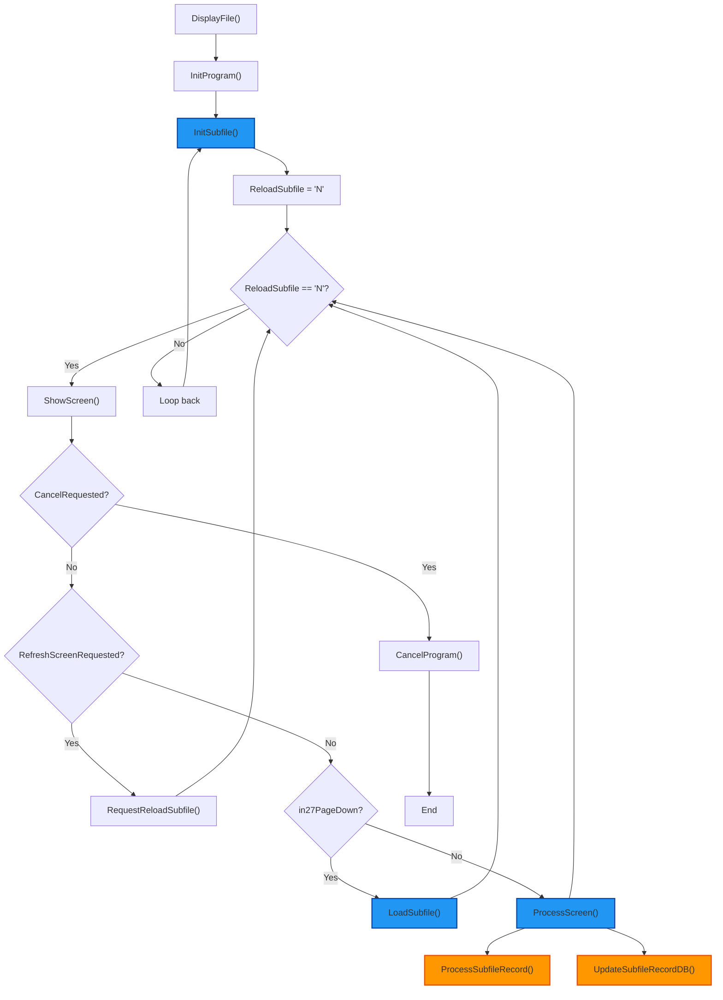
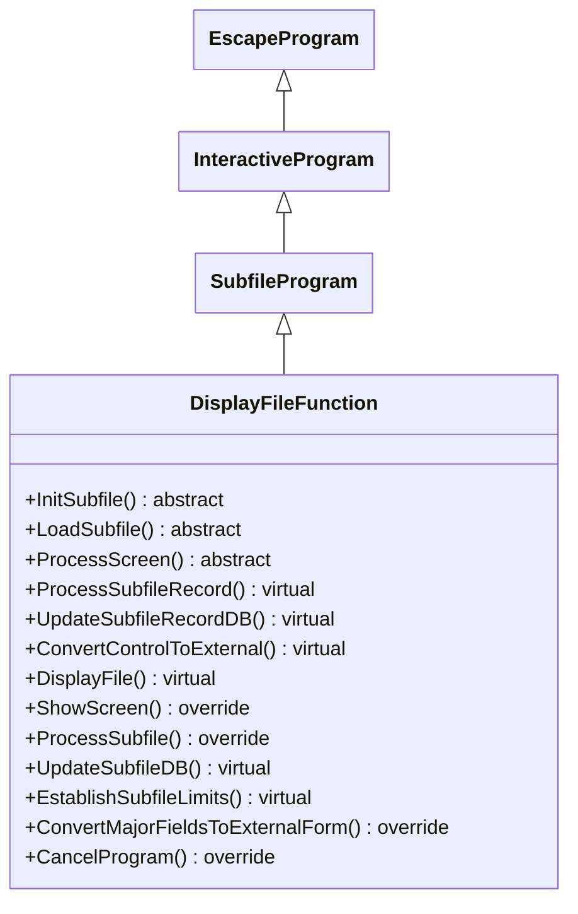

## DisplayFileFunction

The <u>DisplayFileFunction</u> class is an abstract subclass of <u>SubfileProgram</u>, focused on displaying file records in subfiles without editing. It supports loading, viewing, and basic processing. Its primary responsibilities include:

1. **File Display Workflow**:
   - The **DisplayFile()** method initializes the program and loops through subfile initialization, display, and user response handling.

2. **Subfile Initialization and Loading**:
   - Requires subclasses to implement **InitSubfile()** for setup and **LoadSubfile()** for record loading.
   - Provides **EstablishSubfileLimits()** for computing subfile limits during reading.

3. **Screen Display and Processing**:
   - Overrides **ShowScreen()** to reset invite and error indicators.
   - Processes commands like cancel, refresh, page-down, and delegates input to **ProcessScreen()**.

4. **Subfile Record Processing**:
   - Overrides **ProcessSubfile()** to read and process changed records, updating displays.
   - Offers virtual methods like **ProcessSubfileRecord()** and **UpdateSubfileRecordDB()** for optional customization.

5. **Data Conversion and Updates**:
   - Provides **ConvertControlToExternal()** (virtual) and overrides **ConvertMajorFieldsToExternalForm()**.
   - Includes **UpdateSubfileDB()** for processing modified records if displayed.

6. **Integration with Framework Infrastructure**:
   - Inherits subfile features from <u>SubfileProgram</u>, focusing on read-only file displays.
   - Overrides **CancelProgram()** for simple exit, allowing subclasses to customize loading and processing.

In summary, <u>DisplayFileFunction</u> enables read-only subfile displays of file data, abstracting display logic while supporting extensible loading and processing.

## Flowchart

   
## Class Diagram

