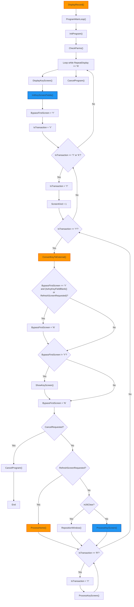
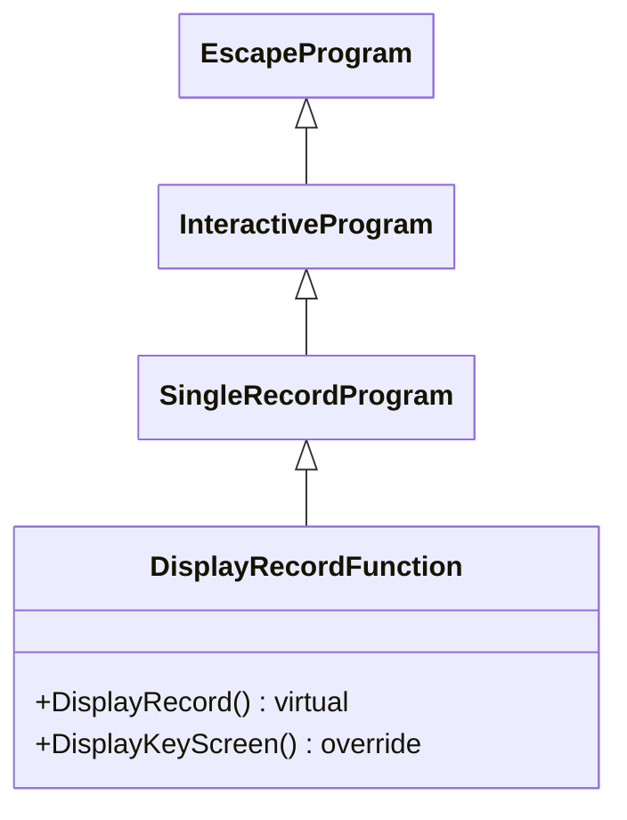

## DisplayRecordFunction

Key Responsibilities of DisplayRecordFunction

The _DisplayRecordFunction_ class is an abstract subclass of _SingleRecordProgram_, designed for read-only or display-oriented single-record applications. It provides a framework for presenting record data to users without allowing modifications, emphasizing data retrieval and visualization. Its key responsibilities include:

1. **Driving the Display Workflow**:
   - The **DisplayRecord()** method invokes **ProgramMainLoop()** to initialize and manage the display cycle, ensuring the program runs until completion or cancellation.

2. **Key Screen Management**:
   - Overrides **DisplayKeyScreen()** to handle key field input and display, bypassing the first screen if possible (**BypassFirstScreen = "Y"**) and processing user responses like cancel, refresh, or repositioning.
   - Initializes key screen fields and manages transaction states for seamless navigation.

3. **User Interaction Handling**:
   - Processes standard commands (e.g., cancel via **CancelProgram()**, refresh via **ProcessHome()**, clear via **RepositionWindow()**) and delegates specific key screen processing to the abstract **ProcessKeyScreen()** method.
   - Supports reprocessing loops for repeated input validation.

4. **Data Conversion and Display Conditioning**:
   - Relies on inherited methods for converting key fields to external formats and setting display attributes, ensuring data is presented correctly without modification capabilities.

5. **Integration with Framework Infrastructure**:
   - Inherits multi-screen support and validation from _SingleRecordProgram_, but focuses on display-only operations (e.g., no add/change modes).
   - Provides hooks for subclasses to implement key screen processing and field initialization, promoting reusability for display-centric applications.

In summary, _DisplayRecordFunction_ specializes in read-only record presentation, abstracting display logic while requiring subclasses to handle user inputs and data setup, making it ideal for inquiry or reporting screens.

## Flowchart

## Class Diagram

