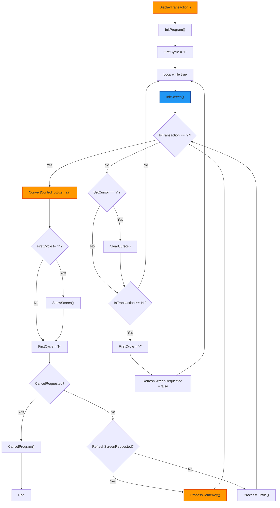
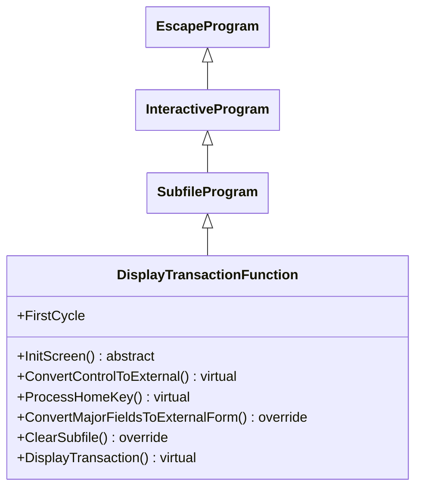

## DisplayTransactionFunction

The <u>DisplayTransactionFunction</u> class is an abstract subclass of <u>SubfileProgram</u>, designed for read-only display of transactional data in subfiles. It focuses on presenting data without allowing modifications, supporting screen initialization and navigation. Its primary responsibilities include:

1. **Transaction Display Workflow**:
   - The **DisplayTransaction()** method initializes the program and conducts a loop for displaying screens, bypassing the first screen on initial cycles (<u>FirstCycle</u>) and handling user responses like cancel or refresh.

2. **Screen and Subfile Initialization**:
   - Requires subclasses to implement **InitScreen()** for setting up screen fields and subfile data.
   - Overrides **ClearSubfile()** to reset subfile records and counters for clean displays.

3. **Data Conversion and Display**:
   - Provides **ConvertControlToExternal()** (virtual) for converting control fields to external formats and overrides **ConvertMajorFieldsToExternalForm()** to integrate with subfile rendering.

4. **User Interaction Handling**:
   - Processes commands such as cancel (via **CancelProgram()**), refresh (via **ProcessHomeKey()**), and delegates subfile processing to inherited methods.
   - Manages transaction states and cursor clearing for seamless navigation.

5. **Integration with Framework Infrastructure**:
   - Inherits subfile management from <u>SubfileProgram</u>, focusing on display-only operations without edit capabilities.
   - Allows subclasses to customize initialization and conversion, enabling flexible read-only transactional views.

In summary, <u>DisplayTransactionFunction</u> specializes in presenting transactional subfile data, abstracting display logic while requiring subclasses to handle setup and data conversion.

## Flowchart

## Class Diagram

