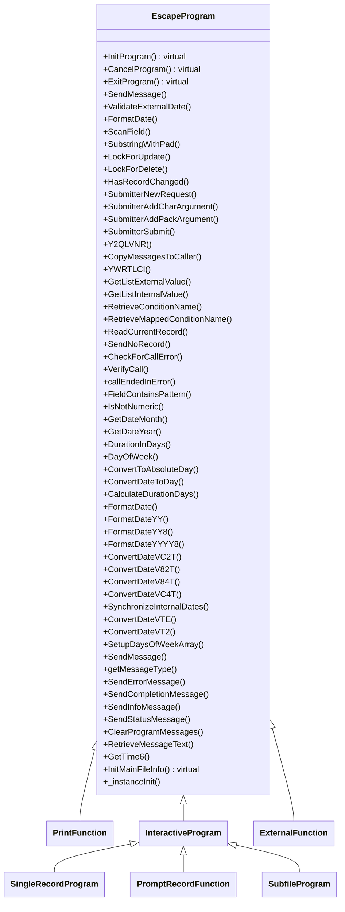

## EscapeProgram Class

Key Responsibilities of the EscapeProgram Class

The _EscapeProgram_ class serves as the foundational abstract base class in the ASNA.QSys.EscapeFX framework, extending _ASNA.QSys.Runtime.JobSupport.Program_. It provides essential infrastructure for program execution, data handling, and system interactions, enabling subclasses to focus on domain-specific logic. Its primary responsibilities include:

1. **Program Initialization and Lifecycle Management**:
   - Initializes program status data structures (e.g., program name, job details, start date/time) and sets up global fields like _ResultingCode_ and indicators.
   - Manages the program lifecycle through methods like **InitProgram()** (virtual), **CancelProgram()**, and **ExitProgram()**, ensuring proper setup, error handling, and termination.

2. **Message and Error Handling**:
   - Provides comprehensive messaging support via **SendMessage()**, **SendErrorMessage()**, and related methods, including sending to program queues, external queues, or status messages.
   - Handles program call errors with **CheckForCallError()** and **VerifyCall()**, setting indicators and sending diagnostic messages.
   - Supports message retrieval and queue management (e.g., **RetrieveMessageText()**, **ClearProgramMessages()**).n

3. **Data Validation and Manipulation**:
   - Offers date validation and conversion methods (e.g., **ValidateExternalDate()**, **FormatDate()**, **SynchronizeInternalDates()**) for various formats (2-digit, 4-digit years).
   - Includes string operations like **SubstringWithPad()**, **ScanField()**, and **TranslateWithTable()** for text processing.
   - Provides numeric validation (e.g., **IsNotNumeric()**) and required field checks (e.g., **ValidateRequiredField()**).

4. **Database and File Operations**:
   - Supports record locking and updates with methods like **LockForUpdate()**, **LockForDelete()**, and **HasRecordChanged()**.
   - Includes file information initialization via **InitMainFileInfo()** and record reading utilities (e.g., **ReadCurrentRecord()**).

5. **Job and System Utilities**:
   - Handles job submission with **SubmitterNewRequest()**, **SubmitterAddCharArgument()**, and **SubmitterSubmit()**.
   - Provides system-level functions like date calculations (**DurationInDays()**, **DayOfWeek()**), time retrieval (**GetTime6()**), and object qualification (**Y2QLVNR()**).
   - Manages window location retrieval and message copying to callers.

6. **Indicator and Field Management**:
   - Defines a wide array of protected fields (e.g., _ProgramName_, _JobName_, _ResultingCode_) and indicators (e.g., _in90Error_, _in91IOError_) for program state and error tracking.
   - Supports data structures for dates, times, and messages, ensuring compatibility with legacy systems.

In summary, _EscapeProgram_ abstracts low-level program mechanics, error handling, and data utilities, allowing subclasses to inherit robust, reusable functionality for building business applications.

## No Flowchart

The Escape Program class does not include a workflow implementation, that is left to the final derived classes withing the framework toprovide.

## Class Diagram

