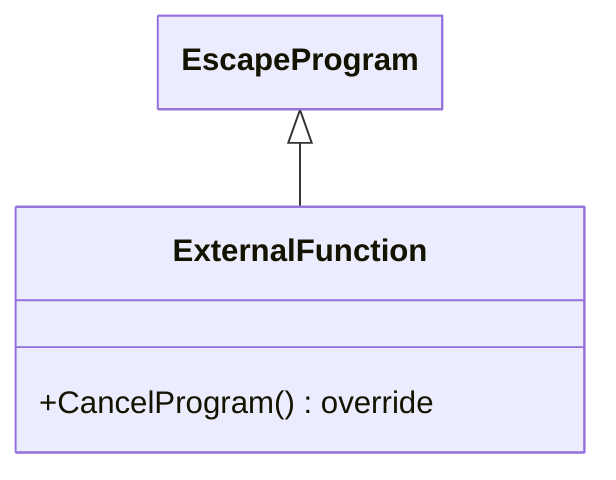

## ExternalFunction Class

The <u>ExternalFunction</u> class is a concrete subclass of <u>EscapeProgram</u>, designed as a base for generic application programs that do not require predefined I/O styles (such as interactive screens or print reports). It provides a minimal, flexible foundation for programs that handle custom logic without inheriting specialized UI or output behaviors from other framework classes. Its primary responsibilities include:

1.  **Program Cancellation and Exit**:
    *   Overrides **CancelProgram()** to directly call **ExitProgram()**, ensuring a straightforward exit without additional cleanup or messaging specific to interactive or print contexts. This allows subclasses to handle cancellation simply by terminating the program.

2.  **Inheritance of Core Infrastructure**:
    *   Inherits all foundational features from <u>EscapeProgram</u>, including program initialization (**InitProgram()**), messaging (**SendMessage()**, **SendErrorMessage()**), data validation (e.g., **ValidateExternalDate()**, **ScanField()**), database operations (e.g., **LockForUpdate()**, **LockForDelete()**), and job utilities (e.g., **SubmitterNewRequest()**).
    *   Provides access to fields like <u>ProgramName</u>, <u>ResultingCode</u>, and indicators for state management and error handling.

3.  **Flexibility for Custom Programs**:
    *   Serves as a starting point for applications that need to implement their own I/O or processing logic, without the constraints of screen-based (e.g., <u>InteractiveProgram</u>) or report-based (e.g., <u>PrintFunction</u>) classes.
    *   Allows subclasses to override virtual methods (e.g., **InitProgram()**) for custom initialization while keeping the base functionality intact.

4.  **Generic Program Structure**:
    *   Enables the creation of programs that focus on business logic, data manipulation, or external integrations, using the framework's utilities without assuming a specific user interface or output format.

In summary, <u>ExternalFunction</u> acts as a lightweight, extensible base for non-specialized programs, emphasizing simplicity and inheritance of core program mechanics while delegating specific behaviors to subclasses. It is ideal for background processes, utilities, or applications with custom I/O requirements.

## No Flowchart

The External Function class does not include a workflow implementation, that is left to its derived classes to provide.

## Class Diagram

