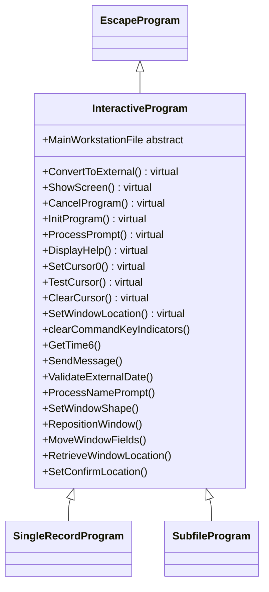

## InteractiveProgram Class

Key Responsibilities of the InteractiveProgram Class

The _InteractiveProgram_ class is an abstract subclass of _EscapeProgram_, designed specifically for user-interactive applications. It extends the base functionality with screen-based interactions, prompting, and UI management, making it suitable for programs that require user input and display handling. Its primary responsibilities include:

1. **Interactive Initialization and Setup**:
   - Overrides **InitProgram()** to initialize interactive-specific fields (e.g., _CompanyName_, _CursorFieldName_, _SetCursor_), set up window locations, and configure large display support.
   - Manages workstation file integration via the abstract _MainWorkstationFile_ property and format prefix detection (**detectFormatPrefix()**).

2. **Screen and Cursor Management**:
   - Provides cursor control methods like **SetCursor0()**, **TestCursor()**, **ClearCursor()**, and **SetCursorInField()** for positioning and overriding cursor behavior.
   - Handles screen time updates and command key indicator clearing (**clearCommandKeyIndicators()**).

3. **Prompting and User Input Processing**:
   - Implements prompting logic with **ProcessPrompt()** (virtual), which extracts cursor positions, selects prompted fields, and checks user prompting permissions.
   - Supports name prompts (**ProcessNamePrompt()**) and confirmation prompts (**PromptForConfirmation()**), including deferral and validation.
   - Includes field validation for numerics (**CheckIsNumeric()**) and required fields, with error indicator setting.

4. **Window and Display Positioning**:
   - Manages window shapes and locations with **SetWindowShape()**, **SetWindowLocation()**, **RetrieveWindowLocation()**, and **MoveWindowFields()**.
   - Supports dropdown calculations for multiple screens (e.g., **CalculateDropdownScreen1()** to **CalculateDropdownScreen4()**).

5. **Help and Assistance Features**:
   - Handles help requests via **DisplayHelp()** (virtual), extracting cursor positions, setting help parameters, and signaling help display.
   - Integrates with prompting to allow context-sensitive help.

6. **Date and Validation Extensions**:
   - Builds on _EscapeProgram_'s date methods with additional validation helpers (e.g., **ValidateExternalDate()** overloads) and internal date conversion routines.
   - Provides user prompting utilities like **CheckUserPromptingAllowed()** and error message sending for prompting issues.

7. **Indicator and State Management**:
   - Extends indicator support with interactive-specific booleans (e.g., _RefreshScreenRequested_, _CancelRequested_, _inF04Prompt_).
   - Manages transaction states, bypass screens, and confirmation requirements for seamless user workflows.

In summary, _InteractiveProgram_ specializes in user-facing interactions, providing tools for screen handling, prompting, cursor management, and validation, while inheriting core program infrastructure from _EscapeProgram_. This enables subclasses to create responsive, interactive applications with consistent UI behavior.

## No Flowchart

The Interactive Program class does not include a workflow implementation, that is left to the SingleRecordProgram and the derived classes of SubfileProgram to provide.

## Class Diagram
