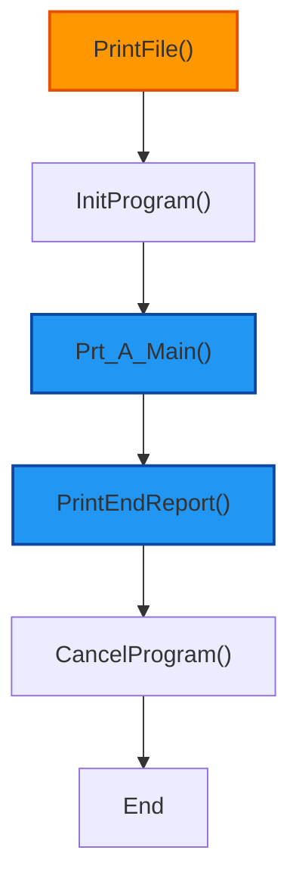
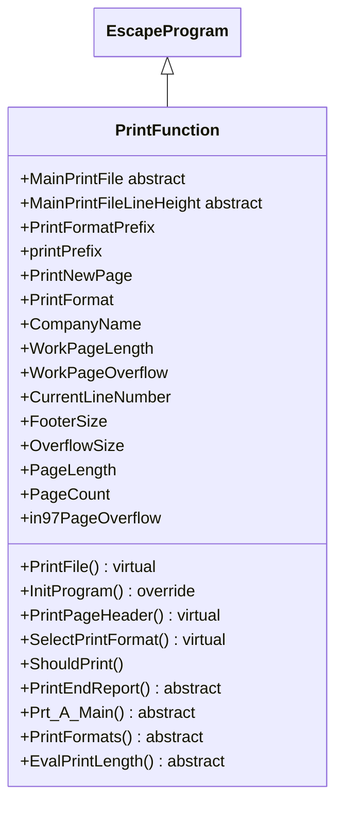

## PrintFunction

The *PrintFunction* class is an abstract subclass of *EscapeProgram*, designed specifically for generating printed reports. It manages print file operations, page formatting, and report generation, providing a structured framework for output-oriented programs. Its primary responsibilities include:

1.  **Report Generation Workflow**:
    *   The **PrintFile()** method orchestrates the main report process: initializing the program, executing the mainline (**Prt_A_Main()**), printing formats, handling end-of-report, and exiting.
    *   Requires subclasses to implement abstract methods like **Prt_A_Main()**, **PrintFormats()**, **EvalPrintLength()**, and **PrintEndReport()** for custom report logic.

2.  **Print File and Page Managemelnt**:
    *   Abstracts the print file via *MainPrintFile* (abstract property) and line height via *MainPrintFileLineHeight*.
    *   Computes page-related properties like *PageLength*, *CurrentLineNumber*, *FooterSize*, and *OverflowSize* based on print file metrics.
    *   Handles page headers with **PrintPageHeader()** and overflow indicators (*in97PageOverflow*).

3.  **Initialization and Configuration**:
    *   Overrides **InitProgram()** to set up print-specific fields (e.g., *CompanyName*, *WorkPageLength*, *PrintNewPage*), adjust page lengths, and clear overflow flags.
    *   Provides *PrintFormatPrefix* for dynamic format naming based on print file tables.

4.  **Printing Logic and Flags**:
    *   Offers **ShouldPrint()** to determine if content should be printed based on flags like **PrintFlag.Ready** or **PrintFlag.OnFirstPage**.
    *   Supports format selection via **SelectPrintFormat()** (virtual) for customizable printing.

5.  **Data Fields and State Management**:
    *   Manages fields like *PrintNewPage*, *PrintFormat*, and work lengths for page control.
    *   Integrates with indicators for page overflow and new page requests.

6.  **Integration with Framework Infrastructure**:
    *   Inherits core program features from *EscapeProgram*, adding print-specific utilities.
    *   Allows subclasses to define print file details and report structures, enabling flexible report generation.

In summary, *PrintFunction* provides a foundation for print-based applications, handling page management and report flow while requiring subclasses to implement specific printing logic.

## PrintObject

The *PrintObject* class is a supporting class within the *PrintFunction* context, used to manage hierarchical print structures (e.g., levels for headings, details, and breaks). It encapsulates state and logic for controlling what and when to print in multi-level reports. Its primary responsibilities include:

7. **Level-Based Print Management**:
   *   Tracks print levels with *Levels* (readonly) and arrays for *LoadLevelBreak* and *PrintLevelBreak* to handle breaks and printing at different hierarchies.

8. **Print State Flags**:
   *   Manages flags like *PrintHeading*, *EndOfFile*, *LoadFirstPage*, *PrintFirstPage*, and *PrintDetail* to control printing behavior.

9. **Break Handling**:
   *   Provides methods like **CascadeLevelBreaks()** to propagate level breaks, **ResetLevelBreaks()** to clear states, **SetLevelBreaks()** to set all breaks, and **RequestAllHeadings()** to load all headings.

10. **Integration with PrintFunction**:

*   Used by *PrintFunction* subclasses to manage complex report structures, ensuring proper sequencing of headers, details, and totals.

In summary, *PrintObject* acts as a utility for organizing print output in layered reports, providing state management for breaks and flags.

## Flowchart

## Class Diagram

