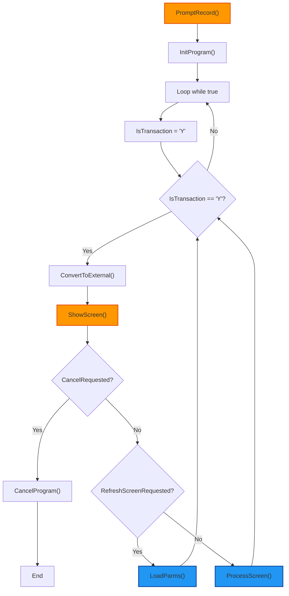
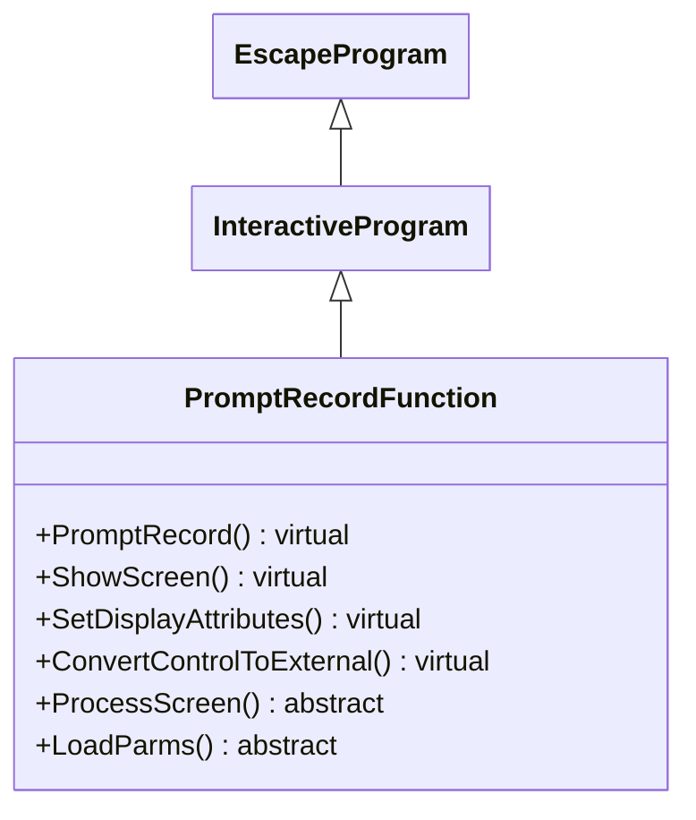

## PromptRecordFunction

The <u>PromptRecordFunction</u> class is a key component in the ASNA.QSys.EscapeFX framework, designed to facilitate user interaction in business applications through a structured, prompt-based workflow. As an abstract class extending <u>InteractiveProgram</u>, it provides a foundation for handling screen conversations, input processing, and response management. Below are its primary responsibilities in the context of user interaction:

## 1. Driving the Main Interaction Loop

*   The core method, **PromptRecord()**, initializes the program and enters an infinite loop to conduct screen conversations. It repeatedly:
    *   Sets up a new transaction (**IsTransaction = "Y"**).
    *   Converts internal data to external form for display.
    *   Displays the screen via **ShowScreen()**.
    *   Processes user responses, such as canceling the program, refreshing the screen, or handling specific inputs.
*   This ensures continuous interaction until the program is explicitly canceled or exited, maintaining a persistent user session.

## 2. Screen Display and Conditioning

*   **ShowScreen()** handles the rendering of the user interface, including:
    *   Setting display attributes (e.g., via **SetDisplayAttributes()** to condition indicators like protection or visibility).
    *   Managing help requests, cursor positioning, and window locations.
    *   Updating screen time and clearing command indicators to prepare for user input.
*   It integrates with the workstation file to write message controls and execute formats, ensuring the screen reflects the current state of the application.

## 3. Processing User Inputs and Commands

*   The class checks for standard user actions:
    *   **Cancel**: Calls **CancelProgram()** to exit gracefully.
    *   **Refresh/Home**: Invokes **LoadParms()** to reset screen fields and reload parameters.
    *   **Other Inputs**: Delegates to the abstract **ProcessScreen()** method, which subclasses must implement to handle specific business logic (e.g., validating inputs, updating data, or triggering actions).
*   It supports prompting mechanisms, such as processing cursor-based prompts and displaying help text when requested.

## 4. Data Conversion and Parameter Management

*   **ConvertControlToExternal()** (virtual) allows customization of converting control fields to external formats for display.
*   **LoadParms()** (abstract) requires subclasses to define how parameters are loaded or reset, often in response to user actions like refreshing the screen.

## 5. Integration with Framework Infrastructure

*   Inherits from <u>InteractiveProgram</u>, leveraging features like indicator management, message handling, and cursor control.
*   Provides hooks for subclasses to extend behavior, ensuring flexibility for various prompt-based applications (e.g., data entry forms or selection screens).
*   Handles low-level details like clearing messages, setting transaction flags, and managing global errors, allowing subclasses to focus on domain-specific logic.

In summary, <u>PromptRecordFunction</u> acts as a controller for user-driven workflows, abstracting the repetitive aspects of screen interaction while enforcing a consistent structure. Subclasses implement the abstract methods to tailor the behavior to specific use cases, such as processing form inputs or loading dynamic parameters. This design promotes reusability and separation of concerns in interactive applications.

## Flowchart

## Class Diagram

