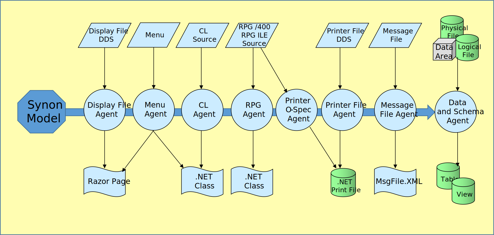

For several decades Synon developers have created applications using the building blocks provided by Synon 2E (also known as Cool 2E and CA 2E).

Synon 2E allowed its developer to define the application data model and then select from a set of prebuilt program templates to create programs that allowed a user to perform edit, display and print functions.  Synon 2E also provided its own language to develop the specific logic of the application. 

The use of the Synon program templates and programming language produce programs that are verbose and repetitive with a dependence on an abstracted application model and a custom runtime that injected into the programs. The RPG that Synon generates isn’t readable—it doesn’t have meaningful field names and it is all but impossible to maintain on its own.

## Migration Agents

ASNA Synon Escape addresses these challenges by exploiting the Synon Model and rationalizing the custom runtime to provide a readable, maintainable C# version of the application. Synon Escape’s migration/refactoring is driven by Synon’s abstract model guiding the conversion of the generated RPG.

_Synon Escape Migration Agents_

## EscapeFX Execution Framework

The programs produced by Synon Escape rely heavily on an execution model provided by the [ASNA.QSys.EscapeFX Framework](./fx/escapefx-framework.html) o class library.

_EscapeFX Class Library_
