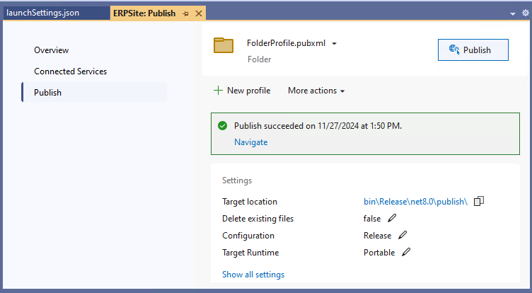
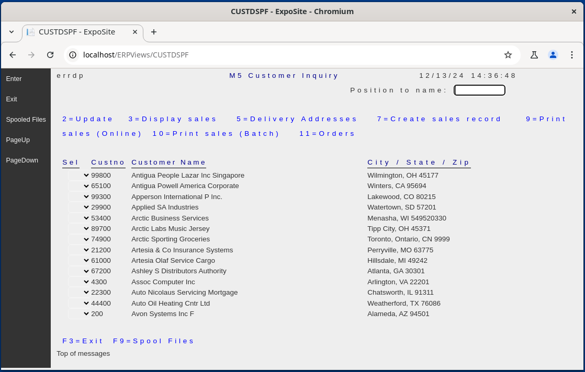

<style type="text/css" rel="stylesheet">
  pre, code {
      background-color: lightgray !important;
      color: #0c5176 !important;
  }
</style>

When a Linux server will be used to host a Monarch application it must be prepared with several components. The requirements for a server that will only host non-interactive applications are fewer but in this article it will be assumed that the server will be used for both kinds of applications: interactive and non-interactive. It is also assumed that the server will not be used for development but only for deployed applications.,

These are the components that should be installed on the Linux server:
 - The [ASP.NET Core Runtime](https://dotnet.microsoft.com/en-us/apps/aspnet) Runtime.
 - A Web Server like [NGINX](https://nginx.org/)
 - The [Monarch Operation Managment](/manuals/hosting/mom/mom-overview.html) components

Microsoft provides documentation on how to [Host ASP.NET Core on Linux with Nginx](https://learn.microsoft.com/en-us/aspnet/core/host-and-deploy/linux-nginx).  This article is a highly simplified set of instructions to setup a simple Linux installation to test run a Monarch interactive application.

## Preparing a Simple Ubuntu Server
This article will show an example on how to prepare a Linux machine running Ubuntu.  Of the many ways in which a server can be prepare, the following steps are showing a simple path that can be used by developers for their own personal use.

This example assumes the user has admin authority on the Ubuntu machine.  We'll assume the user is called eradmin.

It is assumed that the developer is using a Windows machine for its regular use so it will be convinient to install Samba to facilitate copying files from the dev machine to the Ubuntu machine.  [Samba can be installed](https://ubuntu.com/tutorials/install-and-configure-samba#2-installing-samba) like this:

```bash
sudo apt update
sudo apt install samba
```
Follow the rest of the [tutorial to set up Samba](https://ubuntu.com/tutorials/install-and-configure-samba#3-setting-up-samba).


## Install ASP.NET Core Runtime

In order to run .NET application on your Ubuntu machine, you will have to [install the .NET Runtime or SDK]( https://learn.microsoft.com/en-us/dotnet/core/install/linux-ubuntu-install?#install-the-runtime)

Here is a brief summary on how to do it:

```bash
sudo apt-get update
systemctl daemon-reload
sudo apt-get install -y dotnet-sdk-8.0
```

You should have one Sdk:

```bash
dotnet --list-sdks
8.0.110 [/usr/lib/dotnet/sdk]
```

And two Runtimes:
```bash
dotnet --list-runtimes
Microsoft.AspNEtCore.App 8.0.10 [/usr/lib/dotnet/shared/Microsoft.AspNetCore.App]
Microsoft.NETCore.App 8.0.10 [/usr/lib/dotnet/shared/Microsoft.NETCore.App]
```      

## Install NGINX
[NGINX](https://nginx.org/) is, among other things, an HTTP server and a reverse proxy server.

Install NGINX with apt-get.

```bash
sudo apt-get install nginx
sudo nano /etc/nginx/sites-available/default
```

Check the NGINX service status
```bash
sudo systemctl status nginx
```

## Configure MOM Components
The [Monarch Operation Managment](/manuals/hosting/mom/mom-overview.html) components provide support for Monarch applications.

Assuming the **ERCap** application will generate some reports and that these would be made available to the user via PDF, then it will be necessary to install the [ASNA.QSys.Renderer.PDFOnly](/manuals/hosting/mom/rendering-in-linux.html#asnaqsysrendererpdfonly). This renderer can be obtained from [GitHub](https://github.com/asnaqsys/ASNA.QSys.Renderer) and it has to be built.

It will also be necessary to create in the Ubuntu machine the directories where the [printer output queues](/concepts/printing/printing-introduction.html#output-queues-in-monarch) will reside.  The following structure may be used:

```
/var/spool/
├── asnaqsys
    ├── jobqueues
    └── outputqueues
        ├── AbnormalTerminations
        ├── NIGHTPRT
        └── QPRINT
            └── abcuser
            └── xyzuser
```

The directories for each output queue will require to have their permisions set to allow for the creation of subdirectories for each user of the application, or these will have to be created in advanced.

### Install PDFOnly Renderer
Start by building the `ASNA.QSys.Renderer.PDFOnly` renderer on your development machine. Publish it as a [platform-specific and framework-dependent](https://learn.microsoft.com/en-us/dotnet/core/deploying/#platform-specific-and-framework-dependent) application.  You can use a command like this one:

```bash
dotnet publish -r linux-x64
```
The command will include the platform-specific dependencies in the published directory. 

Next create a directory in the Ubuntu machine to host the MOM components used by the application, in this example, the only component needed is the PDFOnly rendere which we'll place at `/bin/lib/asnaqsys/renderer`. After building the PDFOnly renderer, we'll use `samba` to copy the components from the published folder to the `/bin/lib/asnaqsys/renderer` directory. 

After copying the application to the Ubuntu machine, we'll add a link from `/bin` to the executable as follows:

```
    /bin/asnaqsys-renderer -> /bin/lib/asnaqsys/renderer/ASNA.QSys.Renderer.PDFOnly
```

Set the permissions to the `asnaqsys-renderer` link and to the `ASNA.QSys.Renderer.PDFOnly` executable and test that the Renderer is runnable by executing `asnaqsys-renderer`:

You should get a usage message similar to this:

```
             Renderer Options
                - INPUT FILES -           
/m:"file"         Manuscript Path (required)
/d                Delete manuscript file after printing
. . . 
/h or /?          Display this usage message
```

## Build and Install the Application

For this example, we'll assume the application is called **ERCap** and it will by installed by **eradmin**.

Installing the application involves these steps:
 1. Build the Application
 2. Copy the Application to an Ubuntu directory
 3. Configure the Application
 4. Configure the Application as a Service
 5. Configure NGNIX as a Reverse Proxy for the Application

### 1. Publish the Application
The Monarch application will consist of a website and the logic assemblies used by it.  In this example, the application site is called `ERCapSite` and the logic assembly `ERLogic` and it is assumed that they are included in a VS solution to facilitate the building process.

Before building the website, set the port for the application's URL on the profiles section of the `launchSettings.json` file. In the example below the port is **5000**

```json
{
  . . . 
  "profiles": {
    "ExpoSite": {
      "commandName": "Project",
      "launchBrowser": true,
      "environmentVariables": {
        "ASPNETCORE_ENVIRONMENT": "Development"
      },
      "applicationUrl": "http://localhost:5000"
    }
    . . . 
  }
}
```

For small applications, it is useful to add a project reference on the website to the logic project. Doing this will add the logic assembly to the /bin folder of the website which will then be included when the website gets published. For larger applications, it will be necessary to copy the logic assemblies when publishing the application.

Build the solution and publish it.  


As shown above, in this simple example the application will be published in the project's folder `bin\Release\net8.0\publish\`. This folder will have to be copied to the Ubuntu machine.

### 2. Copy the Application to an Ubuntu directory

Start by making a new directory under `/var/wwww/` and set its permissions.

```bash
cd /var/www
sudo mkdir ERCap
sudo chown eradmin ERCap
sudo chmod 777 ERCap
```

### 3- Configure the Application

Edit the application's `appsetings.json` file. 

Point the path to the DLL's directory:
  $TODO: "var/www/ERCap/ERLogic.DLL"


```bash
cd /var/www/ERCap
sudo nano appsetings.json
```

#### Test the Application
Start the application by launching it from the command line:
```bash
dotnet ERPSite.dll
```
Test the application by pointing a Web Browser to the proper port on you machine, like this:

> `http:localhost:5000`

Your browser should display the application's first page, from there you should be able to navigate the application.

### 4- Configure the Website Service

Create a service file for the application in `/etc/systemd/system`, you will probably have to do it under `sudo`. Call the file `ERCap.service`.

Set the contents of configuration file `/etc/systemd/system/ERCap.service` for the application as follows:

```conf
[Unit]
Description=ERCap

[Service]
WorkingDirectory=/var/www/ERCap/
ExecStart=/usr/bin/dotnet /var/www/ERCap/ERPSite.dll
Restart=always
# Restart service after 10 seconds if the dotnet service crashes:
RestartSec=10
KillSignal=SIGINT
SyslogIdentifier=dotnet- ERCap
User=root
Environment=ASPNETCORE_ENVIRONMENT=Production
Environment=DOTNET_PRINT_TELEMETRY_MESSAGE=false

[Install]
WantedBy=multi-user. target
```

Enable the website service and start it as follows:
```bash
sudo systemctl enable ERCap.service
sudo systemctl start ERCap.service
```

### 5- Configure NGINX

Configure the default NGNIX website as a reverse proxy for the application by setting the attributes of the **default** website. 

You can use `nano` to make the necessary edits.
 
 ```bash
 sudo nano /etc/nginx/sites-available/default
 ```
 
 The default site `location` section should look as follows.  Notice the port being used of **5000** is the same as the one set in the `launchSettings.json` file when the application was built.

```c++
    . . .
    location / {
        # First attempt to serve request as file, then
        # as directory, then fall back to displaying a 404.
        # try _files $uri $uri/ =404;
        proxy_pass http://localhost: 5000;
        proxy_http_version 1.1;
        proxy_set_header Upgrade $http_upgrade;
        proxy_set_header Connection keep-alive;
        proxy_set_header Host $host;
        proxy_cache_bypass $http_upgrade;
        proxy_set_header X-Forwarded-For $proxy_add_x_forwarded_for;
        proxy_set_header X-Forwarded-Proto $scheme;
    }    
    . . .
```

Now reload `nginx`:

```bash
sudo nginx -s reload
```

#### Test the Website
You can test the application by pointing a Web Browser to your computer web server via localhost or its IP Address (for example 10.1.1.1).

> `http:localhost`



-----
Follow this [simple tutorial](//github.com/mzand111/DotNetLinuxDeploy?tab=readme-ov-file#dotnetlinuxdeploy) to install .NET on Linux.