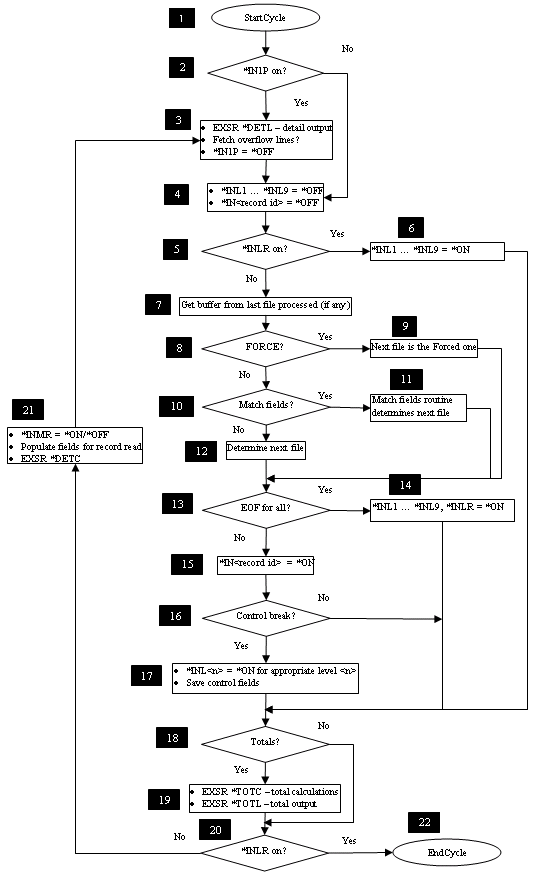

## Overview

The [IBM i RPG Program Cycle](https://www.ibm.com/docs/en/i/7.2?topic=logic-program-cycle) is a series of ordered steps that the main procedure goes through for each record read. Depending on the coded specifications, your program may or may not use each step in the cycle.

## QSys Cycle

## Cycle Narrative

1. _StartCycle is the name of the subroutine that performs the Cycle. It assumes the primary file and all secondary files are already open, which causes the first record from the primary and all secondary files to be read, and all program fields have their correct values including first page indicator (*IN1P is initialized to *ON in the class constructor).

2. If _IN1P is *ON (this is the first time *StartCycle is called), go to step 3. Otherwise, go to step 4.

3. Perform header and detail output (HeadingSpec and DetailSpec in BegCycleOutput). Set *OFF _IN1P.

4. Set *OFF all record identifying and _L1 through _L9 indicators.

5. If _INLR is *ON, go to step 6, otherwise go to step 7.

6. Set *ON the level indicators _INL1 through _INL9, and go to step 18.

7. If this is not the first program cycle, read a record from the last file processed.

8. If FORCE was issued on the previous cycle, go to step 9, otherwise go to step 10.

9. The forced file is selected for processing. If the forced file is at EOF, go to step 10. Otherwise, the match record indicator (_INMR) is set to *OFF and the match fields in the forced file are saved. Continue at step 13.

10. If match fields are used in the program, go to step 11. Otherwise go to step 12.

11. The match field routine selects the next file. Continue at step 13.

12. The next file is selected. It will be either the primary if is not at EOF, or the first secondary that is not at EOF, selected in the order by which they are specified in the program.

13. If all files are at EOF, then go to 14. Otherwise go to 15.

14. Set *ON _INLR and all level indicators *INL1 through *INL9. Continue at 18.

15. The record identifying indicator is set *ON for the record selected for processing.

16. If there is a control break, go to 17. Otherwise go to 18.

17. The appropriate control level indicator (*INL1 through *INL9) is set *ON. All lower level indicators are also set *ON.

18. Determine whether totals need to be executed and if so go to 19. Otherwise go to 20. If no control levels are specified for any record, totals are bypassed on the first cycle and are always processed after the first cycle. If control levels are specified, totals are bypassed until the first record containing control fields has been processed.

19. Total Calculations (*TotalCalc) and total output are processed (TotalSpec in  BegCycleOutput).

20. If _INLR is *ON, go to step 22.

21. The match record indicator (_INMR) is set *ON or *OFF depending on whether the record read is a matching record. Data from the last record read is made available for processing. Detail Calculations (_DetailCalc) are processed. Continue at step 3.

22. Return to the caller.