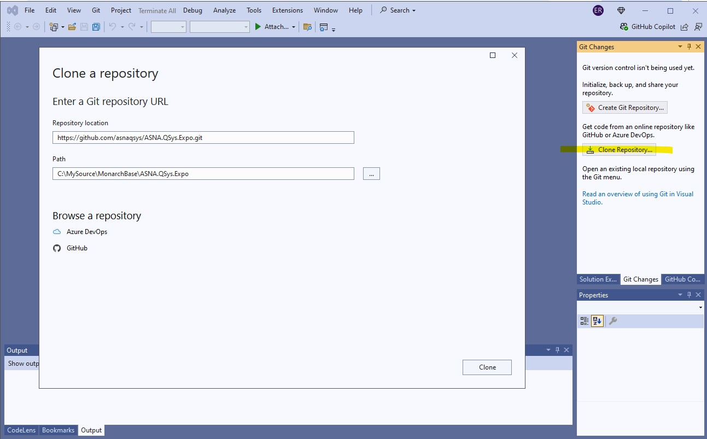

## NuGet Packages
The easiest way of utilizing ASNA Monarch® Base is to [configure](get-asna-qsys-overview.html#add-a-nuget-package-source-in-visual-studio) developer and build machines to have a NuGet Source pointing to the released NuGet packages in the GitHub Store.

As an alternate of using the released NuGet packages, you can build your own by cloning the Monarch Base sources and creating them yourself. You should only consider building your own packages if you need to customize them or if you will lose access to GitHub.

## ASNA Monarch® Base is NOT Open Source

> ASNA grants its ASNA Monarch® Base customers a license to the sources for their own use within the Migrated Application.  
 Customers are not allowed to make the sources available to the public or anybody outside their organization withour prior written agreement from ASNA.

## Clone Monarch Base Source Repositories
There are multiple ways of cloning a GitHub repositiory. An easy way to make a clone is via Visual Studio.

_Cloning a Repository in Visual Studio_

## Obtaining NuGet Packages
There are two ways of obtaining the Monarch Base NuGet packages: you can either build them or download them from NuGet.  In either case you will have to create a NuGet Package Store for your packages and configure NuGet to point to it.

### Produce NuGet Packages from Sources
Monarch Base source repositories typically contain two solutions for each package produced; the first one is used for the package developers to produce a **debug** build and is identified by the suffix `-dev`, the other one lacks the suffix and is used to produce the **release** NuGet packages. For instance, the _ASNA.QSys.Expo_ repository contains the solutions `ASNA.QSys.Expo.sln` and `ASNA.QSys.Expo-dev.sln`.

You can produce the NuGet packages by building the **release** solution of each one of the packages you use.  These will typically be:
- ASNA.QSys.DataGate.Client.sln
- ASNA.QSys.Runtime.sln
- ASNA.QSys.MonaServer.sln
- ASNA.QSys.Expo.sln

> Some packages depend on others; you will need to build the dependency first and have the package available to the consuming project.

> If you build the sources, you should increment the version number to prevent confusion and NuGet issues.

### Download an existing NuGet Package
After restoring (or building) any project refering to the specific NuGet Package version, the package will be located in NuGet's Cache. For instance, building a website with the ASNA.QSys.Expo package as a dependency will download the package to the build machine. The location of the package in the Cache will be similar to this:
    `C:\Users\YOUR-USER\.nuget\packages\asna.qsys.expo\5.0.20`

## Create and Configuring a NuGet Package Store
There are several systems that can serve as NuGet Stores, one of the simplest is a Windows folder.

To create and configure a Windows folder as your Package Store the following:
 1. Create (or use) a folder in a well known location, either local to your machine or on a shared drive.  For instance `C:\bin\LocalNuGetPackages`
 2. Copy the Package you built or the one from the NuGet Cache to the well-known-location folder. The package is identified with the extension `.nupkg`. For instance, copy `C:\Users\YOUR-USER\.nuget\packages\asna.qsys.expo\5.0.20\asna.qsys.expo.5.0.20.nupkg` to `C:\bin\LocalNuGetPackages`.
 3. Add the following highlighted line to your `NuGet.Config` file which can be found at:  `C:\Users\YOUR-USER\AppData\Roaming\NuGet\NuGet.Config`

<pre>
&lt;configuration&gt;
    &lt;packageSources&gt;
        &lt;add key="nuget.org" value="https://api.nuget.org/v3/index.json" protocolVersion="3" /&gt;
        &lt;add key="LocalAsnaQSys" value="C:\bin\LocalNuGetPackages" /&gt;
        . . .
    &lt;/packageSources&gt;
    . . .
&lt;/configuration&gt;
</pre>

