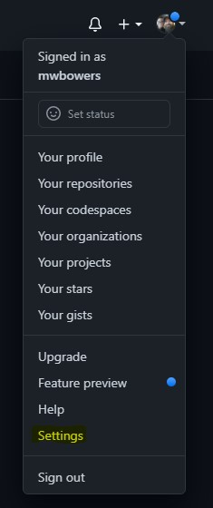
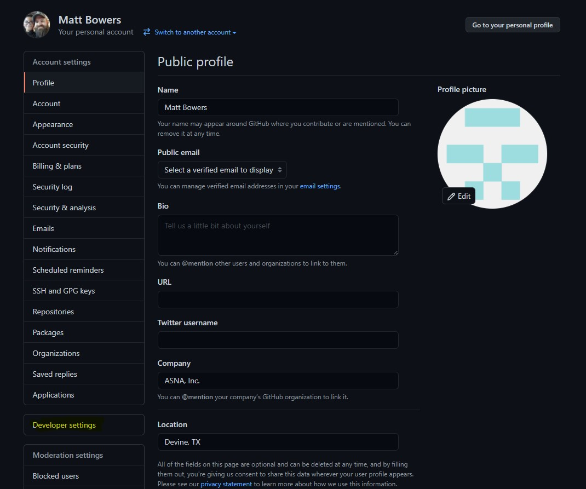
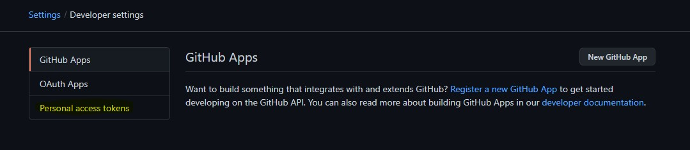
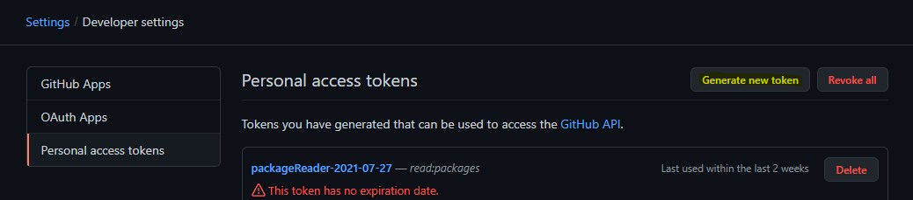
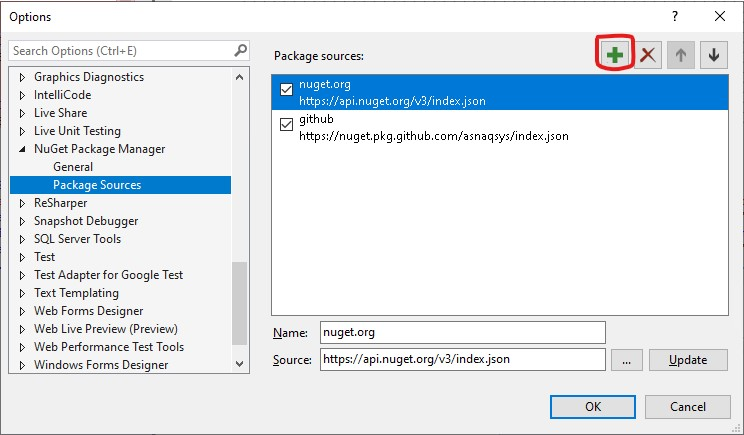
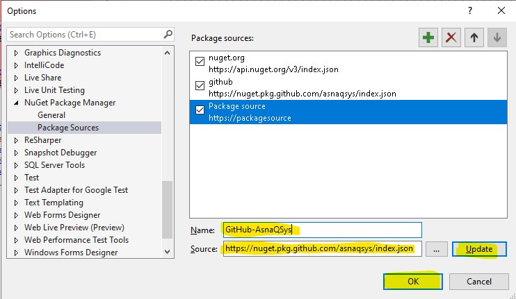
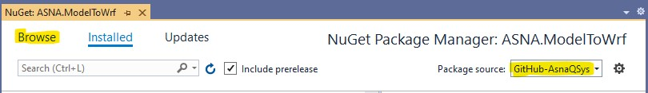
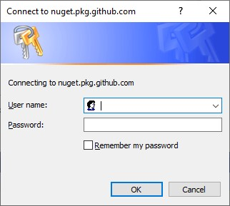
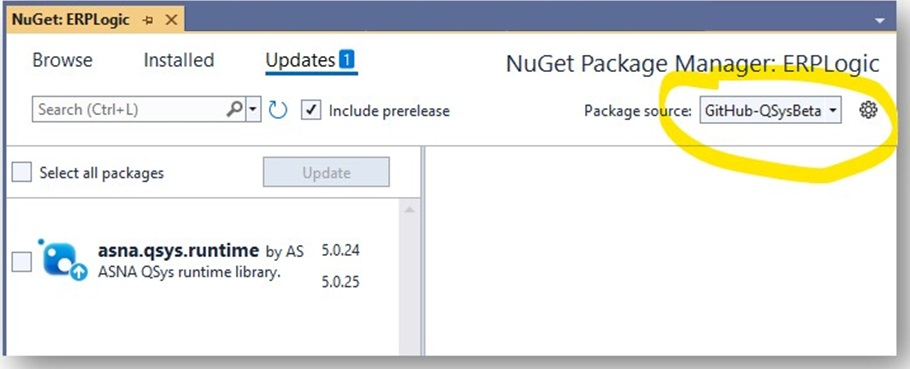

## NuGet Packages
To facilitate the building of migrated applications, Monarch Base is made available via the following NuGet packages:

- ASNA.QSys.DataGate.Client
- ASNA.QSys.Runtime
- ASNA.QSys.MonaServer
- ASNA.QSys.Expo

There are two main ways to get ahold of the NuGet packages:
 - Download the packages by configuring a Source to GitHub. This is the recomended way
 - Clone the sources and build the packages yourself

## Accessing ASNA QSys NuGet Packages on GitHub
The NuGet packages are available at [GitHub](https://github.com/orgs/asnaqsys/packages). In order to download them from this location you will need to have access to the AsnaQSys repository. Contact ASNA to be added to the ASNA QSys organization on the customer team.

In addition to the GA packages on the main GitHub repository, there is also a channel available to obtain [**BETA** versions](https://github.com/orgs/asnaqsys-beta/packages) of the packages. Once again, please contact ASNA to obtain access to this channel.

Most developers will be using Visual Studio for their projects.  Visual Studio can be configured to directly access the NuGet packages.

## Configure Visual Studio with GitHub NuGet Packages
The following steps show how to create a personal access token at GitHub and use it to configure Visual Studio.

### Create a Personal Access Token in GitHub
a.	Register/Login to GitHub.

b.	Click on your profile picture in the upper right corner of GitHub then select **Settings**


c.	Click the **Developer settings** button on the left-hand menu


d.	Click **Personal access tokens** on the left-hand menu


e.	Click **Generate new token** at the top of the page, below the header


f.	Add a note to identify what the token is for (e.g. “Package Reader”)

g.	Set the Expiration for the token.

h.	Check the box for **read:packages**


i.	Click **Generate token** at the bottom of the page

j.	The token will be displayed. Once you navigate away from the page, you will not see the code again and will have to repeat this process to generate another.

### Add a NuGet Package Source in Visual Studio
a.	Go to **Tools -> Options -> NuGet Package Manager -> Package Sources**

b.	Click the **+** button in the upper right corner to add a new source


c.	Change the name to something useful such as **GitHub-AsnaQSys**

d.	Change the Source to **https://nuget.pkg.github.com/asnaqsys/index.json**

e.	Click **Update**

f.	Click **OK**


### Set the Credentials for the Package Source.
There are two mechanisms you can use to set the credentials for your package source:
  1. Enter the credentials in a *NuGet.Config* file.
  2. Let Windows manage the credentials

#### Set Credentials in NuGet.Config
NuGet uses configuration files called *NuGet.Config*.  These files can be set and used at the machine level, the user level or even the VS solution or Project level.  For credentials, the most practical file to use is the one stored for the user at:

    C:/Users/{YourUserName}/AppData/Roaming/NuGet/NuGet.Config

>On MacOS the file is located at: ~/.nuget/NuGet/NuGet.config


You can check the full Microsoft's [documentation here](https://docs.microsoft.com/en-us/nuget/reference/nuget-config-file).

We are interested in these two elements:
 - *packageSources*
 - *packageSourceCredentials*

The *packageSources* should contain the name of the source you added in the steps above.  You would enter your credentials in the *packageSourceCredentials* like this:
```xml
  <packageSources>
    . . . 
    <add key="GitHub-AsnaQSys" value="https://nuget.pkg.github.com/asnaqsys/index.json" />
  </packageSources>
  <packageSourceCredentials>
    <GitHub-AsnaQSys>
      <add key="username" value="MyGitHubName" />
      <add key="cleartextpassword" value="MyGitHubToken" />
    </GitHub-AsnaQSys>
  </packageSourceCredentials>
```

#### Use Windows Credential Manager
If you have not set your credentials in a NuGet.Config, then the first time you attempt to use the new Package Source, Windows will prompt you for the user and password and save it.

a.	Open your Visual Studio solution.

b.	Right click on the project for which you would like to add the NuGet package(s) and select **Manage NuGet Packages…**

c.	Change the **Package source** in the upper right corner to the new source you just added

d.	Click **Browse**


e.	You should be prompted to enter credentials (if not, hit the refresh button)
  1.	Enter your **GitHub user name* (not email address).
  2.	Enter the **Personal Access Token** generated previously (not your GitHub password).
  3.	Check **Remember my password**
  4.	Click **OK**



Now you should be able to see the packages in the AsnaQSys organization.

## Configuring GA and Beta NuGet Package Sources
The easiest way to configure two package sources, one for the General Available packages and one for the Beta packages is by editing your NuGet.Config file as shown here:

```xml
  <packageSources>
    . . . 
    <add key="GitHub-AsnaQSys" value="https://nuget.pkg.github.com/asnaqsys/index.json" />
    <add key="GitHub-QSysBeta"  value="https://nuget.pkg.github.com/asnaqsys-beta/index.json" />
  </packageSources>
  <packageSourceCredentials>
    <GitHub-AsnaQSys>
      <add key="username" value="MyGitHubName" />
      <add key="cleartextpassword" value="MyGitHubToken" />
    </GitHub-AsnaQSys>
    <GitHub-QSysBeta>
      <add key="username" value="MyGitHubName" />
      <add key="cleartextpassword" value="MyGitHubToken" />
    </GitHub-QSysBeta>
  </packageSourceCredentials>
```
After you add the **GitHub-QSysBeta** entry to NuGet.Config, restart Visual Studio and make your selection in the package source dropdown box:


Notice the selection of the checkbox **Include prerelease**

## Getting Sources for Monarch Operations Support Programs
There are several programs that assist in the operations of a Monarch application.  Some of these programs assist with Batch Job dispatching, Printing Manuscripts and processing the manuscripts out of output queues.

The source code for these programs is in GitHub where customers can fork the repository and customize and build them to their particular needs.

Monarch Operations programs:
 - [Batch Processing](/manuals/hosting/mom/batch-dispatch.html) source repository [ASNA.QSys.BatchDispatch](//github.com/asnaqsys/ASNA.QSys.BatchDispatch)
 - [Manuscript Renderers](/manuals/hosting/mom/manuscript-renderer.html) source repository [ASNA.QSys.Renderer](http://github.com/asnaqsys/ASNA.QSys.Renderer)
 - [Printer Writer](/manuals/hosting/mom/printer-writer.html) source repository [ASNA.QSys.PrinterWriter](//github.com/asnaqsys/ASNA.QSys.PrinterWriter)

