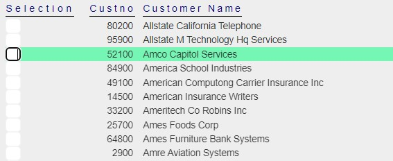
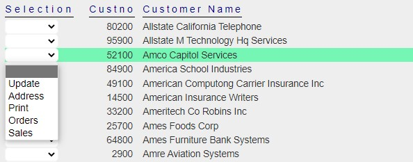

When a decimal or character field's domain is limited by a finite set of discrete values the field can be displayed as a dropdown box. 

## Traditional Display

Take the following definition of a subfile decimal field called SFSEL:
```cs
public class SFL1_Model : SubfileRecordModel
{
    . . .
    [Values(typeof(Decimal),"00","02","05","07","11","12")]
    [Dec(2, 0)]
    public decimal SFSEL { get; set; }
    [Dec(6, 0)]
    public decimal SFCUSTNO { get; private set; } // CUSTOMER NUMBER
    [Char(40)]
    public string?  SFNAME { get; private set; }
    . . .

}    
```

Notice that the SFSEL field is constrained to a set of possible options via the `Values` attribute on the property defining the field in the model.

As the input from the user is being processed, the binding agent will verify that the entered value is part of the set given, if it is not, then the model is marked as invalid and the page is sent to the user with an error message.


Normally an input field is display on the screen as a text box.  For example, the subfile SFSEL field, representing an option or selection, may be defined like this in the markup:

```html
<DdsSubfileRecord RecordNumber="rrn" For="SFLC.SFL1">
    . . .
    <DdsDecField Col="4" For="SFLC.SFL1[rrn].SFSEL" VirtualRowCol="@row,4" EditCode="Z" />
    <DdsDecField Col="7+8" For="SFLC.SFL1[rrn].SFCUSTNO" EditCode="Z" Comment="CUSTOMER NUMBER" />
    <DdsCharField Col="14+8" For="SFLC.SFL1[rrn].SFNAME" />
    . . .                            
</DdsSubfileRecord>    
```

The markup above would be displayed like this:



The programmer may desire to display a dropdown box, instead of the text box, to show the user the possible values that can be entered on the field and display the associated meaning of each option.

## Displaying Field as a Dropdown

To display the field as a dropdown box, set the `ValuesText` property of the TagHelper (`DdsCharField`, `DdsDecField`) to the options the user will see for the corresponding model's `Values`.

```html
<DdsSubfileRecord RecordNumber="rrn" For="SFLC.SFL1">
    . . .
    <DdsDecField Col="4" For="SFLC.SFL1[rrn].SFSEL" VirtualRowCol="@row,4" EditCode="Z" 
                 ValuesText="' ','Update','Address','Print','Orders','Sales'" />
    <DdsDecField Col="7+8" For="SFLC.SFL1[rrn].SFCUSTNO" EditCode="Z" Comment="CUSTOMER NUMBER" />
    <DdsCharField Col="14+8" For="SFLC.SFL1[rrn].SFNAME" />
    . . .                            
</DdsSubfileRecord>    
```

The markup above would render the SFSEL field as follows:



Notice that only the text is display on the dropdown.  It is possible to also display the corresponding Value for each text shown.

## Displaying Value along with Text

To display the program's Value along each ValueText entry set the ValuesTextOptionsSeparator property as shown below:
```html
<DdsDecField Col="4" For="SFLC.SFL1[rrn].SFSEL" VirtualRowCol="@row,4" EditCode="Z" 
             ValuesText="' ','Update','Address','Print','Orders','Sales'"
             ValuesTextOptionSeparator=" - " />
```


## Program Value Received
Regardless of what style being used on the browser, the application would continue to receive the field value in its original format.  In the examples above, the program reading the subfile field SFSEL would receive a decimal number within the set of 0, 2, 5, 7, 11 or 12.