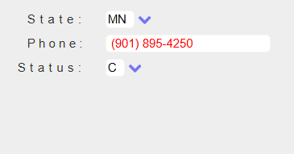
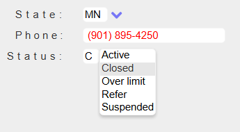

Defines a dynamic list selector that retrieves options by invoking a host program.


**Namespace:** ASNA.QSys.Expo.Tags<br/>
**Assembly:** ASNA.QSys.Expo.Tags.dll


**Inheritance:** [Object](https://docs.microsoft.com/en-us/dotnet/api/system.object) --> [TagHelper](https://learn.microsoft.com/en-us/dotnet/api/microsoft.aspnetcore.razor.taghelpers.taghelper?view=aspnetcore-8.0)
<br>
<br>

## Remarks

The DdsDynamicListTagHelper renders a button-like chevron element that when clicked invokes a Program on the application server so the browser can open a dynamic options list with values returned from the Program.

This TagHelper is intended for scenarios where list values depend on host-side logic and the current page state.

DdsDynamicList provides properties to specify:
 - The `ProgramName` to call 
 - The `TargetField` that will get the value selected by the user. The Field's current value is utilized to pre-select the list item
 - Any number of comma-separated string values the Program may need to perform its task of producing the list, this property is named `ParmsData`.

 The Program should define the following parameter list:
  - Parameter `1`: The generated output list. This is always the first parameter, the program should output the generated list in here.
  - Parameters `2 ⭢ n-1`: The middle parameters receive the values of the `ParmData` property.
  - Parameter `n`: The last parameter is the value of the `TargetField` on the browser when the chevron was clicked and may be used to mark one of the options as 'selected'.

The format of the generated output list should be a string representing a 3 'column table', with each *row* delimited by a new line character and each column separated with a Tab, something like this (where → represents a Tab character /u0009):<br/>
```
     A →           →  A-Allowed
     B →  selected →  B-Bypassed
     C →           →  C-Canceled
     D →           →  D-Delayed
```


## Sample DdsDynamicList

The code that follows shows two DdsDynamicLists, one for helping the user select an address's State and the other one for the account's Status.

```html
   <div Row="13">
       <DdsConstant Col="15"     Text="State" />
       <DdsCharField Col="27"    ColSpan="3" For="CUSTREC.SFSTATE" VirtualRowCol="11,27" PositionCursor="43" />
       <DdsDynamicList Col="30"  ProgramName="Acme.BuildDropdownList" 
                                 TargetField="CUSTREC.SFSTATE" ParmsData="STATES" OptionsPageSize=10  />
   </div>
    <div Row="14">
        <DdsConstant Col="19"    Text="Phone:" />
        <DdsCharField Col="27"   For="CUSTREC.SFPHONE" DisplayAttrCode="@Model.CUSTREC.aFAXPHONE" VirtualRowCol="14,27"  />
    </div>
    <div Row="15">
        <DdsConstant Col="18"    Text="Status:" />
        <DdsCharField Col="27"   ColSpan="2" For="CUSTREC.hsSTATUS" VirtualRowCol="15,27" PositionCursor="44" />
        <DdsDynamicList Col="29" ProgramName="Acme.BuildDropdownList" 
                                 TargetField="CUSTREC.hsSTATUS" ParmsData="STATUS" />
    </div>
```

When rendered, the DdsDynamicList places a chevron 'button', like this:


If the user clicks on the Status' chevron, then the `Acme.BuildDropdownList` program will be called back on the server and the resulting list will be shown in a window.




## The Called Program

The sample DdsDynamicList above expects to call a program named Acme.BuildDropdownList which should receive three user parameters as follows:

```
        public static void _ENTRY(ICaller _caller, out Indicator __inLR,        // First 2 params in C# are used by the system
            Optional<string> ListHTML,
            Optional<string> WhichList,
            Optional<string> CurrentValue)
```

The `ProgramName` should include any necessary name qualifications. If the program is a .NET Class, it should be locate in one of the Assemblies listed in the [AssemblyList](/manuals/programming/programs-and-procedures/call-program.html#assembly-list). 

## Properties

| Type | Name | Description |
| --- | --- | --- |
| [Int32](https://learn.microsoft.com/en-us/dotnet/csharp/language-reference/builtin-types/integral-numeric-types) | Col | Gets or sets a value that indicates the horizontal position within a row. |
| [Int32](https://learn.microsoft.com/en-us/dotnet/csharp/language-reference/builtin-types/integral-numeric-types) | MaxOutputLength | Gets or sets the maximum VARYING length of a character field returned by the host program. |
| [Int32](https://learn.microsoft.com/en-us/dotnet/csharp/language-reference/builtin-types/integral-numeric-types) | OptionsPageSize | Gets or sets the number of options visible at a time in the selector. |
| [String](https://docs.microsoft.com/en-us/dotnet/api/system.string) | ParmsData | Gets or sets comma-separated literal parameter values passed to the host program. |
| [String](https://docs.microsoft.com/en-us/dotnet/api/system.string) | ParmsElements | Gets or sets comma-separated HTML element names whose current browser values are passed as host parameters. |
| [String](https://docs.microsoft.com/en-us/dotnet/api/system.string) | ProgramName | Gets or sets the program or class name to be invoked. |
| [String](https://docs.microsoft.com/en-us/dotnet/api/system.string) | TargetField | Gets or sets the name of the field that receives the selected value. |

